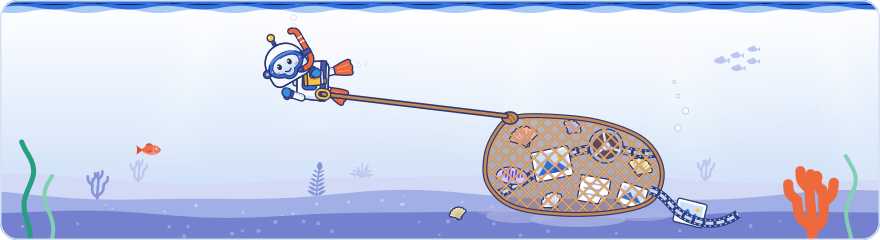

[Knowledge base](../README.md) / **00-raw**

# Raw inputs

**Untouched source material, one folder per day: slide photos, video clips, recordings, raw transcripts, notes and the agenda. Nothing here is edited or renamed.**

<picture><source media="(prefers-color-scheme: dark)" srcset="../_system/brand/illustrations/00-raw-dark.svg"></picture>

> [!CAUTION]
> **Private: this folder never leaves this computer.** Only this `README.md` is in git. Everything else here is ignored by `.gitignore`, never committed and never shared. Back it up yourself.

##  What's here

The expected layout. `ingest.bat` creates the type folders and sorts each file into one of them by its extension.

| Path | What it holds |
| --- | --- |
| `dayN/slides/` | Slide photos, exactly as taken |
| `dayN/video/` | Video clips |
| `dayN/audio/` | Recordings |
| `dayN/transcripts/` | Raw transcripts and subtitles |
| `dayN/other/` | Anything else that came with the material |
| `dayN/` itself | The author's notes (`notes.md`, cited in claims as `notes`) and anything filed by hand, such as the agenda (cited as `agenda`) |

##  How to use it

- **Add material with [`ingest.bat`](../ingest.bat).** Drag a folder onto it and type the day. After a dry run and your <kbd>Y</kbd> it copies every file untouched into `dayN/`, makes JPEG previews in `10-sources/dayN/slides-jpg/` and writes the index `10-sources/dayN/media.yaml`. The source folder is only read, and files already imported are skipped, so running it twice is safe.
- **Material already here?** `python _system/tools/ingest.py 00-raw/dayN --day N` makes only the previews and the index.
- **Never edit or rename a file here.** Claims cite a photo by its file name without the extension, and the build warns when a cited photo has no file here.
- **Other attendees stay out.** Anything that shows another attendee (a badge, a face) is dropped from every later step. A photo on the exclusion list (`EXCLUDED` in `_system/build_kb.py`) is copied like the rest but gets no preview and no index entry, and the build refuses it as evidence.

The full procedure is step 1 of [`_system/PLAYBOOK.md`](../_system/PLAYBOOK.md). What may and may not be shared: [`PRIVACY.md`](../PRIVACY.md).

<a href="../README.md">Knowledge base</a> · <a href="../10-sources/README.md">10-sources</a> →

