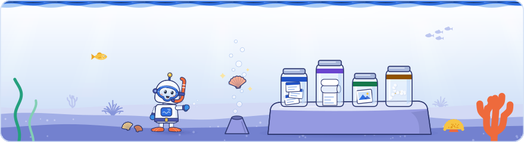

[Knowledge base](../README.md) / **10-sources**

# Cleaned sources

**Working copies made from the raw inputs: cleaned, speaker-labelled transcripts with numbered paragraphs, slide transcriptions, photo previews, the media index and the reconstructed agenda. Claims cite these.**

<picture><source media="(prefers-color-scheme: dark)" srcset="../_system/brand/illustrations/10-sources-dark.svg"></picture>

> [!CAUTION]
> **Private: this folder never leaves this computer.** Only this `README.md` is in git. Everything else here is ignored by `.gitignore`, never committed and never shared. Back it up yourself.

##  What's here

The expected layout, one folder per day:

| Path | What it holds | Made by |
| --- | --- | --- |
| `dayN/clean/<stem>.md` | The cleaned transcripts, one per raw transcript, with numbered paragraphs, so a claim can cite paragraph 14 as `T:<stem>:14` | Hand, step 2 of the playbook |
| `dayN/slides-jpg/` | JPEG previews of the slide photos in `00-raw/dayN/` | `ingest.bat` |
| `dayN/media.yaml` | The media index: every file in `00-raw/dayN/` with its kind, capture time, size, duration and a suggested session | `ingest.bat` (run it again instead of editing) |
| `dayN/` itself | Slide transcriptions, the reconstructed agenda and other working notes for the day | Hand |

##  How to use it

- **Clean each transcript against the slides.** Fix speech-to-text errors (product and feature names, numbers, acronyms, speaker names), mark anything inaudible `[inaudible]` instead of guessing, drop jokes, banter and housekeeping, keep every substantive statement and every audience question with its answer, and number the paragraphs. The rules and the check are step 2 of [`_system/PLAYBOOK.md`](../_system/PLAYBOOK.md).
- **The suggested session in `media.yaml` is only a guess** from the capture time. Check it against the photo before citing the file in a claim.
- **The build checks the references.** When `dayN/` exists here, the build warns about a `T:` reference whose cleaned transcript is missing. It is a warning, never an error, because the folder is absent on a clone.

> [!NOTE]
> Nothing here is ever exported. Claims carry the evidence reference (`T:t06:14`), never the evidence itself. See [`PRIVACY.md`](../PRIVACY.md).

← <a href="../00-raw/README.md">00-raw</a> · <a href="../20-claims/README.md">20-claims</a> →

