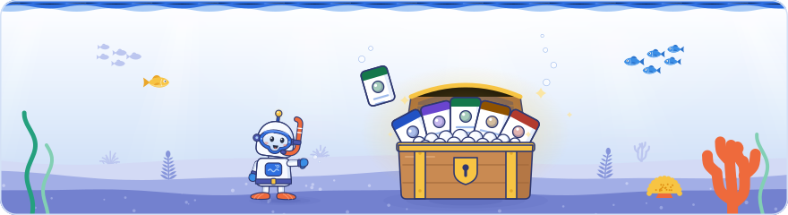

[Knowledge base](../README.md) / **20-claims**

# Claims: the source of truth

**Every claim, session, topic and source the knowledge base is built from. Edit here, then rebuild: the topic and session pages, the maps, the agent pack, the kits, the web edition and the PDFs all draw on these files.**

<picture><source media="(prefers-color-scheme: dark)" srcset="../_system/brand/illustrations/20-claims-dark.svg"></picture>

> [!WARNING]
> **This folder is in git and shared.** A claim is a paraphrase; a quote is at most 25 words and only where the wording matters. Companies shown on stage as bad examples stay unnamed, nothing about other attendees is recorded, and nothing about my own sites, clients or employer goes here (it goes in [`70-private/`](../70-private/README.md)). A claim marked `private: true` never reaches a shared output, but it is still stored here in git. See [`PRIVACY.md`](../PRIVACY.md).

##  What's here

| File | What it holds |
| --- | --- |
| [`day1.yaml`](day1.yaml), [`day2.yaml`](day2.yaml), [`day3.yaml`](day3.yaml) | The claims of each day (`dayN.yaml`), one record per statement: session, label, speaker, evidence, verification grade, sources, topics, text and an optional short quote |
| [`sessions.yaml`](sessions.yaml) | The event, its days and every session in running order: time, title, speakers, coverage and kind |
| [`topics.yaml`](topics.yaml) | Areas and topics: each topic's summary, actions (`do`), related topics and the claims that back the summary (`cites`) |
| [`sources.yaml`](sources.yaml) | The Google pages and press reports the claims are checked against: title (the page's H1), URL, publisher and the date it was last read |
| [`entities.yaml`](entities.yaml) | The things the event talked about (products, features, crawlers, reports, directives, status codes, standards, metrics, concepts, updates, tools), each with its kind, other spellings, a one-line summary, its Google pages, home topics and relations. The build finds them in the public claims by those spellings; the claims themselves never change. Every match, with the words that matched, is listed in [`50-maps/entity-index.md`](../50-maps/entity-index.md) |

The labels (Slide, Stage, Docs, Press, Analysis) and the verification grades are explained in the [legend on the front page](../README.md#labels-who-is-speaking). An example record is under *What a claim looks like* on the same page.

##  How to edit

1. **Edit the YAML.** The field rules for every record are in [`_system/schema/claim.md`](../_system/schema/claim.md). A new day's file starts from [`_system/templates/day.template.yaml`](../_system/templates/day.template.yaml); the whole procedure is [`_system/PLAYBOOK.md`](../_system/PLAYBOOK.md).
2. **Validate:** `python _system/build_kb.py --check` checks everything and writes nothing.
3. **Rebuild:** double-click [`rebuild.bat`](../rebuild.bat). The build validates again first and writes nothing when it finds an error.
4. **After a new day, review the things:** `git diff 50-maps/entity-index.md` shows every new mention of a thing with the words that matched. Fix a wrong one in `entities.yaml` with a longer phrase, a topic scope or `unpin` (step 6b of the playbook).

> [!IMPORTANT]
> **IDs are permanent.** Never reuse or renumber a claim ID (`D1-C054`), a session ID (`D1-S03`) or a thing ID (`googlebot`). To split a claim, keep the old ID for one half and give the other half the next free ID. Only the keys listed in the schema are allowed: a misspelled or repeated key is an error, so a typo can never publish a private claim.

← <a href="../10-sources/README.md">10-sources</a> · <a href="../25-kits/README.md">25-kits</a> →

