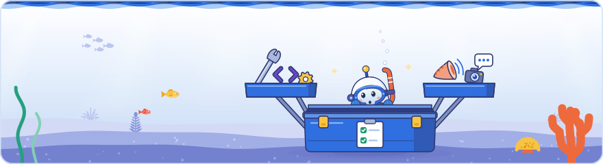

[Knowledge base](../README.md) / **25-kits**

# Kit sources

**The hand-written source of the developer kit and the media kit. The build checks every item against the claims, then renders both kits.**

<picture><source media="(prefers-color-scheme: dark)" srcset="../_system/brand/illustrations/25-kits-dark.svg"></picture>

##  What's here

| Source | What it holds | Becomes |
| --- | --- | --- |
| [`dev-requirements.yaml`](dev-requirements.yaml) | **Developer kit**: requirements, grouped in areas | The [developer kit](../60-outputs/dev/README.md) |
| [`snippets/`](snippets/) | One code snippet per file (`<key>.md`) | The kit's `snippets.md` |
| [`content.yaml`](content.yaml) | **Media kit**, community edition: every wording rule and glossary term, and a short preview of facts, myths, a story angle and quotes | The [media kit](../60-outputs/content/README.md) page and its glossary |
| [`differences.yaml`](differences.yaml) | **Differences ledger**: where the event and Google's documentation differ, with the event, docs and analysis claims of each row and what to follow | [`50-maps/differences.md`](../50-maps/differences.md), the developer kit's `differences.md` and `differences.json` in the agent pack |

- **A requirement** has an ID (`DEV-<AREA>-NN`), a level (MUST, SHOULD, MAY or AVOID), an imperative title, why, how, a test, an optional snippet, the claims it rests on, Google's pages (`docs`) and a status (`documented` or `event-only`).
- **A snippet** is a title line, one to three sentences and fenced code with its language. A requirement points to it with its `snippet` key.
- **Media kit items** (facts, myths, quotes, story angles and glossary terms) cite the public claims they rest on; the wording rules say how to word them.
- **A difference** has an ID (`DIF-NN`), a title, the slide or stage claims that give the event's version (`event`), the docs claims (`docs`) or Google pages (`pages`) that give the documented one, the analysis claims that explain the gap (`analysis`) and what to follow (`follow`). The build adds the claims linked by `contradicts` or `updates` and the claims that say they are uncertain to the ledger by itself.
- **Both kits** also go into the agent pack (`dev-requirements.json`, `content-library.json`) and onto the web edition's developer and content pages.
- **The community edition** (`_system/edition.yaml` says `edition: community`) keeps the developer kit, the differences ledger, the wording rules and the glossary complete. The full media kit, with the numbers registry and the question bank that the build derives from it, is not part of this edition; `content.yaml` holds a short preview of it, and the build writes the preview into the media kit's README.

##  How to edit

1. **Edit the YAML or a snippet.** The fields and rules are step 7 of [`_system/PLAYBOOK.md`](../_system/PLAYBOOK.md#7-keep-the-kits-current); the differences ledger and when to add a row are step 7b, and the fields are listed at the top of `differences.yaml`.
2. **Validate:** `python _system/build_kb.py --check`.
3. **Rebuild:** double-click [`rebuild.bat`](../rebuild.bat). The build's `OK: kits:` line counts the items.

The build refuses an item that:

- cites a claim that does not exist or is private, or a source that does not exist;
- is marked `documented` without documentation behind it;
- names a person that no cited claim's `who` names, or says "community speaker" without citing a community speaker's slide or stage claim;
- has a snippet whose JSON, JSON-LD or XML does not parse, or a code block that is never closed.

A difference is refused when an `event` claim is not a slide or stage claim, a `docs` claim is not a docs claim, an `analysis` claim is not an analysis claim, a page is not a Google source, an audience question is cited, or a claim sits in two lists of one row.

An angle point that mixes documented claims with event claims the documentation does not back is labelled *Partly documented*.

The media kit's wording rules (in `content.yaml`, printed in the [media kit's README](../60-outputs/content/README.md)) keep what Google documents apart from what was only said at the event. Event-only points are never presented as documented policy.

> [!IMPORTANT]
> **Never edit the generated kits** in `60-outputs/dev/` and `60-outputs/content/`: the next build overwrites them. Change this folder and run `rebuild.bat`.

← <a href="../20-claims/README.md">20-claims</a> · <a href="../30-topics/README.md">30-topics</a> →

