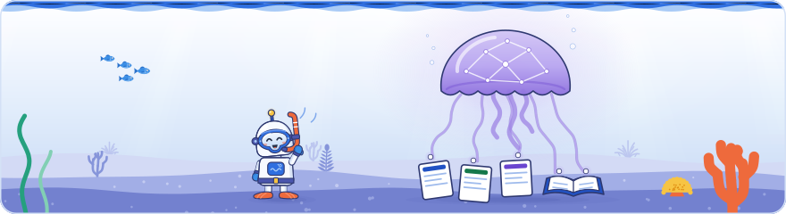

[Knowledge base](../../README.md) / [30-topics](../README.md) / **ai-features**

<!-- GENERATED by _system/build_kb.py. Do not edit; change 20-claims/ and rebuild. -->

# AI and Search

**How the AI features relate to classic Search, which AI systems already run inside it, how Gemini and AI agents use web content, and what that means for optimisation.**

<picture><source media="(prefers-color-scheme: dark)" srcset="../../_system/brand/illustrations/30-topics-ai-features-dark.svg"></picture>

## What's here

| Topic | Claims | Days | Sessions |
| --- | ---: | --- | ---: |
| [SEO vs GEO](seo-vs-geo.md) | 52 | 1 · 2 · 3 | 16 |
| [Query fan-out](query-fanout.md) | 38 | 1 · 2 · 3 | 8 |
| [llms.txt](llms-txt.md) | 17 | 1 | 3 |
| [AI-written vs human-written content](ai-content-detection.md) | 33 | 1 · 2 · 3 | 6 |
| [AI systems already inside Search](ai-in-search-systems.md) | 50 | 1 · 2 · 3 | 14 |
| [Gemini and Search](gemini-and-search.md) | 28 | 1 · 2 · 3 | 9 |
| [Content for people](helpful-content.md) | 125 | 1 · 2 · 3 | 17 |
| [Measuring success in the AI era](measurement.md) | 96 | 1 · 2 · 3 | 12 |
| [Chunking content for AI](chunking.md) | 10 | 1 · 2 | 2 |
| [AI crawlers and agents on your site](ai-crawlers-and-agents.md) | 75 | 1 · 2 · 3 | 13 |
| [Measuring AI visibility and brand impact](measuring-ai-visibility.md) | 44 | 1 · 3 | 4 |
| [AI in SEO and content workflows](ai-in-seo-workflows.md) | 47 | 1 · 2 | 2 |

*Claims* counts every public claim on the topic. *Days* and *Sessions* say where it was raised on a slide or on stage; a point from a session that was not recorded counts for its day, never as a session.

## In brief

- **[SEO vs GEO](seo-vs-geo.md)**: Google's position on both days is that GEO is not a separate discipline: AI Overviews and AI Mode use the same crawling and index as Search, are built on the core ranking systems and add grounding and query fan-out at serving, so good SEO is good GEO. Day 2 repeated and extended this: the AI features are a different experience of the same content, sites need no extra work to appear in them, and they use the same index structures and token-based snippets as classic results, with fan-out queries run against the Search index. Google's structured data talk said the same processed markup feeds classic results and AI features and that raw schema.org markup is generally not put straight into a model's context (said at the event, not in Google's docs), and Google's AI features guide says no special markup is needed for generative AI search. Google added that both retrieval routes, posting lists and vector embeddings, work from page content, so the content mantra Google started about 25 years ago still stands, while Google's internationalisation talk stressed that AI answers are still language-dependent. Day 3 closed on the same line: Google's final slide said AI on Google is just SEO, since AI Overviews and AI Mode use the same processes as traditional results and have very few of their own, so no new acronym is needed, and query understanding flows into the AI features too. Google said spam techniques aimed at manipulating AI responses violate the same spam policies, and its marketing research talk also advised optimising for people to win in generative AI search. A community speaker's agency found some pages doing better in AI features and third-party LLMs than in classic search, so its answer to whether good SEO is good GEO was 'it depends'. Author's view: that comparison mixed Google's AI features with other LLMs, so it does not refute Google's line; measure each surface separately. A second recording of Day 1 placed the 'GEO is not needed' line at the end of Gary Illyes's talk on what is new in Search; he traced 'SEO is dead' posts back to a 1997 forum post titled 'Search engine R.I.P.' and said the new AI features only create more opportunities for site owners. A community speaker argued the opposite on the label, for adopting GEO as a chance to leave SEO's bad reputation behind, while another said AI search changes the workflow but not the foundation and expands SEO's target to whether information is useful and easy to extract as a source. In the Day 1 Q&A a Google panelist said optimising for AI search can indeed hurt classic search, pointing to questionable GEO advice published online. A second recording of Day 2 confirmed that AI Overviews and AI Mode typically do not ground answers by reading pages live, unlike Gemini asked about a specific page, and that schema.org markup is first sorted, quality-checked and indexed before it is passed on as grounding context rather than put into a model's context as text.
- **[Query fan-out](query-fanout.md)**: Query fan-out expands one question into several related searches run at once, across subtopics and, for AI Mode, data sources such as the Knowledge Graph and shopping data as well as web content. Day 2 filled in the mechanism behind Day 1's grounding on the Search index: Google described the generated queries going to the index and the documents coming back with their token-based snippets, which become the source material for the AI answer (part of that passage is unclear in the recording), so a page that forbids a snippet cannot contribute one. Google's robots meta tag specification confirms that nosnippet keeps a page's content out of AI Overviews and AI Mode as a direct input and that max-snippet limits how much can be used. Google's guide warns that creating separate pages for fan-out query variations primarily to manipulate rankings or AI responses is scaled content abuse, and says its AI systems can judge relevance without an exact query match. Day 3 tied fan-out to classic query handling: Google's AI features send the query and its search results to an LLM, which returns new queries for Google to run, and Google treats those like typed queries, passing each through query understanding, synonym expansion included, while keeping them distinct for better coverage; synonym expansion belongs to traditional Search, and fan-out expands further. Google said fan-out queries are not added to Search Console (not in Google's docs, though its reports fit the statement) but can be seen in Gemini and some search APIs, and advised understanding that fan-out happens without overfocusing on individual fan-out queries, which differ from system to system. A second recording of Day 1 added Google's own framing: the keynote said Gemini lets Search understand the user's intent and fan-out then adds further queries to enrich the answer, as when a query about weeds in a lawn also looks for the best herbicide, a non-chemical solution and prevention, and Gary Illyes said fan-out is nothing new, firing, say, ten normal searches in the background on the same systems. Community speakers added that fan-out queries are often in another language than the prompt: a study (heard as Peec AI's) found 43% of prompts produced fan-out queries in another language, and a Spanish prompt about places to eat in Barcelona fanned out into English queries, so the content used to answer may be written for a different audience; one speaker said Microsoft is ahead of Google in showing site owners the grounding queries its AI uses. Author's view: in Peec AI's published analysis of over 10 million ChatGPT prompts, 43% is the share of fan-out searches for non-English prompts that ran in English, and nearly 78% of non-English prompt runs had at least one English fan-out, so cite the 43% as a share of fan-outs, not of prompts.
- **[llms.txt](llms-txt.md)**: Google said on a slide that llms.txt is not necessary, and its documentation says such files neither harm nor help because Google Search ignores them. The Day 1 Q&A, captured by a second recording, added detail: Gary Illyes said llms.txt does not matter for Google Search now and he does not expect it to, though he has been wrong before, and that it matters to some people, which is why Lighthouse audits it (Chrome's documentation treats the file as optional and marks the audit not applicable when it is missing). A Google panelist knew of no plan to use it and said a possible future change is no reason to implement it now, since most files come from an SEO plugin checkbox; he objected that the file is designed for allegedly intelligent systems that should be able to parse a website, and compared llms.txt to meta keywords: an agent should not trust what a site says about its own authority. Crawler requests for llms.txt, or for the satirical cats.txt, in server logs do not mean a file matters; Googlebot crawls any file it finds linked, with no other effect. A community speaker cited a third-party study (heard as Ahrefs') of almost 40,000 sites over one month, in which 97% of llms.txt files had no AI agent hits and the rest got about two hits a month, and advised against markdown copies of pages for agents. Author's view: Ahrefs' June 2026 study of 137,210 domains matches the 97% (of about 38,000 sites with the file), but the files that were fetched got around 20 requests each in May 2026, not two.
- **[AI-written vs human-written content](ai-content-detection.md)**: Raising on its own slide the question this topic usually prompts, whether it can tell AI text from human text, Google said its ranking systems are trained on content by humans for humans and promote natural content better. Author's view: that is not a claim of detection, and the risk is scaled, low-value content. Day 3 answered the question more fully: Google's quality talk said quality problems are quality issues, not AI versus human ones, because much good AI-assisted content exists, and the rater guidelines say the tool is not the problem but how it was used and what for. The risk is scale and deception: Google counts AI slop, mass-produced LLM content, as scaled content abuse, a Google speaker expected scaled content abuse to replace link spam as the spam type worth discussing, and the rater guidelines rate fake author personas with AI-generated headshots as Lowest. Google also said hallucinations cannot be removed with current training methods, so publishing unchecked AI output can harm a site's standing indirectly, and its closing slide said to use AI, responsibly. A second recording of Day 1 made the answer explicit: Gary Illyes said Google is not really trying to tell AI-written from human-written content because it cares more about quality than about how content was made, as the keynote also said, though he added that the more important documents in its index tend to be human-created and that the natural content its algorithms promote includes content created, or at least edited and reviewed, by humans (said at the event). On Day 2 he said AI-generated images on a site are up to the site owner and that Google shows them when users look for them, but that image models are poor at text, so sites should check them for hallucinations; Google's image metadata guide supports IPTC and C2PA labels for AI-made images.
- **[AI systems already inside Search](ai-in-search-systems.md)**: AI in Search is not new: Day 1 slides placed statistical models (in use for over 20 years, for spam and 'Did you mean'), BERT in indexing, and RankBrain and MUM in serving. Google's ranking systems guide lists BERT among its ranking systems without mentioning indexing and says MUM is not used for general ranking, and Google's 2021 MUM announcement covered text and images in 75 languages, with video and audio named as a future step, while the slide listed audio and video as well. Day 2 named more machine learning inside the pipeline: a BERT-like model trained on page structure detects soft 404s, machine learning weights the canonical-selection criteria and the weighting changes over time, index selection is a predictive ML system, and SpamBrain is now built on Gemini and fine-tuned for spam (all said at the event, not in Google's docs). Google also said it uses more and more AI to detect spam, with high accuracy in its testing, and Google said it can retrieve documents by the distance between document and query embeddings as well as through posting lists, both consistent with Google's published descriptions. Google's structured data talk set limits: Google cannot afford complex models on every indexed page, and LLM extraction does not yet reach the very high accuracy, around 99.9% as the speaker put it, that Google needs, one reason structured data still matters (said at the event, not in Google's docs). Day 3's closing talk described AI as an umbrella of technologies: Google said it has used machine learning for probably 30 years, starting with the statistical models behind 'Did you mean' (Day 1 said over 20 years), that some ranking features are still plain machine learning models because they suit the task better than LLMs, and that BERT is technically a predictive language model, an LLM in the purest sense. Hallucinations can happen with any model, and grounding or retrieval-augmented generation reduces but cannot eliminate them (said at the event). The quality talk's slide listed MUM next to BERT and RankBrain among the ranking systems, while Google's guide says MUM is not used for general ranking, and Google said AI has made its spam updates faster and broader. A second recording of Day 1 added the history: Google said it declared itself AI-first more than a decade ago, created and published the Transformer architecture, and takes a full-stack approach from its own TPU chips through research and Gemini to its apps, and that in 2025 it delivered a decade of innovation in 12 months, with its new Gemini model at the top of all the benchmarks. Gary Illyes said 'Did you mean' launched around 2001-2002 on a statistical model, which he counts as AI, that Google began talking publicly about AI in Search around 2015-2016 with RankBrain, and that MUM helps interpret the context of query words (a hiking-shoes query that mentions Mount Everest rather than Kilimanjaro); Cherry Prommawin said a majority of Search features now use AI (said at the event). Author's view: date these systems by Google's own posts (RankBrain 2015, MUM May 2021), not by the talk, which placed MUM three years after RankBrain.
- **[Gemini and Search](gemini-and-search.md)**: Gemini is not part of Search, but it uses Google's crawlers for data and grounds answers on the Search index; Google's crawler documentation defines that grounding as Search-index content given to the model at prompt time, controlled with Google-Extended. Day 2 contradicted part of Day 1's slide, which said Gemini shares tokenization with Search: Gary Illyes said Gemini's tokenization differs ('or mostly') and showed the AI-model tokenizer splitting 'robots.txt' and 'tl;dr' into pieces that the Search tokenizer keeps whole. Google also said Gemini training renders pages the same way Search does, that a Gemini user asking about a specific page triggers a live read that takes extra time, that Gemini in Chrome relies heavily on page screenshots and that SpamBrain is now built on Gemini (all said at the event; Google's docs say only, in general terms, that browser agents may analyse screenshots). Gary Illyes said Gemini's context window holds millions of tokens, and Erin Sparling urged making JavaScript content crawlable, renderable and fast, or server-side rendered, because AI systems increasingly ground answers on it. Author's view: Google documents grounding only from the Search index, so whether a live page read follows Google-Extended or ignores robots.txt like a user-triggered fetcher is unclear. Day 3's closing talk explained the models behind it: large language models are deep learning on internet-scale data that map concepts by context in an internal vector space, and adding grounding or retrieval-augmented generation reduces hallucinations but cannot eliminate them (said at the event, not in Google's docs). A second recording of Day 1 added the keynote's framing: Google takes a full-stack approach from its own TPU chips to Gemini and its apps, and Gemini lets Search understand intent before fan-out adds further queries; an audio recording of the keynote added Google's claim that in 2025 it delivered a decade of innovation in 12 months, with its new Gemini model at the top of all the benchmarks. Gary Illyes said Google does not own third-party chatbots such as ChatGPT and has no insight into them, and that crawling for Gemini may care less about quality and more about the amount of content, because for LLMs the number of tokens matters more (said at the event). On Day 2 he put the context window at millions of tokens and then at perhaps 900,000 to a million. Author's view: Google's long-context docs say Gemini models have context windows of one million or more tokens, so plan with about one million as the documented floor.
- **[Content for people](helpful-content.md)**: Google's repeated message is to optimise for people: it asks for unique perspectives and expertise beyond common knowledge, says content made for Search will not succeed, and calls optimising for people optimising for generative AI Search. Day 2 tied this to indexing: Google said index selection aims to keep only documents useful now or later, that page quality ultimately decides indexing, and that 'Crawled – currently not indexed' is most often a quality issue rather than a technical one (the index-selection details were said at the event, not in Google's docs). Google repeated Day 1's advice to focus on users, saying that creating content users like is a better use of time than combing documentation for signals, and Google said both retrieval methods work from page content, so the content mantra of about 25 years still stands. Google's video talk added that paying for a generative AI subscription does not make AI-generated videos succeed. Day 3 made content quality central to ranking: Google's quality talk defined it, as the rater guidelines do, by effort, originality, talent or skill and accuracy, contrasted commodity content built on common knowledge with unique, experienced takes, and said quality problems are quality issues, not AI versus human ones. Google added that pages need no synonym lists, because Google expands queries itself, and its guidance names writing to a word count or covering many topics in the hope of traffic as signs of search-engine-first content. Google's marketing research talk reached the same advice, optimise for people because a human makes the final decision, and the closing talk warned that chasing fan-out queries distracts from creating helpful content. A community case study, in which a niche article drew 28 times more clicks than a comprehensive one from far fewer impressions (no data source or period given), illustrated the point. A second recording of Day 1 added that the opening keynote closed with 'UEO', user engine optimisation, next to SEO and GEO: focus on the user and the rest will follow; it also said high-quality content may be created by humans or by AI, as long as it is made for users and not for search, and that information quality remains a core focus across Search, YouTube and Discover. Cherry Prommawin said quality is one of the most important things in ranking, and Gary Illyes said the natural content Google's algorithms understand and promote better includes content created, or at least edited and reviewed, by humans (said at the event). A Google host of the AI lightning talks advised always checking what AI tools do and focusing on what the business and its users need, and on Day 2 Gary Illyes said AI-generated images and videos must be checked for hallucinations. In Day 2's consolidation case study a community speaker kept only pages with real business potential, introduced the financial experts responsible for the content instead of an anonymous content factory, and credited the growth to quality rather than more content.
- **[Measuring success in the AI era](measurement.md)**: Google's answer to the myth that old metrics no longer work in the AI era was to measure success through metrics that matter to the business. For AI features, Google points to the Generative AI performance report in Search Console (launched 3 June 2026 and rolled out to all sites worldwide by 31 August 2026), which lists impressions, pages, countries, devices (Search only) and dates, with no click or query metrics. Author's view: the report's country breakdown helps compare AI visibility across markets, and Search Console, not site: queries or Google Trends, is where to judge a migration or Discover demand. Day 3 added detail and debate. Search Console's regular Performance report still counts AI Overviews and AI Mode traffic under the Web search type, while the generative AI report counts AI-surface impressions only, by page, country and device, and Google expects it to get richer; Google said fan-out queries are not added to Search Console (not in Google's docs). Google's published position (August 2025) is that total organic clicks are relatively stable, and its guidance is to judge visits by conversions and value, not clicks alone. Community speakers argued from the practitioner side that rankings and clicks no longer equal business outcomes, that traffic after an AI recommendation may arrive direct or through paid search, and, in one case study, that a niche article converted 10 times better than a comprehensive one with far more impressions (single cases, no published data). A second recording of Day 1 added more voices. Gary Illyes said the generative AI reporting launched with the generative AI control, starting with impressions only, and may expand; in the Q&A a Google panelist expected more AI reporting to launch, without a timeline or a promise, and Google said AI reporting should not simply mirror classic results, because users get more information before they click, so Google first has to work out which data is useful and actionable. Community speakers said the industry turned everything into a metric because budgets are approved on numbers, that most AI-visibility tracking copies rank tracking with invented prompts, and that one misplaced figure in an LLM-assisted data pipeline compounds downstream; one agency replaced monthly reports that took a workday each and went unread with an automated pipeline (data in, script, AI summary, dashboard). On Day 2 migration speakers advised merging both sites' analytics, comparing daily Search Console data and crawls with the pre-migration baseline and giving moved content its own baseline, and an international speaker warned that features often launch in some languages or countries first, so cross-market comparisons should not assume a feature is live everywhere. Author's view: after a migration, report indexing and traffic recovery separately, since they move on very different timescales.
- **[Chunking content for AI](chunking.md)**: Day 1's slide already answered an AI myth by saying there is no need to chop content, and on Day 2 Gary Illyes said the common SEO advice to chunk content for AI is misunderstood: chunking is real but matters at the level of a model's context window. He said Gemini's context window holds millions of tokens, so Gemini does not need content cut into pieces of 100 or 200 words; in the clearer wording of a second recording, once chunk size is thought of in millions of tokens, chunking has perhaps lost its meaning anyway. Author's view: rewriting pages into short, self-contained chunks for AI brings nothing; structure content for readers. He then put the window at perhaps 900,000 to a million. Author's view: Google's long-context docs give one million tokens or more, so plan with that as the floor. On Day 1 a community speaker linked the serial-position effect to the 'lost in the middle' pattern found in language models and advised placing the most important information at the beginning or end of content, where, in the speaker's experience on client sites, AI systems cited it more. Author's view: that is a community heuristic, not something Google has said its systems do; a short summary at the top serves readers either way.
- **[AI crawlers and agents on your site](ai-crawlers-and-agents.md)**: Google said its effort to render pages as users see them keeps its knowledge of the web current and that rendering JavaScript matters whether the client is a search crawler or an AI system, and a community speaker advised putting everything you want cited into the server-rendered HTML because some AI systems cannot render JavaScript yet. Google warned that AI agents browsing for users hit the same bot walls as scrapers and may buy elsewhere, and closed its duplication talk with 'Don't block agents'; John Mueller said AI crawlers do not really know what to do with nofollow links because they look at content (all said at the event, not in Google's docs). Google's documentation says user-triggered fetchers such as Google-Agent generally ignore robots.txt, and Google said a Gemini user asking about a specific page triggers a live read and that Gemini in Chrome relies heavily on screenshots (both said at the event; Google's docs describe neither specifically), extending Day 1's documented point that browser agents read screenshots, the DOM and the accessibility tree. Erin Sparling added that web standards such as WebMCP let a site expose tools that AI agents can operate (said at the event, not in Google's docs). Author's view: nofollow is not an access control; at Google, Google-Extended governs Gemini training and grounding and the Search generative AI setting governs AI Overviews and AI Mode. Day 3 raised the bar for shopping data: Google said data quality matters more for AI and even more for agents acting for consumers ('garbage in, garbage out'), since an agent with wrong data might buy the wrong product (said at the event), and Google launched the Universal Commerce Protocol on 11 January 2026 as an open standard for agentic commerce, compatible with A2A, AP2 and MCP. The second recording of Day 1 added Google's view of crawlers in general. Gary Illyes said AI agents are technically the same thing as crawlers, HTTP clients acting for a user or a service; Google runs probably hundreds, if not thousands, of crawlers on one infrastructure (its Inside Googlebot post speaks of dozens of other clients, and both say only the larger ones are documented), Googlebot is the crawler for web search including Search's AI features, and the only Google-owned crawlers that ignore robots.txt are contractual ones that crawl sites by agreement (Google's docs call them special-case crawlers). Google said AI Mode sits on its existing crawling infrastructure, so it brings no extra Googlebot crawling, although sites should expect more crawling overall from other services, AI services included. In the Day 1 Q&A a Google panelist said many AI crawlers are less sophisticated than search crawlers and may simply work through a site in order, because model training mainly needs a very large number of tokens, while search crawling tracks which pages change (Gary Illyes likewise said crawling for Gemini may care more about the amount of content than its quality; said at the event). Mainstream crawlers from Google, other search engines and AI companies try to follow robots.txt, so correct rules are the control and crawlers that ignore them are a scraping problem; user-initiated fetchers, and AI agents acting on a user's request, generally do not check robots.txt, which the panelist argued makes business sense because an agent sent to buy something could not otherwise complete the purchase. Nearly all mainstream AI systems use their own user agents, so robots.txt can set a policy for each, but the panelist doubted per-crawler policies make practical sense yet, called blocking all AI crawlers while allowing search crawlers a personal decision and called a default-deny robots.txt a bad pattern. Gary Illyes added that Google now sees more 403 responses (described on stage as 'authentication required') and, more recently still, more 402 Payment Required responses (not in Google's docs), and treats both like a 404, dropping the pages from Search and its AI features. A community speaker described agent readiness in three layers: visual stability (CLS) for how agents see a page; schema, landmarks, a logical heading order and ARIA for how they understand it; and WebMCP, a proposed standard Chrome lets sites test through an origin trial, for how they act on it; the speaker advised against markdown copies of pages for agents, and another community speaker advised against blocking AI training bots in most cases. Author's view: a logical heading order is an accessibility and agent concern rather than a Google Search requirement, structured data is not required for Google's generative AI search, and a Google user agent missing from the public lists is not proof of a fake request; verify with reverse DNS or Google's published IP ranges.
- **[Measuring AI visibility and brand impact](measuring-ai-visibility.md)**: A community speaker argued that rankings and clicks no longer equal business outcomes: visibility can rise while clicks fall, and traffic that follows an AI recommendation may arrive direct, through paid search or through another channel. In one controlled test with no other marketing changes, work on a brand's AI visibility coincided with more inquiries and a 36% rise in paid search click-through rate, figures from one unpublished test of one unnamed brand. The talk leaned on third-party studies (Similarweb on AI-recommended brands, a 2018 eye-tracking study on familiar brands) that Google has not published; Google's own position is that total organic clicks are relatively stable and that sites should judge visits by conversions and value, not clicks alone. This matches Google's Day 1 advice to measure success through metrics that matter to the business, and Google's AI features guide suggests tracking conversions and time on site to value traffic from AI features, because Search Console's generative AI report shows impressions but no clicks. Day 1's first lightning session, captured by a second recording, added community methods. One speaker proposed measuring AI search as a five-stage funnel (know, association, search, retrieval, selection) with metrics such as an AI bot allow rate, a brand association rate asked with web browsing switched off, and a brand co-occurrence rate in fan-out queries, arguing that most tracking covers only selection and copies rank tracking with invented prompts of unknown search volume. Another speaker said a study linking JSON-LD to AI visibility was followed by a controlled study that found no benefit, the markup being a sign of teams doing everything else right, that listicles earn more AI mentions because LLMs check that a thing exists rather than whether the content is honest, and cited a study (heard as Peec AI's) in which 43% of prompts produced fan-out queries in another language. An agency built its own AI visibility tracker to control the method, and a community speaker reported that on client sites AI systems cited information near the end of the content. In the Q&A Google said AI query data is hard to provide because AI questions do not map back to keywords and the data would have to be grouped to protect privacy while staying useful. Author's view: in Peec AI's published study the 43% is the share of fan-out searches for non-English prompts that ran in English, not a share of prompts. Google's AI optimisation guide says structured data is not required for generative AI search, so use markup for rich results and clear data, not as an AI-visibility lever.
- **[AI in SEO and content workflows](ai-in-seo-workflows.md)**: Day 1's first lightning session showed how practitioners use AI in SEO work. An agency SEO director uses AI only where it enriches work the team has already defined: people set the strategy buckets, scoring and rules, and AI pulls in the data and applies them, which cut a competitor keyword analysis from three days to a few hours; his lesson was that AI should not decide what good looks like. A second speaker showed how LLMs get search data wrong, for example calling a move in average position from 8 to 9 an improvement, and argued for receipts that trace every figure to its data request, for never letting a model check its own output and for giving it fixed metric definitions. A community speaker applied Pascal's line about false windows built for symmetry to LLMs, which sometimes are not trying to produce the most accurate figures or interpretations of them. Other talks showed an LLM loop that rewrites structured data until Google's structured-data test passes, a small model (Claude Haiku) choosing keywords under fixed rules (no brand terms, no navigation terms, at most two keywords per page), and monthly Search Console reports automated step by step with AI as a coding partner. Google's hosts closed by calling AI a tool that can be used well or badly and advised always checking what AI tools do. On Day 2 a community speaker described 'prompt journalism': a prompt-assisted workflow that cleans, maps and restructures recorded interviews into an article and social posts, to make more of material that already exists rather than to create more content. Author's view: a fix loop that stops when Google's test passes proves only that the markup is valid, not that its values are true, and the Search Console API itself is free, so the cost check before automating is about usage limits and the paid parts of the pipeline.

## How to use it

Open a topic for its summary and the claims it is based on, what to do, where it was discussed on each day, every claim (what was shown and said at the event, Google's documentation, press reports, analysis), related topics and sources.

> [!NOTE]
> **Generated** by `_system/build_kb.py`. Do not edit; change `20-claims/topics.yaml` or the claims in `20-claims/` and run `rebuild.bat`.

← [Publisher controls](../publisher-controls/README.md) · [All topics](../README.md) · [How Search works](../how-search-works/README.md) →

