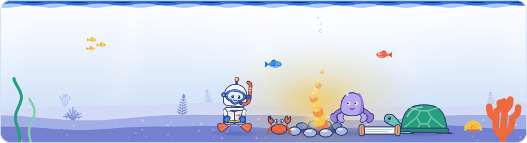

[Knowledge base](../../README.md) / [30-topics](../README.md) / **community**

<!-- GENERATED by _system/build_kb.py. Do not edit; change 20-claims/ and rebuild. -->

# Working with Google

**How the Search team says it works with the community, what SEO covers, and how to take part in the web standards Search builds on.**

<picture><source media="(prefers-color-scheme: dark)" srcset="../../_system/brand/illustrations/30-topics-community-dark.svg"></picture>

## What's here

| Topic | Claims | Days | Sessions |
| --- | ---: | --- | ---: |
| [Requesting features from Google](feature-requests.md) | 9 | 1 · 2 · 3 | 6 |
| [The scope of SEO](seo-scope.md) | 21 | 1 · 2 · 3 | 7 |
| [Web standards and how to take part](web-standards.md) | 25 | 1 · 2 · 3 | 8 |
| [Organic results are not for sale](honest-results.md) | 7 | 1 | 1 |

*Claims* counts every public claim on the topic. *Days* and *Sessions* say where it was raised on a slide or on stage; a point from a session that was not recorded counts for its day, never as a session.

## In brief

- **[Requesting features from Google](feature-requests.md)**: On Day 1, the advice for getting Google to build something, such as an addition to an API, was to request it publicly and in volume. Day 2 showed the other side: Google often needs to see a markup type adopted on websites before it invests in a feature that uses it, a chicken-and-egg problem that schema.org's usage statistics, published for every type and property since 2026, are meant to help break (said at the event, not in Google's docs). Google also asked site owners to report mistakes in its own systems, such as pages wrongly treated as soft 404s, in its forums. Author's view: markup for types Google does not use yet is a bet on future features, so check a type's usage bucket on schema.org before investing. Day 3 widened the channels: Google's quality talk invited attendees to share the quality issues they want Google to work on next, and the Search Console team asks for feedback on every new feature through its thumbs up and thumbs down buttons, which it said it takes very seriously; a community speaker publicly asked for query data in the generative AI report. A second recording placed that advice in the Day 1 Q&A, after a question about crawl stats in the Search Console API: Google added that its Search Relations team now talks with the Search Console team about the API more than before, partly because with so many vibe-coded systems around it is very easy to say 'use the Search Console API to do something', and annoying when Search Console has no API for that.
- **[The scope of SEO](seo-scope.md)**: SEO is not only content; it has many parts, as was said on Day 1. On Day 2 a community speaker extended this to rendering: many SEOs still treat everything beyond the raw HTML as the developers' business, while developers often do not handle rendering problems. Because even established brands showed rendering problems that were not fixed promptly, he argued that most sites probably have them too and that ignoring rendering is reckless. On Day 3 a community speaker argued that SEO is for humans, writing for people and their problems rather than to please Googlebot, and another said the challenge is no longer ranking but measuring and showing SEO's value to stakeholders as AI features take clicks. Google said it does not tell community speakers what to present and judged from their talks that the vast majority of SEOs have a very good handle on what is happening in Search. The second recording of Day 1 added the community's own framing. Google received close to 200 submissions for the lightning talks and gave each selected speaker seven minutes, because the community holds knowledge worth highlighting; on Day 2 it added a poster session for topics that need a longer one-to-one discussion, with posters ranging from SEO testing in CI/CD pipelines to complex migrations, and one by a Googler on bringing Google's tools into WordPress. Community speakers said the industry turned everything into a metric and reduced Google's push for fast sites to a checklist, and contrasted real audience understanding with keyword tools that turn People Also Ask questions into headings, but said much SEO work is plumbing, not gaming, since a site must be crawlable and visible before it is even considered. Another argued that search no longer happens in one place and that SEO's target expands rather than moves: technical SEO stays the foundation, and the new question is whether a page's information is useful and easy to extract as a source.
- **[Web standards and how to take part](web-standards.md)**: Robots.txt is defined by an internet standard, RFC 9309, which Google's Gary Illyes co-authored, but no RFC covers robots meta tags yet, and John Mueller invited attendees to help write one, saying standards groups are made up of ordinary people and need only passion and a willingness to join the discussions. Community speaker Natalia Venditto (Adobe) took up a similar remark, which two recordings have her crediting to Gary: the Web Fragments team wants to standardise the library's approach rather than maintain browser patches, and supports ShadowRealm, a JavaScript standard proposal that she said was at stage 2.7 at the time of the talk and would do much of the same isolation work (said at the event, not in Google's docs). Google's Erin Sparling said polyfills can also patch forward, letting a site build now for a feature expected in the future, and that web standards such as WebMCP, combined with schema-based interfaces, let a site expose tools that AI agents can operate (not in Google's docs). Schema.org is another open collaboration, and Google's structured data talk invited people who enjoy ontologies and data to join it. An audio recording of Day 1's robots.txt talk gave the standard's history: Martijn Koster proposed robots.txt in 1994 because bots were crashing servers, it was kept extremely simple so that anyone could implement and understand it, and its formal name is the Robots Exclusion Protocol; the standard requires parsers to skip lines they cannot read, and while writing RFC 9309 Google found opinions split roughly 50-50 on how to treat an unknown line between two user-agent lines (not in Google's docs). On Day 3 Google said its service level objective is to refresh robots.txt every 24 hours, as RFC 9309 calls for. Day 1's lightning talks, captured by a second recording, presented WebMCP in more detail: a way for a site to declare the actions it offers to AI agents, such as booking an appointment, with declarative tools (mostly HTML annotations such as form fields) and imperative ones (booking, filtering, adding to a cart); Chrome's documentation calls it a proposed web standard that sites can test through an origin trial from Chrome 149. In the Day 1 Q&A a Google panelist mentioned crawler best practices being written that would exempt research, malware-scanning and privacy crawlers, apparently because they sometimes need to ignore robots.txt or probe URLs other crawlers would not touch. Author's view: those best practices match the public IETF Internet-Draft 'Crawler best practices' (July 2025), a draft and not Google documentation.
- **[Organic results are not for sale](honest-results.md)**: On Day 1 the event host framed Search Central Live as being about organic Google Search, which is separate from Google Ads: Google does not accept payment to rank websites in organic search, and ads in Search are clearly marked as sponsored. Under Google's Honest Results Policy no website gets an advantage in Search because it is a Google client or partner or has a personal relationship with Google, and the Search team gives no site special treatment or support. For the same reason the event shared only information that is available to everyone and did not reveal secrets of the ranking formula; its stated goal was to put public information into context and show how the pieces fit together.

## How to use it

Open a topic for its summary and the claims it is based on, what to do, where it was discussed on each day, every claim (what was shown and said at the event, Google's documentation, press reports, analysis), related topics and sources.

> [!NOTE]
> **Generated** by `_system/build_kb.py`. Do not edit; change `20-claims/topics.yaml` or the claims in `20-claims/` and run `rebuild.bat`.

← [Search trends and Google Trends](../search-trends/README.md) · [All topics](../README.md)

