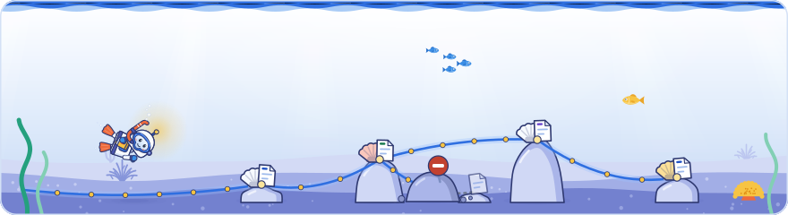

[Knowledge base](../../README.md) / [30-topics](../README.md) / **crawling**

<!-- GENERATED by _system/build_kb.py. Do not edit; change 20-claims/ and rebuild. -->

# Crawling

**How Google discovers and fetches URLs, and what gets in the way.**

<picture><source media="(prefers-color-scheme: dark)" srcset="../../_system/brand/illustrations/30-topics-crawling-dark.svg"></picture>

## What's here

| Topic | Claims | Days | Sessions |
| --- | ---: | --- | ---: |
| [The crawl pipeline](crawl-pipeline.md) | 33 | 1 · 2 · 3 | 8 |
| [URL discovery](url-discovery.md) | 33 | 1 · 2 · 3 | 9 |
| [Crawl errors](crawl-errors.md) | 53 | 1 · 2 · 3 | 7 |
| [Soft 404s](soft-404.md) | 40 | 1 · 2 · 3 | 10 |
| [HTTP versions and Googlebot](http-protocols.md) | 7 | 1 | 1 |
| [robots.txt rules](robots-txt.md) | 96 | 1 · 2 · 3 | 13 |
| [robots.txt group parsing differences](robots-group-parsing.md) | 9 | 1 | 2 |
| [Crawl budget](crawl-budget.md) | 51 | 1 · 2 · 3 | 8 |
| [Crawl rate limit (hostload)](crawl-rate-limit.md) | 29 | 1 · 2 · 3 | 5 |
| [Crawl demand](crawl-demand.md) | 34 | 1 · 2 · 3 | 6 |
| [Crawl demand inherited by path](crawl-demand-inheritance.md) | 5 | 1 · 2 | 2 |
| [Faceted navigation](faceted-navigation.md) | 13 | 1 · 2 | 4 |
| [HTTP caching for crawlers](http-caching.md) | 5 | 1 | 3 |
| [Directives and crawl budget](crawl-directives.md) | 32 | 1 · 2 | 5 |
| [Pagination and "load more"](pagination.md) | 10 | 1 · 2 | 2 |
| [Crawlable links](crawlable-links.md) | 38 | 1 · 2 · 3 | 6 |
| [Sitemaps](sitemaps.md) | 34 | 1 · 2 · 3 | 8 |
| [Similar URLs and URL normalisation](url-normalization.md) | 10 | 1 | 1 |

*Claims* counts every public claim on the topic. *Days* and *Sessions* say where it was raised on a slide or on stage; a point from a session that was not recorded counts for its day, never as a session.

## In brief

- **[The crawl pipeline](crawl-pipeline.md)**: URLs wait in a crawl queue, a shared scheduler decides what to fetch and when, and the crawler fetches while enforcing robots.txt and protecting servers. One centralised infrastructure serves Search, Ads, Shopping and Images. Day 2 showed an example of what the crawler hands to processing: a fetch record with the fetch result, connect time and time to first byte in milliseconds, the robots policies that apply (such as a Google-Extended opt-out) and the raw HTTP response; this record was shown on a slide and is not in Google's docs. Links extracted during processing go back to the crawl queue, and the renderer fetches JavaScript and CSS through the same crawler. Day 3 named a second crawler on that shared infrastructure: Google Shopping uses Storebot-Google instead of Googlebot because it needs fresh prices, availability and shipping details and crawls more often; it validates merchant feeds by double-checking prices on the site and crawls product, cart and checkout pages, as Google's Merchant Center help confirms, and its robots.txt group governs all Shopping surfaces. The second recording of Day 1 added the crawling talk itself. Cherry Prommawin defined a crawler as software that downloads pages, extracts their links and repeats the process, and opened with how the internet works, from TCP/IP to DNS and HTTP. Gary Illyes said Googlebot is an ordinary HTTP client with nothing special about it, and that Google runs probably hundreds, if not thousands, of crawlers but does not let teams build their own: all share one infrastructure and obey Google's internal crawling policies (Google's Inside Googlebot post speaks of dozens of other clients); he described it as a large distributed swarm of simple HTTP clients, roughly many wget or curl instances. The scheduler hands the crawler an ordered list that it works through from top to bottom, and teams prioritise differently: web search cares a lot about site and content quality, while Ads checks every publisher page as it comes in (said at the event). URLs extracted during indexing go back to the scheduler, and the crawl budget talk added that a request from any Google user agent is routed through the shared platform. Author's view: a Google user agent missing from the public lists is not proof of a fake request; verify with reverse DNS or Google's IP ranges.
- **[URL discovery](url-discovery.md)**: Google finds new URLs by following links from pages it already knows. Author's view: pages without internal links depend on sitemaps alone and are found slowly. Day 2 added that Google uses extracted links for discovery, for understanding a site's structure and for ranking, and extracts them from the HTML before rendering and again from the rendered HTML, sending new URLs back to the crawl queue. For large sites, a Google Q&A slide said good HTML sitemaps are hard to do well at that scale (said at the event) and advised relying instead on category hub pages that link to important pages, the kind of hub page Google's guide to how Search works also describes; Google's ecommerce guide recommends the same menu-to-category-to-product linking, with a sitemap or Merchant Center feed where not every product can be linked. Google said it sometimes picks up URLs written as plain text, but the remark was unclear in the recording and is not documented. Day 3 added scale and timing: Google said it knows hundreds of trillions of URLs (as of October 2026) but does not crawl them all, and estimated that discovering a new URL takes about 20 hours on average, from seconds to weeks or never (not in Google's docs). Author's view: since discovery and recrawling take far longer than indexing, internal links from often-crawled pages and accurate sitemaps are what speed results up. The second recording of Day 1 added that there are trillions of URLs on the internet or more, that even Google cannot tell how many, and that some may never be discovered; Google finds what to crawl mainly by extracting URLs from crawled pages and passing them back to the scheduler, and additionally from sitemaps, and may visit hub pages such as the homepage and category pages more often because they link to new or updated pages. Search Console's crawl data separates discovery fetches of new URLs from refreshes of known ones. Day 2's opening Q&A repeated that the effort an HTML sitemap takes on a large site is better spent on hub pages such as category pages.
- **[Crawl errors](crawl-errors.md)**: Google slows crawling when it sees 5xx or 429 responses, network timeouts, connection resets or DNS errors, and drops indexed URLs that stay unreachable. It cannot tell that a firewall or CDN rule is the cause, so a misconfigured block looks like a failing server. Other 4xx codes do not change the crawl rate. Day 2 added a second failure mode for bot protection: when a CDN or other bot protection shows Googlebot the same challenge page with a 200 status on many URLs, Google struggles to recognise it as an error and can cluster those pages as duplicates; Google's CDN post says recovery can be slow and recommends a 503 status for bot-verification interstitials. Google also said AI agents browsing for users hit the same bot walls and may go to another site (said at the event, not in Google's docs). Day 3 timed the effect: when a site starts serving 500 errors, Google lowers its crawl capacity within about four hours on average, and recovery takes weeks; Google's crawl rate guide says crawling picks up again automatically once the errors drop and warns against using error codes to slow crawling for longer than 1-2 days. The second recording of Day 1 filled in the status codes. Cherry Prommawin walked through the five classes: a 200 makes the returned resource eligible for indexing (although, as Gary Illyes put it, a 200 only means the server believes it did what was asked), a 204 has nothing to index, Google follows permanent and temporary redirects and indexes what the target returns, 404, 410 and 403 leave nothing to index, and 429 and 5xx make Google slow down so as not to break the site. Gary Illyes called DNS and network errors very common: DNS errors get a site removed from Search very aggressively, network errors and timeouts can also remove it from Search and with it from every feature that depends on Search, and most happen between the origin server and Google's data centers, often at a firewall, CDN, host or DNS provider, where neither side can see them, so the first step is to ask the host or CDN what changed; a rise in HTTP errors can also come from a CDN throttling crawlers by injecting 429 or 503 responses on the network path (Google's CDN post lists both codes as CDN blocks). He added that Google now sees more 403 responses (described on stage as 'authentication required') and, more recently still, more 402 Payment Required responses, and treats both like a 404, and that CDN captcha challenges served with a 200 end up classified as soft 404s; Day 2 said such pages can instead be clustered as duplicates, and Google's CDN post describes both outcomes. Google pointed to the Crawl Stats report (Settings, Crawl stats) and server logs as the main tools for debugging crawl errors, and to the reasons in the Page indexing report for spotting patterns, which is also where soft 404s are looked up. In Lightning session B Dave Smart showed a quieter failure: robots.txt is checked for every URL in a redirect chain, so a redirect through a disallowed URL, an external authorisation service or a step served only to Googlebot stops the crawl and the page is reported as blocked (not in Google's docs). Author's view: do not answer verified Googlebot with 401, 402 or 403 from a login wall or paywall; and while 4xx responses do not slow crawling, a 404 is still a fetch that counts towards crawl budget.
- **[Soft 404s](soft-404.md)**: A soft 404 returns a success code while its main content looks like an error or an empty page; Google keeps it out of the index but keeps crawling it, which wastes crawl budget. On Day 2 Google explained that it detects soft 404s with a BERT-like language model trained on page structure and layout, so an error message alone in the main content makes a soft 404 while an error in the navigation need not, and simple keyword matching would not work (said at the event, not in Google's docs). Google listed four common causes that its troubleshooting guide also names (pages that look like errors, thin or empty content, server or CMS misconfiguration, JavaScript content that fails to load) and a fifth said only at the event, mistakes in Google's own systems, which it asked site owners to report in its forums. Single-page apps are a frequent source because the server returns 200 for every route, and Google documents a real 404, a JavaScript redirect to a URL that returns 404, or a noindex added with JavaScript as fixes. Soft 404s are also clustered together as duplicates, and index selection drops any that earlier steps missed. On Day 3 an audience member reported that on one large client site, pages clustered as soft 404s were still recrawled, but only every 160 to 190 days (one site's observation, not Google data). The second recording of Day 1 added the full definitions: Cherry Prommawin called a soft 404 a 404 in disguise, a 200 page whose content says 'not found', information the site should have sent as the status, and said soft 404s are still crawled like normal pages, with their bigger consequences in indexing; Gary Illyes called them one of the biggest problems on the internet right now for crawling and showing up in Search, and said a 200 only means the server believes it did what was asked. CDN captcha pages served with a 200 end up classified as soft 404s (Day 2 added that they can also be clustered as duplicates; Google's CDN post describes both outcomes), and Google's status code page says a 204 or an empty 2xx page also shows as a soft 404. Day 2's second recording confirmed that a client-rendered page that renders empty for Google is seen as thin content before it is treated as a soft 404, and Google's site move guide warns that redirecting many old URLs to an irrelevant page such as the home page might be treated as a soft 404. An audio recording of Day 1 added that soft 404s, like some other problem categories, are looked up in Search Console's page indexing report, while other crawl issues are debugged in the Crawl Stats report.
- **[HTTP versions and Googlebot](http-protocols.md)**: Google's crawlers use HTTP/1.1 and HTTP/2, not HTTP/3. Author's view: serving HTTP/3 to browsers is fine as long as the older versions keep working. Day 1's second recording added the basics behind it: a URL states how a resource is requested (HTTP or HTTPS), where (the host) and what (the path), and DNS, the internet's address book, is consulted for each request to find the host's IP address.
- **[robots.txt rules](robots-txt.md)**: A crawler obeys only the most specific group that names it; within the group the longest matching path wins, and ties go to the less restrictive rule. An audio recording of Google's Day 1 robots.txt talk added the history and the basics. Robots.txt began in 1994, when Martijn Koster proposed a text file of access rules because bots were crashing servers; Google has supported it since it started crawling in 1996, and it is now an IETF standard, RFC 9309, the Robots Exclusion Protocol, which Google follows because anyone who wants to opt out of crawling should be able to. Google stressed that the protocol only controls which automated clients may access what, not how the content is used, and that it is not a security measure: the file always sits at the root of the host, where anyone can read the paths it disallows, so a secret folder needs authentication. Everything is implicitly allowed, so an allow rule only re-opens a path inside a disallowed one; * matches any characters and $ ends the match, so user-agent: *, disallow: / and allow: /$ let unnamed crawlers fetch only the homepage. Comments start with #, and the talk pointed to the ASCII-art robots.txt of thebestfriedchickenever.com to show why they are useful. Google called the format extremely forgiving: lines a parser cannot read are skipped, a typo in a path blocks only the wrong path and a misspelt rule name makes Google ignore that line (not in Google's docs). Search Console's robots.txt report shows the file as Google last fetched it, with a version history and the errors and successes of each fetch; Google said the report uses its open-source parser and helps catch CDNs that change robots.txt without the owner knowing and hosts that cloak the file, which happens more often than people think (not in Google's docs). In Lightning session B Dave Smart added that robots.txt is checked for every URL in a redirect chain and crawling stops at the first blocked one: a page that redirected through a disallowed /cart/ URL to set the local currency was reported as blocked, and Search Console names only the first URL of the chain, which is not itself disallowed; the same happens with an external authorisation service blocked by its own robots.txt, content that moved through several URLs and redirects served only to Googlebot (the per-URL check is not in Google's docs). Google supports only user-agent, allow, disallow and sitemap, and Day 2 confirmed that a sitemap line can be picked up by any crawler, while a sitemap not listed there has to be submitted, for example in Search Console. A disallow is not a noindex: Google does not index a disallowed page's content, but its URL can still appear in results. Google said it will not treat a disallow as noindex because some very important sites block their most important pages by accident (said at the event, not in Google's docs). Day 2 also showed that disallowing JavaScript or API endpoints a page needs for rendering leaves its content missing, and that rules apply per host, so an API or CDN on its own hostname has its own robots.txt. Day 3 added timing and Shopping: Google said its service level objective is to refresh robots.txt every 24 hours, as RFC 9309 calls for and its robots.txt guide confirms, though delays happen, and that requesting a recrawl in Search Console's robots.txt report refreshes it sooner. Rules addressed to Storebot-Google affect all Google Shopping surfaces, such as the Shopping tab. The second recordings added Google's own stance. Gary Illyes said all of Google's automated crawlers obey robots.txt, which Google treats as the way site owners opt out of its crawling, except contractual crawlers that crawl by agreement; on Day 2 Google repeated that site owners should be able to opt out, for legal reasons or for crawl budget, and in the Day 1 Q&A said it follows robots.txt partly in its own interest, since crawling a blocked infinite URL space would waste its time too. Mainstream crawlers from search engines and AI companies try to follow robots.txt, so correct rules are the control; user-initiated fetchers and agents acting for a user generally do not check it, and a panelist noted that much of robots.txt is written for search engines, which should never add items to a cart, while an agent probably should. A panelist also mentioned crawler best practices in progress that would exempt research, malware-scanning and privacy crawlers, apparently because they sometimes need to ignore robots.txt or probe URLs other crawlers would not touch. Day 2's opening Q&A said listing a sitemap in robots.txt is fine but makes the sitemap public, and explained why a disallow is not a noindex with a national tax authority that blocks very important PDFs: Google can show their URLs but cannot index their content; very few disallowed URLs are in the index, and John Mueller added that robots meta rules only work if robots.txt lets Google fetch the page. For media, rules for Googlebot-Image and Googlebot-Video control image and video indexing, and a video blocked by robots.txt is not shown by its bare URL at all (said at the event, not in Google's docs). Author's view: the best practices mentioned match the public IETF draft 'Crawler best practices', not Google documentation; and Google's docs name links from elsewhere as the reason a disallowed URL can still be indexed, so keep an important page crawlable with noindex if it must stay out of Search. Author's view: Google's open-source parser in fact accepts common misspellings of disallow and user-agent, though not of allow, and other crawlers may be stricter, so spell rule names correctly.
- **[robots.txt group parsing differences](robots-group-parsing.md)**: A user-agent line with its allow and disallow rules forms a group, and one group can name several crawlers; Google's Day 1 robots.txt talk advised giving a named crawler its own group only when it needs rules the * group should not grant to every crawler. Groups are not additive: a crawler that a named group matches follows only that group, so a Googlebot group that blocks /dogs/ leaves Googlebot free to crawl what the * group blocks, as Dave Smart showed in Lightning session B and Google's specification confirms. The talk's quiz made the same point: to let Googlebot crawl /staging/preview/ while keeping the rest of /staging/ closed, the answer was a Googlebot group with both the disallow and the allow, and Google's specification combines all groups that name the same user agent into one. Crawlers disagree on how to treat an unknown line between user-agent lines: Google said that while writing RFC 9309 it asked people whether the first crawler should inherit the rules that follow and opinions split roughly 50-50 (not in Google's docs). Googlebot ignores the line and merges the groups, as Google's robots.txt specification documents, while a Google slide showed Bing ending the group there instead, so the same file can block one crawler and not another. Author's view: Content-Signal lines are now common because a large CDN provider adds them to its managed robots.txt files, so put any non-standard line after a group's rules and test the file with each search engine's tools.
- **[Crawl budget](crawl-budget.md)**: Crawl budget is crawl rate limit combined with crawl demand. Google's crawl budget guide is written for sites with over 1 million unique pages changing weekly, over 10,000 pages changing daily, or many URLs reported as 'Discovered – currently not indexed'. On Day 2 Google called that status a crawl-scheduling state in which it knows a URL but does not want to crawl it yet (said at the event), while the Page indexing help explains it by expected server overload. A Google slide also questioned whether a new URL that fits a known duplicate URL pattern even needs to be crawled (not in Google's docs). Author's view: rule out slow responses and server errors first, then treat slow crawling of a smaller site as a demand problem, which means quality. Day 3 gave the scale: Google said it knows hundreds of trillions of URLs (as of October 2026) and does not crawl them all, because a much smaller crawl space is enough, and its crawl chart said discovering a new URL can take weeks or never happen. The second recording of Day 1 added the crawl budget talk and the Q&A. Crawl budget is the finite resources Google allocates to crawling one site, which decide how many of its pages are discovered and how often they are revisited; Google crawls every URL that differs even when it leads to the same content, so infinite spaces such as calendars burn it, and the content worth improving or removing includes low-quality, spam, duplicate and soft error pages. Not every site needs to worry, and never did: a site under a few thousand URLs likely has no crawl budget problem, news sites are crawled aggressively anyway, and a higher crawl rate does not make a URL rank better. Every 2xx fetch consumes crawl budget, while 4xx responses were said not to affect it. To check for a problem Google pointed to the Crawl Stats report: whether total crawling has plateaued, whether the average response time limits Googlebot, the file-type breakdown for anomalies and the discovery versus refresh split. Log files alone cannot show inefficiency, because they do not reveal where the crawl limit lies, but they help on sites with filter parameters; many complaints turn out to come from a plugin, such as a WordPress calendar plugin that adds calendar parameters to the URLs of every page, and Google learns that such URLs are useless only from large samples; a panelist said useless plugin-generated parameter URLs can be handled at the web server, for example with an Apache rule, which saves crawl budget for the URLs that matter (the exact mechanism is not clear in the recording). For news sites Gary Illyes advised measuring the time from publishing a URL to Googlebot's first crawl and investigating only a rising trend, adding that for fresh stories something like two hours is probably not great, while John Mueller said that if Crawl Stats shows about half of crawling going to discovering new pages, crawling of new pages is not the problem; Gary Illyes said disallowing a section such as /ads shifts crawl budget to the rest of the site. Author's view: Google's guide says freed crawl budget shifts only on sites that already hit their capacity limit, a 404 is still a fetch that counts towards crawl budget, and a site between a few thousand URLs and Google's million-page threshold should check Crawl Stats before blaming crawl budget; for a consolidation of about 2,000 URLs the crawl-budget gain is likely minor.
- **[Crawl rate limit (hostload)](crawl-rate-limit.md)**: Hostload, the crawl capacity limit, is a host-wide limit shared by all Google crawlers, so heavy crawling by one Google product can leave less capacity for the others. It falls when connect time or time to first byte rise, or when the server returns 429, 5xx or network errors. On Day 2 a Google slide showed an example fetch record, as passed on to processing, that includes connect time and time to first byte in milliseconds (not in Google's docs). Day 3 gave timings: when a site starts serving 500 errors, Google lowers its crawl capacity within about four hours on average, while increases take one to three weeks because Google first needs to know that higher demand will last, and a continuously running process recalculates capacity within about a month (the spoken and slide figures differ slightly and are not in Google's docs). Google's crawl rate guide confirms that many 500, 503 or 429 responses reduce the crawl rate, which recovers automatically once the errors drop. The second recording of Day 1 added that crawl rate limit, or hostload, is a proxy for how many requests per second the connection to a site can handle, and that it applies per host, not necessarily per site: a site's CDN, app, subdomains and www host may be different hosts. Cherry Prommawin said 429 is the one 4xx code that tells Google to slow down, and that a 5xx makes Google slow down so as not to break the site; a rise in errors can come from a CDN throttling crawlers by injecting 429 or 503 responses on the network path. In the Q&A Google said that when higher demand brings more crawling than a server can cope with, Google reduces it again, and, asked how a site of about 100 million pages can tell a crawl capacity problem from a crawl demand problem, that a capacity drop is most of the time an abrupt step down, illustrated as hostload falling from 10 to 5, which a panelist said means up to five requests per second, and that a fall in the number of connections Googlebot opens shows the capacity limit changed. Google added that demand from Search, Google Ads or another Google product raises crawling only as far as the site's crawl capacity allows. Author's view: Google's crawl budget guide does not express the capacity limit in requests per second but as the total time a server spends holding connections open for Google, counting parallel connections and their duration, so fewer connections is the documented form of a lower limit. Author's view: to slow crawling for a short time return 429 or 503, never 401, 402 or 403, which Google treats like 404.
- **[Crawl demand](crawl-demand.md)**: Crawl demand is how much Google wants a site's URLs, and each Google crawler has its own. It rises with site quality, how often URLs change and how popular they are on the web. On Day 2 Google said site owners can influence 'Discovered – currently not indexed' by getting other URLs of the site indexed and showing that its content is useful to users. Google's robots meta tag specification adds that Googlebot considerably lowers the crawl rate of a URL after the date in its unavailable_after rule. Day 3 put demand in time: Google estimated that recrawling a known URL takes about 30 days on average, from seconds (for news sites, a likely reading of the recording) to never, since URLs not recrawled for a very long time are dropped from the index, and that a crawl demand update driven by Search takes about 20 hours (estimates not in Google's docs). When the web gets excited about a few URLs, Google raises crawl demand for the whole site, and other Google products such as Shopping create their own demand; increases in crawl capacity take one to three weeks, longer than decreases. An audience member's large client site showed recrawl frequency following site hierarchy, demand and internal linking, with pages clustered as soft 404s recrawled only every 160 to 190 days. The second recording of Day 1 added how the scheduler sets demand: it logs how often each page changes and crawls frequently changing pages first (a news homepage before its terms of service page), very likely deprioritises URLs or sites known to be historically spammy, and visits hub pages such as the homepage and category pages more often because they link to new or updated pages. The crawl budget talk said the quality that drives demand is that of the site as a whole, and that frequent crawling is a consequence of interest and quality, not a cause of better rankings. In the Q&A Google said crawl demand is not only Search's: when enough of a site's URLs are wanted by Search, Google Ads or another Google product, it raises the site's crawl demand and crawls up to it as far as crawl capacity allows, which Day 3 repeated with Shopping as the example. It also said very large, constantly changing sites get no special handling: frequently changing URLs, or URLs useful to users, raise demand and Google tries to raise its capacity, the same logic as for small sites; news sites are crawled aggressively anyway; and, asked how a very large site can tell the two apart, that a drop in crawling is hard to attribute to lower demand or a lower capacity limit, although a capacity drop is most of the time an abrupt step down. Author's view: read site quality as the baseline, with known URL-level signals still counting, as the same talk's slide and Google's crawl budget guide suggest.
- **[Crawl demand inherited by path](crawl-demand-inheritance.md)**: When Google does not know a URL's quality or popularity, it uses the aggregate of its parent path, then that path's parent. This was shown on a slide and is not in Google's public documentation. Day 2 extended the idea to indexing: Google said index selection is more forgiving with new URLs from a site, or even a section, that already satisfies users well (said at the event, not in Google's docs). Author's view: new content therefore starts with the reputation of the folder it sits in, for crawling and for indexing. Day 1's second recording added a stage remark that the quality driving crawl demand is that of the site as a whole. Author's view: read it beside the slide's fallback to the parent path, which applies only when a URL's own quality is unknown: site quality sets the baseline while known URL-level signals still count.
- **[Faceted navigation](faceted-navigation.md)**: Filter and sort URLs multiply into near-infinite combinations and are a classic crawl budget leak. Google prefers blocking them in robots.txt and keeping only item pages and one unfiltered listing crawlable. Day 2 added that non-crawlable link markup, such as onclick handlers and hash pseudo-links, is common in single-page apps, so sites with faceted navigation should check their links for it. Author's view: hash fragments can deliberately keep filter states out of the crawl, as Google's faceted navigation guide allows, as long as product, category and language links use real URLs. Day 1's second recording added that Google crawls every URL that differs even when it leads to the same content, so infinite URL spaces burn crawl budget; a community speaker advised checking that every parameter in a request is used and in the expected order and redirecting otherwise, and in the Q&A Google suggested working out the normalised URL and redirecting parameter variants to it, which costs crawl budget at first but leaves a clean slate, said log files are worth checking on sites with filter parameters, and noted that many crawling complaints trace back to plugins that generate URLs, such as calendars, whose useless parameter URLs can be handled at the web server.
- **[HTTP caching for crawlers](http-caching.md)**: Supporting conditional requests lets Google skip re-downloading unchanged pages. Answer with 304 Not Modified, and prefer ETag. Day 1's second recording added that Gary Illyes named Last-Modified and ETag as the response headers that matter for caching, and that Cherry Prommawin described a 304 as telling Google's crawler that the content has not changed since its last visit.
- **[Directives and crawl budget](crawl-directives.md)**: Disallowed URLs are not fetched, so they cost no crawl budget. Pages with noindex must be fetched, so they do; nofollow is a hint, not a block, so the linked URLs can still be crawled, and crawl-delay is ignored by Googlebot. Day 2 stressed that robots.txt does not control indexing: a disallowed URL can still appear in results without its content, and a noindex on a blocked URL is never seen. John Mueller advised against the page-level nofollow robots rule, which stops signals passing through every link on the page, in favour of rel=nofollow on individual links. He also said AI crawlers do not really know what to do with nofollow, without saying whose crawlers he meant (not in Google's docs). A second recording of Day 1 explained the slide on nofollow: Google does not crawl through the nofollow link itself but still crawls the linked page when it finds it through other links, as Google's 2017 crawl budget post also says. A second recording of Day 2 confirmed John Mueller's remark that if robots meta tags were reinvented today the page-level nofollow rule would probably not be part of them. Day 2's opening Q&A illustrated why a disallow is not a noindex with a national tax authority that blocks very important PDFs, whose URLs Google can show without their content, and John Mueller said robots meta rules only work if robots.txt allows the fetch. Disallowing an image or video file keeps it out of Google, and a disallowed video is not shown by its bare URL. In the Day 1 Q&A Gary Illyes said disallowing a section such as /ads shifts crawl budget to the rest of the site. Author's view: Google's guide says freed crawl budget shifts only on sites already at their capacity limit, so block only sections you never want crawled.
- **[Pagination and "load more"](pagination.md)**: Google's crawlers do not click buttons, so each page in a series needs its own URL and a normal `<a href>` link to the next. Google's pagination guide says later pages should not use page 1 as their canonical. On Day 2 Google said on stage that pointing paginated pages' canonical to page 1 can sometimes make sense, for example to make a category page more visible, but that it affects canonicalization and deduplication; this contradicts Day 1 and is not in Google's docs, and a 2013 Google post says the content of the later pages would then not be indexed at all. For infinite scroll, Google has said it renders with a very tall viewport that can miss content, and its lazy-loading guide asks for paginated loading with a unique URL per chunk. Moving to infinite scroll or a load-more button was called risky, depending on what you want to achieve, because Googlebot does not click buttons. In the Day 1 Q&A, captured by a second recording, Google answered a question about replacing thousands of paginated category pages with a JavaScript load-more button: without crawlable links to the further pages, Google will not see them at all.
- **[Crawlable links](crawlable-links.md)**: Google extracts links from a page's HTML ('We like links.') to discover pages, understand site structure and rank, sending new URLs back to the crawl queue, which extends Day 1's point that discovery runs on links. Only an a element whose href holds a real URL is dependable: Google's slide put onclick-only links (Googlebot does not click, as on Day 1), routerLink without href, href on a span and javascript: URLs under 'can not extract', while its documentation calls them not recommended and says Google may still try to parse them. Links are extracted before and after rendering, so JavaScript-added a href links can count, but a community speaker showed navigation that exists only after rendering being lost when rendering fails. Day 2 repeats Day 1 on fragments: Google cannot request the part of a URL after #, which Google called the next most common JavaScript issue, so single-page apps should use real paths with the History API, a change it called not free but relatively straightforward. A community speaker showed a language selector built as a button that orphaned a whole set of language versions; Google said it sometimes extracts plain-text URLs too, but that passage of the recording is unclear. Day 3 timed link processing: Google estimated that link annotations are processed in minutes to 1-3 weeks, with an end point of about a year (not in Google's docs), and an audience member's large site showed recrawl frequency following site hierarchy and internal linking. In the Day 1 Q&A Google said that if paginated pages are replaced by a load-more button or infinite scroll without crawlable links, Google will not see the further pages at all; on Day 2 migration speakers stressed updating internal links so moved pages do not rely on redirects alone.
- **[Sitemaps](sitemaps.md)**: A sitemap line in robots.txt lets any crawler find the sitemap; a sitemap not listed there has to be submitted, for example in Search Console. For HTML sitemaps on large sites, a Google Q&A slide said good HTML sitemaps are hard to build at that scale (said at the event) and advised relying instead on category hub pages that link to the important pages; Google's ecommerce guide recommends the same linking, with a sitemap or Merchant Center feed where not every product can be linked. As a canonical signal, listing only the preferred URL in sitemaps was named on stage among the signals that make a big difference, but Google's canonical guide rates sitemap inclusion as weak next to redirects and rel=canonical. Image and video sitemaps help Google find media, and an XML sitemap is one of three equivalent ways to declare hreflang. Author's view: sitemaps support discovery but do not replace internal links, because pages known only from sitemaps are found slowly. Day 3 timed sitemaps and tied them to quality: Google estimated that processing a sitemap takes about 24 hours on average and that it tries to refetch a useful sitemap of a high-quality site within 14 days at most (neither figure is in Google's docs), while it may never fetch a lower-quality site's sitemap again. The second recordings added Google's framing: Gary Illyes said Google finds what to crawl mainly by extracting URLs from crawled pages and additionally from sitemaps, an XML format from around 2005 that is 'nothing fancy' but still used, and in the Day 1 Q&A Google said there is no sweet spot to find for a sitemap: technically it should list every URL you want indexed, so that Google can find each of them; for a migration, listing the new URLs in a sitemap cannot hurt but is not the main tool. Day 2's opening Q&A said a site that wants an HTML sitemap can make one but the effort is better spent on hub pages, and that listing a sitemap in robots.txt is fine but makes it public. For migrations, Google's site move guide and a community case study both submit the new sitemap. Gary Illyes said video sitemaps are not critical but good to have, because Google ingests them much more often than it can process HTML pages and they tell it which URLs carry videos (said at the event).
- **[Similar URLs and URL normalisation](url-normalization.md)**: On Day 1 community speaker Tobias Schwarz treated similar URLs, technically different URLs that differ in only a few characters, as an indicator of duplicate content, broken links, unnecessary redirects and other technical issues. He showed five kinds on well-known brand sites: a different protocol or host (HTTP vs HTTPS, www vs non-www), capitalisation, the number of delimiters such as slashes, a space encoded as %20 in one URL and + in another, and parameters in a different order. To find them he normalises a URL list twice, first without changing the URLs' meaning and then into a deliberately uniform form that groups similar URLs together. Because anyone can link to a variant, he advised that the application compute the expected URL for every request and redirect, or return an error, when the requested URL differs, including checks on unused or reordered parameters and on numeric IDs written with leading zeros. In the Day 1 Q&A Google likewise suggested working out the normalised URL and redirecting parameter variants to it, which costs crawl budget at first but leaves a clean slate, and a panelist said Tobias Schwarz's slides had pleased the engineer side of his brain. Author's view: of the two answers, Google's canonicalization guide favours the redirect, a strong signal that its target should be canonical, while an error page throws away the links pointing at the variant.

## How to use it

Open a topic for its summary and the claims it is based on, what to do, where it was discussed on each day, every claim (what was shown and said at the event, Google's documentation, press reports, analysis), related topics and sources.

> [!NOTE]
> **Generated** by `_system/build_kb.py`. Do not edit; change `20-claims/topics.yaml` or the claims in `20-claims/` and run `rebuild.bat`.

← [How Search works](../how-search-works/README.md) · [All topics](../README.md) · [Rendering and JavaScript](../rendering-javascript/README.md) →

