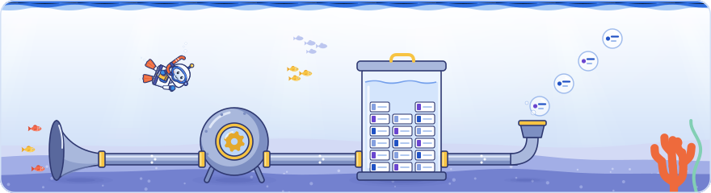

[Knowledge base](../../README.md) / [30-topics](../README.md) / **how-search-works**

<!-- GENERATED by _system/build_kb.py. Do not edit; change 20-claims/ and rebuild. -->

# How Search works

**The pipeline every page goes through, from the crawl queue through processing and the index to serving.**

<picture><source media="(prefers-color-scheme: dark)" srcset="../../_system/brand/illustrations/30-topics-how-search-works-dark.svg"></picture>

## What's here

| Topic | Claims | Days | Sessions |
| --- | ---: | --- | ---: |
| [The pipeline: crawling, indexing, serving](pipeline-overview.md) | 21 | 1 · 2 · 3 | 12 |
| [Ranking signals by result type](ranking-signals-by-vertical.md) | 6 | 1 · 2 · 3 | 5 |
| [How long Google's processes take](processing-times.md) | 38 | 1 · 3 | 2 |

*Claims* counts every public claim on the topic. *Days* and *Sessions* say where it was raised on a slide or on stage; a point from a session that was not recorded counts for its day, never as a session.

## In brief

- **[The pipeline: crawling, indexing, serving](pipeline-overview.md)**: Search works in three stages, crawling, indexing and serving, and AI Mode and AI Overviews share the crawling and indexing stages with classic Search, adding grounding on the index and query fan-out only at serving; Day 2 repeated that they are a different experience of the same content. Day 2 filled in the middle: a processing stage between the crawler and the index runs HTML parsing, rendering, deduplication, feature extraction, signal extraction and index selection, and sends the links it finds back to the crawl queue. Google's how-Search-works guide describes rendering as part of the crawl, while the event slides drew it inside processing. Gemini is not part of Search but uses Google's crawlers and grounds on the Search index; Day 2 qualified the shared tokenization mentioned on Day 1, showing that Gemini's tokenizer splits text differently from the one Search uses. Day 3 drew the serving stage: query understanding and retrieval lead into the index, then ranking and search features lead back to the user, and AI features send their fan-out queries back through the same search engine. Google said its processes depend on each other, crawling, then indexing, then serving, so a change such as a new canonical cannot be processed until the page is recrawled, and that AI Overviews and AI Mode are built on Search infrastructure 25 to 30 years old with very few processes of their own. Day 1's second recording added that crawling and indexing happen before anyone searches while serving and ranking happen in real time, and that AI Overviews and AI Mode may have extra processes of their own like any search feature but share the bulk of their processing with normal Search.
- **[Ranking signals by result type](ranking-signals-by-vertical.md)**: A Day 1 slide said signals differ by result type: web pages rely on text, links and passages; images on resolution, colour and associated text; news on freshness, originality and diversity; local on location, type, rating, reviews and hours; video on language and text from speech. Google's documentation does not list signals this way. Day 2 expanded two of them: the text around an image is critical context for understanding and ranking it, so alt text alone is not enough, which is consistent with Google's image SEO guide; and freshness counts for queries that deserve fresh results, such as a breaking local event, as Google's ranking systems guide confirms. Google added that some freshness signals are calculated during indexing and used in ranking. Day 3's quality talk repeated the split by result type: text, links and passages for web pages and, probably, freshness, diversity and originality for news. A community speaker said Google loves fresh content (not in Google's docs). Author's view: Google's 'query deserves freshness' systems are narrower than a general preference for fresh content, so refresh pages whose queries expect current information and judge other refreshes by quality.
- **[How long Google's processes take](processing-times.md)**: Google shared estimates from internal analysis of how long its processes take, as information rather than targets: discovering a new URL takes about 20 hours on average and recrawling a known URL about 30 days, while indexing a document takes about 1.5 hours on average (probably lowered, Google said, by the many news sites). A robots.txt change is picked up in about 24 hours, as Google's docs say, and a sitemap is processed in about 24 hours. After a 404 or noindex a page usually leaves the index within one to three weeks, a canonical change also takes one to three weeks, a site move one to three months and a Search Console removal about 2 hours; snippet and title changes take 1-2 days, removing a manual action 1-2 weeks, and a core update reaches a site in 2 to 4 weeks. Most of these figures are not in Google's documentation, and each step waits for the one before it: a change cannot be processed until the page is recrawled. The robots.txt figure matches Day 1's documented 24-hour cache, and Google's help gives similar ranges elsewhere: a temporary removal usually takes up to a day and lasts about six months, and title link changes a few days to a few weeks. Other estimates said at the event: images are indexed in hours to two days, structured data changes are picked up within hours to two weeks, and a spam update reaches sites within 1-2 days of its rollout. On Day 1 Gary Illyes advised news sites to track their own figure, the time from publishing a URL to Googlebot's first crawl, and to investigate only a rising trend, adding that for fresh stories something like two hours is probably not great (said at the event).

## How to use it

Open a topic for its summary and the claims it is based on, what to do, where it was discussed on each day, every claim (what was shown and said at the event, Google's documentation, press reports, analysis), related topics and sources.

> [!NOTE]
> **Generated** by `_system/build_kb.py`. Do not edit; change `20-claims/topics.yaml` or the claims in `20-claims/` and run `rebuild.bat`.

← [AI and Search](../ai-features/README.md) · [All topics](../README.md) · [Crawling](../crawling/README.md) →

