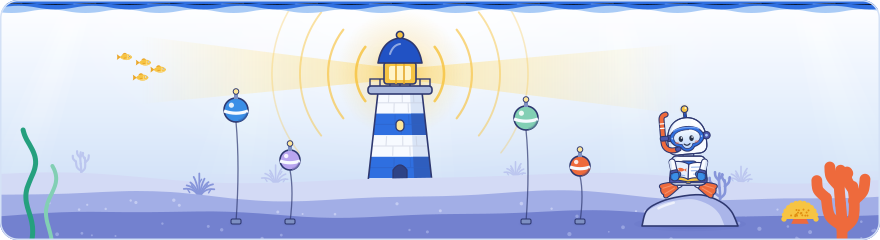

[Knowledge base](../../README.md) / [30-topics](../README.md) / **index-and-signals**

<!-- GENERATED by _system/build_kb.py. Do not edit; change 20-claims/ and rebuild. -->

# The index and its signals

**The signals Google calculates while indexing, how it decides what enters the index, what the index looks like, and how Search Console reports it.**

<picture><source media="(prefers-color-scheme: dark)" srcset="../../_system/brand/illustrations/30-topics-index-and-signals-dark.svg"></picture>

## What's here

| Topic | Claims | Days | Sessions |
| --- | ---: | --- | ---: |
| [Signals calculated during indexing](indexing-signals.md) | 25 | 1 · 2 · 3 | 7 |
| [Spam detection and SpamBrain](spam-detection.md) | 50 | 1 · 2 · 3 | 10 |
| [Index selection: deciding what gets indexed](index-selection.md) | 50 | 1 · 2 · 3 | 8 |
| [Indexing statuses in Search Console](page-indexing-report.md) | 22 | 1 · 2 · 3 | 6 |
| [What the index looks like](index-structure.md) | 31 | 1 · 2 · 3 | 6 |

*Claims* counts every public claim on the topic. *Days* and *Sessions* say where it was raised on a slide or on stage; a point from a session that was not recorded counts for its day, never as a session.

## In brief

- **[Signals calculated during indexing](indexing-signals.md)**: Of the many signals Google calculates during indexing, it singled out country, language, freshness, SafeSearch and spam as having large effects, and said country and language have been among its most important signals since its early days. Google stores one language per page and weights language and country in index selection so the index is not dominated by English or by the largest countries (said at the event, not in Google's docs). Some freshness signals are calculated at indexing but used in ranking for queries that deserve fresh results, and Google said freshness plays no big role in whether a page is indexed (not in its docs). SafeSearch signals are calculated at indexing because ranking runs online with no time for them, need the whole parsed page plus its inbound and outbound links, and, Google said, do not change a page's chance of being indexed (the timing and indexing points are not in its docs); Google's guidelines advise keeping explicit content on a separate domain or subdomain so the whole site is not filtered. Each indexed document carries its calculated signals for index selection to use; Google said many are documented under other names, but that creating content users like is a better use of time than hunting for signals. Day 3 showed where these signals are used next: at retrieval Google orders candidates with per-document signals collected during indexing, language first and then country. Google added that its slowest signal is recalculated only about once a year, which is why a site move can take up to a year (a partly uncertain passage of the recording). Day 1's second recording added that the signals calculated during indexing are stored and used both for index selection and later for ranking.
- **[Spam detection and SpamBrain](spam-detection.md)**: Google said spam is stopped at indexing: index selection loads most spam signals and keeps documents detected as spam out of the index, and Google's spam policies say violating sites may rank lower or not appear at all. Google has used statistical models against spam for over 20 years and now uses more and more AI; it said SpamBrain is built on Gemini and fine-tuned for spam, which is not in its documentation. Figures said on stage differ from the record: Google's 2021 webspam report gives 2018 as SpamBrain's launch year (2022 was mentioned on stage), and its 2022 report's '5 times more spam sites' compares 2022 with 2021, with 200 times more than at launch, rather than comparing SpamBrain with older algorithms. Google said its testing shows more than 99% of visits from Search are spam-free, a figure in its 2022 webspam report. Google said spam metadata such as white-on-white text is stored with a page's tokens (not in its docs), and its scaled content abuse policy covers automatically translated scraped content. Day 3 put the scale in numbers: Google discovers about 40 billion spammy pages a day, the figure in its webspam report for 2020 and its How Search Works page (a Day 3 slide headed 'In 2023' repeated it, and the quality talk said tens of billions), and its spam systems remove a very large amount before results are served. Google said AI has changed how it builds spam updates, letting it evaluate more candidates, catch new types of spam and launch faster; four spam updates had shipped in 2026 by 2 October, the September 2026 one still rolling out. Google repeated its aim of keeping more than 99% of results spam-free, which its webspam reports measure as visits from Search. Keyword stuffing remains a policy violation, and Google counts AI slop, mass-produced LLM content, as scaled content abuse that it is working hard to remove. Day 1's second recording added that the crawl scheduler very likely deprioritises URLs or sites known to be historically spammy. On Day 2 the non-Latin-script talk cited the October 2023 spam update, whose post says it improved coverage in many languages, naming Turkish, Vietnamese, Indonesian, Hindi and Chinese, particularly against cloaking, hacked, auto-generated and scraped spam. Author's view: the post names neither Persian nor Arabic and does not mention link spam, so it does not show that the bought links the presenter saw working in those languages were addressed.
- **[Index selection: deciding what gets indexed](index-selection.md)**: Google's index is immense but finite, so index selection, the last step before it, sets thresholds and keeps only documents likely to be useful to users now or later; Google said the system is predictive and relies heavily on machine learning (not in its docs). Quality is ultimately what decides; Google added that a site's or document's overall importance plays a significant role, as with news sites, and that a site or section already satisfying users gets more forgiving treatment for its new URLs (not in its docs). Language and country are weighted so the index is not dominated by English or by the largest countries, and where Google lacks content in a language such as Basque, lower-quality documents are more likely to be selected, which Google presented as an opening for new publishers (said at the event, not in Google's docs). Index selection also applies blocking signals: a noindex rule (a likely reading of the recording), an expired unavailable_after date, soft 404s, non-canonical duplicates, spam signals and other policies, while freshness and explicit content play no big role in the decision. In Search Console, 'Crawled – currently not indexed' is an index selection decision and, Google said, most of the time a quality issue rather than a technical one: the pages are low quality or useless for the index. Day 3 repeated that Google does not index every URL, which is why it has to rank better and better; Google's indexing chart said end-to-end indexing can take months or never happen, for reasons of quality, and Google said URLs not recrawled for a very long time are dropped from the index (not in its docs). Author's view: set against the hundreds of trillions of URLs Google said it knows and the hundreds of billions of pages its ranking guide puts in the index, only around one known URL in a thousand is indexed, if both figures hold. A second recording of Day 1 added Cherry Prommawin's version: signals calculated during indexing are stored and used both to decide whether a page is indexed and later for ranking, index selection runs after signals are collected and duplicates dropped, and a selected page takes its whole duplicate cluster into the index with it. Day 2's opening Q&A added that very few robots.txt-disallowed URLs are in the index, and that an important disallowed URL might still be indexed without its content. Author's view: Google's robots.txt guide names links from elsewhere as the reason, so keep important pages crawlable with noindex if they must stay out of Search.
- **[Indexing statuses in Search Console](page-indexing-report.md)**: Google described the two not-indexed statuses as different stages: 'Discovered – currently not indexed' is a crawl-scheduling state in which Google knows the URL but does not want to crawl it yet, and 'Crawled – currently not indexed' is an index selection decision taken after processing. On stage Google called the first the nastier one and said owners can influence it by getting other URLs indexed and showing that the site's content is useful, while the Page indexing help explains it by expected server overload. For 'Crawled – currently not indexed', Google said the cause is most of the time quality rather than a technical fault: check whether the pages match the quality of the indexed parts of the site, or whether a different template hides where their content is; the help page adds that such pages need no resubmission. Other not-indexed reasons include noindex and 'Alternate page with proper canonical tag', the canonical choice of deduplication that site owners see in Search Console, and Google suggested the report's reasons for checking index selection issues when testing changes. Google's URL Inspection help says a valid live test only confirms that Google can access a page; indexing still depends on other conditions, such as not being a duplicate and being of high enough quality. On Day 3 a community speaker said analysing Search Console query data with an LLM helped his agency spot developer mistakes such as unwanted pages being indexed, which Search Console also shows directly. On Day 1 Gary Illyes had already pointed to the report's breakdown of reasons as a way to find patterns in how a site's content is crawled and served. An audio recording of Day 1 added that soft 404s are looked up in this report rather than in Crawl Stats, and Dave Smart warned in Lightning session B that a URL reported as blocked by robots.txt may not be disallowed itself: Search Console reports a block anywhere in a redirect chain on the chain's first URL, so check whether the URL redirects and test every URL in the chain.
- **[What the index looks like](index-structure.md)**: Google's Search index, described on Day 1 as big but not limitless, holds the tokens of each page with their metadata and the signals calculated for the document, not the full page content. Retrieval works through posting lists, kept for most tokens, that list the URLs containing each token: Google intersects the lists of the important query words to get an unranked set of candidates, and its public How Search Works explainer likens the index to the index at the back of a book. Google can also retrieve documents through vector embeddings, where closeness to the query's embedding decides what comes back, and both methods work from the page's content. Snippets are rebuilt from the stored tokens and their positions, and AI Overviews and AI Mode use the same index and snippets: fan-out queries go to the Search index and the returned snippets are the material for the AI answer, so a page that forbids snippets cannot be used for them. The token storage, the posting-list details and snippet reconstruction were said at the event and are not in Google's documentation. Day 3 repeated the posting-list model at retrieval: a document can be retrieved only if it contains the query's words or, for embeddings, related concepts. For scale, Google's first index in 1998 held 26 million pages, Google's own figure (25 million was said on stage). Cherry Prommawin said on Day 1 that Google's index, printed on paper, would reach the Moon and back twelve times (said at the event).

## How to use it

Open a topic for its summary and the claims it is based on, what to do, where it was discussed on each day, every claim (what was shown and said at the event, Google's documentation, press reports, analysis), related topics and sources.

> [!NOTE]
> **Generated** by `_system/build_kb.py`. Do not edit; change `20-claims/topics.yaml` or the claims in `20-claims/` and run `rebuild.bat`.

← [Indexing](../indexing/README.md) · [All topics](../README.md) · [Structured data and media](../content-and-media/README.md) →

