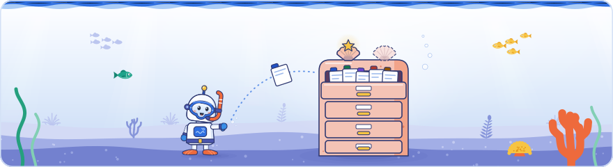

[Knowledge base](../../README.md) / [30-topics](../README.md) / **indexing**

<!-- GENERATED by _system/build_kb.py. Do not edit; change 20-claims/ and rebuild. -->

# Indexing

**How Google processes a crawled page: parsing and extraction, main content, tokens, duplicates, canonicals, redirects and site moves.**

<picture><source media="(prefers-color-scheme: dark)" srcset="../../_system/brand/illustrations/30-topics-indexing-dark.svg"></picture>

## What's here

| Topic | Claims | Days | Sessions |
| --- | ---: | --- | ---: |
| [Duplicate content](duplicate-content.md) | 63 | 1 · 2 · 3 | 12 |
| [Processing: from fetched page to index](indexing-pipeline.md) | 40 | 1 · 2 · 3 | 9 |
| [Main content and page sections](main-content.md) | 36 | 1 · 2 | 6 |
| [Tokenization: how text is stored](tokenization.md) | 23 | 2 · 3 | 4 |
| [Canonical selection](canonical-selection.md) | 56 | 1 · 2 · 3 | 7 |
| [Canonical graphs: chains, loops and leaders](canonical-graphs.md) | 41 | 2 | 2 |
| [Redirects, site moves and alternate names](site-moves.md) | 85 | 1 · 2 · 3 | 9 |
| [Pruning and consolidating content](content-pruning.md) | 10 | 2 | 1 |

*Claims* counts every public claim on the topic. *Days* and *Sessions* say where it was raised on a slide or on stage; a point from a session that was not recorded counts for its day, never as a session.

## In brief

- **[Duplicate content](duplicate-content.md)**: There is no duplicate content penalty: Google's documentation says some duplicate content is normal and not a spam-policy violation, and Day 2 described deduplication as clustering duplicates, indexing one representative URL and forwarding the signals of every URL in the cluster, such as links, to it. Google deduplicates because users do not want repeated results and the index has no room for everything; on stage it added rising storage costs, which is not in its docs. Clusters are built from redirects, content, rel=canonical and other inputs, and Google said content clustering catches exact matches, near matches such as pages with a translated template but untranslated main content, soft 404s and URL patterns, which can fold city or service pages into one canonical without each page being looked at (the four-way split and the pattern behaviour are not in Google's docs). A CDN challenge page served with a 200 status on many URLs can get them clustered as well, and Google's troubleshooting guide says pages split out once they are clearly different, which can take up to two weeks after a fix. Author's view: the real costs are losing control over which URL is chosen and crawling spent on copies. Day 3 widened the frame: Google's spam slide said sites with mostly scraped content and no added services or content may not provide value to users, and a community speaker said some keyword cannibalization is logical and fine, while for harmful cases the agency groups an article's Search Console queries before deciding whether to redirect the pages or rewrite and split the content. The second recording of Day 1 added the basics: Google clusters duplicates and picks one representative, the canonical, so users are not shown duplicates, and when a page is selected for the index its whole duplicate cluster goes in with it. A community speaker treated similar URLs (protocol, host, case, slashes, encoding, parameter order) as an indicator of duplicate content, and in the Q&A Google suggested redirecting parameter variants to the normalised URL; another community speaker advised against markdown copies of pages for AI agents, a duplicate (which the speaker also called a possible source of cloaking, a word the recordings disagree on). Day 2's second recording completed the deduplication talk: in a migration the site owner says the old and new domains are the same and that Google should pick the new one, and the short advice for same-language, different-country pages was to use hreflang. A Day 2 case study merged two competing loan-comparison sites and folded pages with the same search intent into one strong article each, from over 2,000 URLs to about 100.
- **[Processing: from fetched page to index](indexing-pipeline.md)**: Day 2 opened the stage that Day 1's crawl pipeline hands its fetches to: the crawler passes on a fetch record, shown on a slide as an example (fetch result, connect time, time to first byte, the robots policies that apply, such as a Google-Extended opt-out, and the raw HTTP response), and processing runs HTML parsing, rendering, deduplication, feature extraction, signal extraction and finally index selection. HTML parsing builds a DOM from which Google extracts every element to separate header, navigation and main content, plus the robots meta tag, rel=canonical (used for deduplication and canonical selection), hreflang and links, which go back to the crawl queue. Links are extracted again from the rendered HTML; rendering itself sits among the processing steps on the slides, is a detached system because it is so expensive, Erin Sparling said, and happens during the crawl according to Google's guide to how Search works. Gary Illyes said deduplication runs before feature extraction, so the costly extraction of structured data, images and videos is spent on fewer documents, and images and videos go on to dedicated indexing services. The fetch record, the DOM step and that order were shown or said at the event and are not in Google's documentation, which describes indexing more broadly. Day 3 timed the stage: Google estimated that indexing a document end to end, from entering indexing until it reaches the serving index tokenized and ready to serve, takes about 1.5 hours on average, and that meta annotations such as robots meta tags are typically processed in 45 to 90 minutes, a critical step without which indexing cannot continue (said at the event, not in Google's docs). Rendering happens either right after crawling or later through a queue. Day 1's second recording added that indexing starts with parsing the fetched HTML so that elements such as the title can be extracted, and a second recording of Day 2 that the media indexer attaches each image and video to the URL of the page that hosts it (said at the event).
- **[Main content and page sections](main-content.md)**: Google extracts every element of a page to tell header, navigation and main content apart; its slides marked the main content very important and the header and navigation not so important, and its canonicalization guide says it determines each page's primary content, or centerpiece, when indexing. Gary Illyes said words are weighted by where they sit: footer text is unlikely to contribute much to ranking, and moving a term into the main content is the simplest way to make it count; Google's Search Essentials supports this only in general terms, advising that search words go in prominent places such as the title and main heading, and describes no weighting. Page structure also drives soft 404 detection, extending Day 1's soft 404 discussion: a BERT-like model trained on page layout ignores navigation and footer, so an error message alone in the main content makes a soft 404 while one in the navigation need not. Pages that translate only the menu and footer around the same main content are clustered as duplicates, as Google's hreflang guide also says. A Google software engineer working on data ingestion said extraction sometimes misjudges the main content or picks up extraneous data such as related products' prices, which structured data helps prevent, and Google said a 'Crawled – currently not indexed' page on a site of even quality may use a template that hides where its content is. A second recording captured Gary Illyes's part on main content in Day 2: main content is any part of a page that directly helps it achieve its purpose, not only text but images, videos or a tool, user-generated content on a UGC site, a comment section, content in tabs, and all headings and the visible title, matching Google's Search Quality Rater Guidelines, which add that tabs and comments can be main or supplementary content depending on the page's purpose. He said the main content is what Google considers when ranking a page, and that whatever a site puts in its navigation or header tells Google it does not particularly care about that content. Both recordings have the token metadata marking a word as in the header, the main content, bold or a heading (a third item, heard as title in one recording and italics in the other, is left out). Author's view: a logical heading hierarchy is not a Google Search requirement, since Google's SEO Starter Guide says out-of-order headings do not matter to Search; the case for it is accessibility and agents that read the accessibility tree.
- **[Tokenization: how text is stored](tokenization.md)**: Google said, in detail not in its documentation, that the Search index holds neither full pages nor sentences but tokens, the smallest searchable units (words, for languages written with spaces), each stored with its position and metadata, with posting lists of the URLs that contain most tokens. The metadata records where a word appeared (header, main content or 'centerpiece', bold, a heading; a further item, heard as title in one recording and italics in another, is left open) and spam signals such as white-on-white text, and snippets are rebuilt from the stored token positions. Thai, Chinese and other languages written without spaces are segmented with statistical models built from web content in that language, and queries go through the same segmenter so they match the index; retrieval then looks up only the query's important words. Day 2 partly contradicts Day 1's slide that Gemini shares tokenization with Search: Gary Illyes said AI-model tokenization is different ('or mostly'), and his slides showed Search keeping 'robots.txt' and 'tl;dr' whole where the AI tokenizer split them into sub-word pieces, as Google's Gemini documentation describes for long words (the slide also showed each token's numeric ID). Author's view: read it as a shared step with different outputs, and treat leftover hidden keyword blocks as a liability, since spam metadata is stored with the tokens. Day 3 confirmed the mirror on the query side: Google transforms a query into something that can be matched against the index, removing stop words as part of that, while a phrase whose stop words matter is recognised as a whole and its words are indexed together (said at the event, not in Google's docs). Author's view: a community speaker's picture of Googlebot seeing a page as ones and zeros blends two steps, since crawling fetches the page and tokenization happens later, when it is processed.
- **[Canonical selection](canonical-selection.md)**: Some duplicate content is normal and is no spam violation or penalty: Google clusters duplicate pages and picks one as canonical. For Google the canonical is the representative of a duplicate cluster, the URL it would ideally show, and Google makes its own choice because rel=canonical is often wrong, for example, apparently, a placeholder left in place of a URL. Google named three considerations: protection against hijacking across pages or sites, user experience (whether the page loads, meta refresh, security) and site-owner signals (redirects, rel=canonical, sitemaps); it said machine learning sets how much each criterion weighs and that the weighting changes over time, which is not in its docs. When the signals agree Google follows the site owner, and when they point in different directions it cannot tell what the owner wants; Google also said it forwards the signals of every duplicate to the URL it picks, which sits uneasily with a community speaker's advice to make the strongest page of a canonical group its leader. On stage rel=canonical was said to 'also help a bit' next to redirects and sitemaps, but Google's canonical guide rates redirects and rel=canonical as strong signals and sitemap inclusion as weak, and says Google prefers URLs that are part of hreflang clusters. A permanent redirect matters only for which URL becomes canonical, not for clustering, and with a 302 Google shows the source URL; Google also said pointing paginated pages' canonical to page 1 can sometimes make sense, which its pagination guidance still advises against. Day 3 gave timings: a change of canonical URL usually shows within one to three weeks, though it can happen in seconds, and Google's guide to canonicalization issues says Google may hold pages in a duplicate cluster for up to two weeks after content issues are fixed. Google also described a site move as a complex canonicalization in which every signal of the old site is recalculated and moved to the new one. Day 1's second recording added Cherry Prommawin's definition: Google clusters duplicates and selects one page per cluster as its representative, the canonical, so users are not shown duplicates. A community speaker advised that a web application compute the expected URL for every request and redirect, or return an error, when the requested URL differs; on Day 2 the same speaker added that under the canonical link specification an improperly declared canonical can be ignored completely, not only replaced by the processor's own heuristic. Author's view: of the two answers, Google's canonicalization guide favours the redirect, a strong canonical signal, while an error page throws away the links pointing at the variant.
- **[Canonical graphs: chains, loops and leaders](canonical-graphs.md)**: A community talk on Day 2 argued for auditing canonicals as whole groups rather than page pairs: a canonical group is every URL connected through canonical links, and its leader is the URL they ultimately point to. The speaker's problem cases were chains (also through server-side or client-side redirects), loops with no leader, several canonicals on one page, a leader that is noindexed, blocked or returns an error, a leader reachable only through a canonical link, and canonicals between language versions, which hreflang should connect instead. Google's documentation is more lenient on chains: a 2009 post says a canonical may point to a URL that redirects and that Google can follow chains, while strongly recommending links to a single canonical, and a 2013 post says Google will likely ignore all canonicals on a page that declares more than one. Google's own advice on the day was to check rel=canonical links with a crawler and keep canonical signals clear, and its guide says that on hreflang pages the canonical should be in the same language. The speaker's view that the leader should be the group's strongest page sits uneasily with Google's statement that it forwards the signals of all duplicates to the representative URL. In a second recording the speaker added that, under the canonical link specification, an improperly declared canonical can also be ignored completely by the application that processes it, not only replaced by its own heuristic.
- **[Redirects, site moves and alternate names](site-moves.md)**: Google treats a site migration as deduplication across sites: redirects are trusted strongly for clustering, and whether a redirect is permanent or temporary only decides which URL becomes canonical, so with a 302 Google keeps showing the source URL. The URLs that lose are kept as 'alternate names', which is why a site: query for an old domain still lists old URLs after a migration and why people searching for an old brand can still see the old domain; Google's redirects guide calls this normal and says it fades. Google's closing advice on duplication included using redirects for site migrations and keeping canonical signals clear, and a community speaker showed a canonical chain running through a 301 to another subdomain. For a product out of stock for months, a Google Q&A slide said keeping or redirecting the page depends on how important it is to users, who may wait or pre-order; Google's guide to pausing a business recommends staying online and updating Product structured data with current availability. Google also said a site should not move to country-code domains just because a ccTLD is a strong country signal. Day 3 put a site move in time: Google treats it as a complex canonicalization in which every signal of the old site is recalculated and moved, so a move takes one to three months on average, a few weeks for a small site and up to about a year in the worst case, because Google's slowest signal is recalculated about once a year (said at the event, in a partly uncertain passage of the recording; Google's site move guide says a few weeks for most pages of a small to medium site and to keep redirects for at least a year). The second recordings added two migration case studies and Google's own example. In the Day 1 Q&A Google described consolidating a dozen or so language blogs, a Help Center and its old developers site into one site: the first priority was to identify the popular URLs and protect them, and duplicated language versions were merged by giving both old URLs one target path to redirect to. Asked how to plan a migration that does not leave many URLs unindexed, a panelist said the answer is probably not sitemaps but deciding what matters to the business, such as whether to consolidate languages; listing the new URLs in a sitemap is probably a good idea and cannot hurt, but it is not the main tool. As a fun fact the panel said JavaScript was used for the language-consolidation redirects in Google's own migration, because it was the only option available to the person doing it (said at the event; the recording does not make fully clear how it was used). Author's view: Google's redirects guide says Google Search follows JavaScript redirects only after rendering and recommends them only when server-side or meta refresh redirects are impossible, and its site move guide asks for server-side 301 or 308 redirects, so Google's own JavaScript was a fallback, not a pattern to copy. Author's view: this matches Google's November 2020 move to Google Search Central, about six years before the event rather than the four or five said on stage. Cherry Prommawin said Google follows permanent and temporary redirects and indexes whatever the target returns (Google's docs: up to 10 hops by default), and Day 2's opening Q&A added that several sloppy migrations on one domain cause many short-term effects on indexing as well as crawling, and contrasted out-of-stock products buyers will wait for with easily replaced ones they simply swap. In Day 2's Lightning session E a community speaker merged two competing loan-comparison sites into one brand: every URL was given a keep, merge or remove decision, an old URL got a 301 only when a new page served the same intent, removed URLs were never redirected to the homepage, and new sitemaps, a Change of Address in Search Console and updated internal links followed, as Google's site move guide advises; the speaker reported traffic growth from the first day and revenue up 100% month over month (the speaker's figures). A second community speaker ran a post-acquisition migration around one redirect map giving every old URL an approved destination and an owner, froze the inventory (export, crawl, sitemap, search data, logs) before launch, and after it checked each URL's route, content and lead rather than its 200 status; he cited an unnamed study's median recovery time of 304 days but said broken routes need action at once. Author's view: return 404 or 410 for removed content rather than redirecting it to an unrelated page, and report indexing and traffic recovery separately, since Google's guide measures the switch of indexed URLs in weeks while traffic can take far longer.
- **[Pruning and consolidating content](content-pruning.md)**: In Day 2's lightning session on duplicates and site moves, a community speaker presented the consolidation of two competing loan-comparison sites into one brand. Every URL of both domains was compared on traffic, conversion, backlinks, revenue and rankings and given one decision: keep, merge or remove; pages that served the same search intent were merged into one strong article, taking the site from over 2,000 URLs to about 100. An old URL got a 301 redirect only when a new page served the same intent, and removed URLs were never redirected to the homepage. The speaker reported traffic growth from the first day and revenue up 100% month over month (the speaker's figures). A second speaker advised agreeing what to keep and retire with an owner for every decision, reviewing it with data and prioritising by business value, not only traffic. Author's view: return 404 or 410 for removed URLs, as Google's site move guide says; for a site of about 2,000 URLs the crawl-budget gain is likely minor, and the benefit of pruning more plausibly comes from one strong URL per intent and consolidated signals.

## How to use it

Open a topic for its summary and the claims it is based on, what to do, where it was discussed on each day, every claim (what was shown and said at the event, Google's documentation, press reports, analysis), related topics and sources.

> [!NOTE]
> **Generated** by `_system/build_kb.py`. Do not edit; change `20-claims/topics.yaml` or the claims in `20-claims/` and run `rebuild.bat`.

← [Rendering and JavaScript](../rendering-javascript/README.md) · [All topics](../README.md) · [The index and its signals](../index-and-signals/README.md) →

