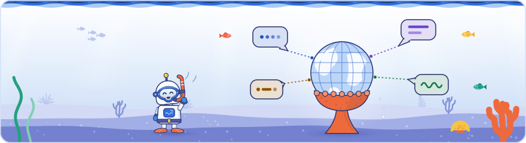

[Knowledge base](../../README.md) / [30-topics](../README.md) / **international**

<!-- GENERATED by _system/build_kb.py. Do not edit; change 20-claims/ and rebuild. -->

# International and multilingual sites

**Language versions, hreflang, country targeting and localisation, including languages written in non-Latin scripts.**

<picture><source media="(prefers-color-scheme: dark)" srcset="../../_system/brand/illustrations/30-topics-international-dark.svg"></picture>

## What's here

| Topic | Claims | Days | Sessions |
| --- | ---: | --- | ---: |
| [hreflang annotations](hreflang.md) | 53 | 2 · 3 | 6 |
| [Page language and language versions](page-language.md) | 36 | 2 · 3 | 7 |
| [Country targeting](geotargeting.md) | 34 | 2 · 3 | 6 |
| [Localisation beyond translation](localisation.md) | 70 | 1 · 2 · 3 | 8 |
| [Non-Latin scripts and word segmentation](non-latin-scripts.md) | 32 | 2 · 3 | 4 |

*Claims* counts every public claim on the topic. *Days* and *Sessions* say where it was raised on a slide or on stage; a point from a session that was not recorded counts for its day, never as a session.

## In brief

- **[hreflang annotations](hreflang.md)**: Google extracts hreflang while processing a page's HTML to learn its other-language equivalents, called it useful in ranking, and said it tries to use hreflang alternates when it clusters same-language pages for different countries (German pages for Germany, Austria and Switzerland) so it can show the right country version. Google's internationalisation talk listed the common mistakes: missing return links (Google ignores one-way annotations, since an alternate URL can be on any domain and any site could otherwise claim to be another site's language version), missing self-references, several methods at once with conflicting values, and invalid codes such as se, dk or cz instead of sv, da or cs, UK instead of GB, EU, city codes or a region code with no language. Google's hreflang guide agrees and adds detail: the HTML head, HTTP header and sitemap methods are equivalent and combining them brings no benefit (so using only one is the talk's advice against conflicts, not a documented rule), alternate URLs must be fully qualified and may be on other domains, and hreflang is recommended even for small regional variations or when only the template is translated. Google does not use hreflang to determine a page's language, and its canonical documentation says the canonical of an hreflang page should be in the same language and that URLs in hreflang clusters are preferred as canonicals; a community speaker called canonical links between language versions a misuse that would leave only one language ranking. A community speaker cited a third-party study (reported in 2017, auditing 20,000 multilingual sites) that found at least one hreflang error on 75% of them, and stressed that hreflang only routes users to the right version: it does not make a site trusted in a new country, and understanding each market is the harder part. Day 3 added the query side: a brand-only query does not reveal which language the user wants, so Google sometimes shows the wrong language version for brand searches, falling back on location and browser settings, and it applies language and country already at retrieval, before ranking. Author's view: that makes hreflang and a visible language switcher the safeguard for brand searches. Google's internationalisation talk added that incorrect language and region codes are a mistake it finds very often, with the same wrong codes coming up again and again, especially in Europe, because site owners assume the codes are easy; a second recording of the deduplication talk confirmed that its short advice for same-language, different-country pages was simply to use hreflang.
- **[Page language and language versions](page-language.md)**: Google determines a page's language for indexing from its content, not from hreflang or a language code in the URL, and its internationalisation talk said each page is annotated with only one language in the index (said at the event, not in Google's docs). Pages should therefore make their target language obvious and avoid mixing languages, and pages that translate only the template around untranslated main content are near-duplicates that Google may cluster. Each language version needs its own URL, because Googlebot mostly crawls from US IP addresses without an Accept-Language header and versions switched by cookie, in place or by redirect may not all be crawled; a community speaker showed that a language selector built as a button leaves the whole alternate-language cluster without crawlable links. Google called language and country among its most important signals since its early days, and said index selection weights language so the index does not turn into an English one; in under-served languages such as Basque that makes lower-quality documents more likely to be selected and gives new local content a good chance to replace spam (the index-selection details were said at the event, not in Google's docs). Author's view: an orphaned language cluster is a case of Day 1's point that pages with no internal links depend on sitemaps and are found slowly. Day 3 showed the query side: detecting a query's language is Google's first step in understanding almost any query, and at retrieval Google matches results to the user's language wherever possible. A brand-only query does not reveal the language, so Google falls back on location and browser settings and sometimes shows the wrong language version; Google's help says the results language comes from the query, the user's language setting, the device's languages and location. Google called a missing result in a user's language an opportunity for whoever targets those words. Google said on Day 2 that working out a site's localized pages and which countries it targets is one of the difficult, complex tasks for it in indexing.
- **[Country targeting](geotargeting.md)**: Google's internationalisation talk called the ccTLD one of the strongest country-targeting signals, yet said a separate ccTLD per country is not necessarily better: ccTLDs, subdomains and subdirectories are all acceptable depending on availability, cost, local rules and commitment, URL parameters are not recommended, and sites should not move domains for the signal. The speaker added that server location is no longer reliable and little used (the word 'server' is unclear in the recording), whereas Google's documentation still lists it as a possible but not definitive signal, alongside hreflang, local addresses and phone numbers, currency, local links and Business Profile signals, without ranking them. Language subdomains such as en or de do not set a target audience, hreflang targets countries only (EU and city codes are invalid), and Google's duplication talk advised against 'clever' geo-redirecting, which Google's documentation explains: Googlebot mostly crawls from US IP addresses. Google said country has been one of its most important signals since its early days, helps serve users the right content, and is weighed in index selection so that smaller countries sharing a language, such as the UK or Switzerland, are not crowded out by the US or Germany (the index-selection part was said at the event, not in Google's docs). A community speaker warned that neither hreflang nor a country version makes a brand trusted in a market: local authority has to be earned, and a brand that no local source mentions should fix its existing markets before expanding. Day 3 placed country at retrieval: it is the second signal Google uses to order candidates, after language, so a user in Switzerland gets Swiss rather than German results, and Google's multi-regional guide says geotargeting a site to one country can improve its rankings there at the expense of other locales. Google added that working out a site's localized pages and which countries it targets is one of the difficult, complex tasks for it in indexing.
- **[Localisation beyond translation](localisation.md)**: Google's internationalisation talk treated localisation as more than translation: machine translation may be acceptable, at the site owner's judgement, after weighing translation quality, local conventions such as date formats and calendars (in Thailand the current year, as of 2026, is 2569) and cultural adaptation, and Google's spam policies list automated translation of scraped content as an example of scaled content abuse. Consumer data shown in the talk (source not captured) suggested that trust cues differ by market: promotions and discounts matter to shoppers in Europe and the US, reviews weigh more in the US, brand reputation in Europe, expert recommendations and certifications in Germany, and product origin in France (said at the event, not in Google's docs). The talk also warned that AI answers are still language-dependent: if an answer is synthesised from the top results, a query in another language draws on different data, so missing or weak local content becomes an invisible gap that site owners should check per language and market. John Mueller explained that the notranslate rule opts a page out of Google Search's translation features (documented) and that its form in a meta tag named google also turns off Chrome's automatic translation (said at the event; a 2008 Search Central blog post says that form stops Google Translate, and Chromium's Translate design document says it disables Chrome's translation), adding that he dislikes the rule because translation is a form of accessibility. A community speaker argued that understanding each market is harder than hreflang, citing an audit in which a correctly translated Dutch site converted far worse than its sister sites because the region had never been checked (Dutch homes are narrow, on several floors, with steep stairs), and noting that regional demand shifts over time, as a chart of search interest in ceiling fans in northern versus southern Europe showed. Day 3 added that Google does not prefer English words on pages in other languages, and that where it recognises an English term and its local equivalent as synonyms a page needs only one of them; Google called a gap in results for a language an opportunity for whoever targets those words, and repeated that some countries rely heavily on reviews as social proof (said at the event). A second recording of Day 2 added that working out a site's localized pages and which countries it targets is one of the difficult, complex tasks for Google in indexing, and the non-Latin-script talk saw AI answers to Persian queries written in Persian but citing English sources where Persian content was thin, concluding that multilingual SEO is more than translation: script, typing habits and market maturity must be fitted to each market. On Day 1 a community speaker showed that AI fan-out queries are often in another language than the prompt, citing a study heard as Peec AI's and a Spanish prompt about Barcelona restaurants that fanned out in English. Author's view: Peec AI's published study found English fan-outs in nearly 78% of non-English prompt runs, from 66% for Spanish to 94% for Turkish, and 43% of the fan-out searches for those prompts ran in English.
- **[Non-Latin scripts and word segmentation](non-latin-scripts.md)**: Gary Illyes said Google segments text in languages written without spaces, such as Thai and Chinese, into words using statistical models built from web content in that language, and applies exactly the same segmentation to queries so they can match the index (said at the event, not in Google's docs). Google's internationalisation talk said Google usually understands query words written with or without diacritics, consistent with a 2006 Google blog post, and usually understands non-English words typed 'in English', probably meaning romanised spellings (not in Google's docs). A community talk on Persian and Arabic showed that letters which look identical can be different Unicode characters (such as the Arabic and Persian forms of the letter ye), so a searcher may type one variant while a site uses another, and keyword data for one term splits across the variants (a community observation, undocumented). Day 3's query understanding talk filled in the details: Google generally treats spellings with and without diacritics as synonyms behind the scenes (a German ü written as ü, as ue or without the dots), which the 2006 post supports, but sometimes gets variants wrong, so search a variant to check before picking one spelling. Users expect content in the form they search with, Latin letters or the local script, and some, such as Hindi users, use both; Google's advice was to focus on what users actually search for rather than on what the search engine does (said at the event, not in Google's docs). Thai was named again as a language whose lack of spaces between words complicates query understanding. A second recording covered the rest of that talk: mixing right-to-left and left-to-right scripts can scramble the display order of titles, product names and URLs, and users may type the same Persian query in Persian script or in Latin letters with the same intent, as Google's 2023 post on multilingual searches describes for Hindi, so keyword research should ask how people actually type, especially on mobile. The presenter observed that bought links and paid editorial content still visibly influence competitive Persian, Turkish and Arabic results (an observation, stressed as not a recommendation), that Persian offers far fewer natural link opportunities, and that AI answers to Persian queries cite English sources where Persian content is thin; Google's October 2023 spam update improved its coverage per language. The talk concluded that multilingual SEO is more than translation: script, language behaviour and market maturity matter. Author's view: the October 2023 update names neither Persian nor Arabic and covers cloaking, hacked, auto-generated and scraped spam, not link spam, so it does not show that the bought links seen working there were addressed.

## How to use it

Open a topic for its summary and the claims it is based on, what to do, where it was discussed on each day, every claim (what was shown and said at the event, Google's documentation, press reports, analysis), related topics and sources.

> [!NOTE]
> **Generated** by `_system/build_kb.py`. Do not edit; change `20-claims/topics.yaml` or the claims in `20-claims/` and run `rebuild.bat`.

← [Structured data and media](../content-and-media/README.md) · [All topics](../README.md) · [Serving and ranking](../serving-ranking/README.md) →

