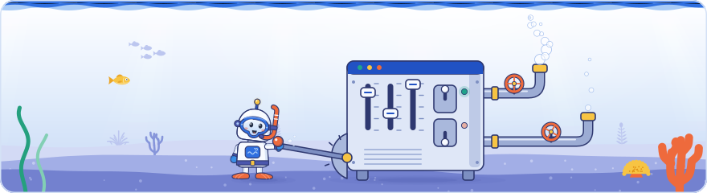

[Knowledge base](../../README.md) / [30-topics](../README.md) / **publisher-controls**

<!-- GENERATED by _system/build_kb.py. Do not edit; change 20-claims/ and rebuild. -->

# Publisher controls

**Settings, meta tags and features site owners can use to shape how they appear in AI and classic Search.**

<picture><source media="(prefers-color-scheme: dark)" srcset="../../_system/brand/illustrations/30-topics-publisher-controls-dark.svg"></picture>

## What's here

| Topic | Claims | Days | Sessions |
| --- | ---: | --- | ---: |
| [The generative AI opt-out in Search Console](genai-optout.md) | 24 | 1 · 2 · 3 | 6 |
| [Google-Extended](google-extended.md) | 13 | 1 · 2 | 4 |
| [Search profiles](search-profiles.md) | 6 | 1 | 1 |
| [Preferred sources](preferred-sources.md) | 3 | 1 · 3 | 2 |
| [Linked subscriptions](linked-subscriptions.md) | 3 | 1 · 3 | 2 |
| [Robots meta tags and noindex](robots-meta-tag.md) | 46 | 2 · 3 | 7 |
| [Snippets and preview controls](snippet-controls.md) | 42 | 2 · 3 | 6 |

*Claims* counts every public claim on the topic. *Days* and *Sessions* say where it was raised on a slide or on stage; a point from a session that was not recorded counts for its day, never as a session.

## In brief

- **[The generative AI opt-out in Search Console](genai-optout.md)**: A property-level Search Console setting, Search generative AI, lets a site leave AI Overviews, AI Mode and generative AI in Discover: excluding removes both links to the site and use of its content to ground answers, so the site gets no traffic or impressions from those features, and include is the default. Google says the setting is not a ranking or inclusion signal for regular results and does not affect AI training, which Google-Extended governs; changes generally apply within 1–2 days, and a child property inherits from its closest parent that changed the setting. Day 2 repeated this, with John Mueller presenting it as one of very few indexing-like settings in Search Console, and added the page-level route: nosnippet keeps content out of AI Overviews and AI Mode as a direct input and max-snippet limits that use, as Google's robots meta tag specification confirms, but both also remove or shorten regular snippets. Author's view: lead-generation, local and e-commerce sites should normally stay included, because AI answers cite and link sources. Day 3's Search Console talk repeated it: every property owner can tell Google whether the site's content may be used in AI search results, because Google wants content owners to control their content. In the Day 1 Q&A, captured by a second recording, Google said the Google-Extended token in robots.txt opts a site out of Google's AI training, that blocking all AI crawlers while allowing search crawlers is a personal decision every site owner can make, and that Apple offers a similar control for Applebot; a community speaker advised not blocking AI training bots in most cases, so that models can represent the brand accurately. Gary Illyes said the generative AI report launched alongside the control, with impressions only to start. Author's view: Google-Extended is a usage token, not a crawler; disallowing it does not stop Googlebot fetching pages and controls only Gemini training and grounding, while the Search Console setting governs AI Overviews and AI Mode. Google's Day 1 robots.txt talk, in an audio recording, added that robots.txt was designed only to control which clients may access what, not how content is used, and that disallowing the Google-Extended token keeps a directory or a whole site out of Gemini model training; it named Apple's Applebot-Extended as a similar token.
- **[Google-Extended](google-extended.md)**: Google-Extended is a robots.txt control token, not a crawler with its own user agent: it governs whether crawled content is used to train future Gemini models and to ground Gemini apps and Vertex AI, and it has no effect on inclusion or ranking in Google Search. Day 2 showed how it travels: in Google's example fetch record the applicable robots policy, shown as opt-out-google-extended, stays attached to the fetched page as it goes into processing, and Google's crawler documentation defines the grounding it controls as Search-index content given to the model at prompt time. Google also said Gemini training renders pages the same way Search does, provided the site allows training (said at the event, not in Google's docs). Author's view: the live read of a page that a Gemini user asks about is not documented, so it is unclear whether Google-Extended applies to it or whether it behaves like a user-triggered fetcher, which generally ignores robots.txt. In the Day 1 Q&A, asked whether Google plans dedicated AI user agents, Google said a site can opt out of Google's AI training with the Google-Extended token. Author's view: the panel spoke of blocking AI 'crawling or training', but Google documents Google-Extended as a usage token: disallowing it does not stop Googlebot fetching pages. An audio recording of Day 1's robots.txt talk added that a site can keep a directory or the whole site out of Gemini model training by disallowing it for the Google-Extended token, which Google said it respects, and that robots.txt itself was designed only to control access, not how content is used; Google named Apple's Applebot-Extended as a similar token from another company. Author's view: the speaker's belief that Google was the first to offer such an opt-out needs care, since OpenAI documented blocking its GPTBot crawler in August 2023, before Google announced Google-Extended on 28 September 2023; what Google-Extended added was a training control for pages fetched by Google's existing crawlers, separate from Search.
- **[Search profiles](search-profiles.md)**: Publishers and creators can claim a Search profile with a profile photo, cover image, bio, linked accounts, pinned posts and a follow button. It launched on 4 June 2026 in the US for accounts with a sizable following. Since 16 September 2026, US publishers and creators qualify with 10,000 followers across YouTube, Instagram, X or TikTok, and media groups can manage all their sub-brands from one login. Day 3 linked profiles to Search Console: platform properties let owners verify Instagram, TikTok, X and YouTube accounts and see the traffic Google sends to them, and Google's social and video performance guide says that once a Search profile is claimed, all its verified accounts are added automatically as platform properties.
- **[Preferred sources](preferred-sources.md)**: Users can mark sites as preferred sources. Those sites become more visible in Top Stories and are labelled in AI Mode and AI Overviews. Author's view: it rewards brands people actively choose. On Day 3 Google said it can add a preferred-source badge, or a 'highly cited' badge, to a text result.
- **[Linked subscriptions](linked-subscriptions.md)**: Users can link their paid subscriptions to Google so answers highlight paywalled content they already have access to. Google cited 34% more engagement among one publisher's linked subscribers. On Day 3 a Google speaker, unsure of the name, suggested linked subscriptions as an example of a search feature whose container holds text results (not in Google's docs).
- **[Robots meta tags and noindex](robots-meta-tag.md)**: Robots meta tags (name robots or googlebot, comma-separated rules, placed in the head, though Google also respects them in the body) are how site owners control indexing, because robots.txt controls only crawling; Google said it does not treat a robots.txt disallow as noindex because some very important sites disallow their key pages by accident or out of ignorance, and a noindex on a disallowed URL is never seen. John Mueller went through the rules: all is the default and does nothing (it is not an instruction to index), noindex keeps a page out of results, none equals noindex plus nofollow, page-level nofollow is a very broad rule he would replace with rel=nofollow on individual links, noimageindex blocks every image on the page, and unavailable_after drops a page after a set date, though most sites do not use it. Google said index selection drops a document carrying noindex (a likely but not certain reading of the recording) if it was not dropped earlier, and removes a page once its unavailable_after date passes, extending Day 1's point that Google must fetch a page to see its noindex. Robots rules added with JavaScript take longer to take effect and removing a noindex with JavaScript does not work, and Google's documentation advises avoiding JavaScript for meta tags. Unlike robots.txt, robots meta tags have no RFC, and John Mueller invited SEOs to help write a specification. Day 3 timed the rules: Google estimated that meta annotations such as robots meta tags are typically processed in 45 to 90 minutes (not in Google's docs), and that once Google has processed a page that now returns a 404 or noindex, the page usually leaves the serving index within one to three weeks, sometimes much sooner. A second recording of Day 2 covered the end of John Mueller's talk: robots meta rules only work if robots.txt lets Google fetch the page; when Google finds a noindex in the HTML it drops the page without even processing its JavaScript, so a script cannot make the page indexable again (Google's JavaScript guide says it may skip rendering), and he recommended putting robots meta tags in the HTML exactly as intended, using JavaScript only where that is impossible. He also suspected that the page-level nofollow rule would probably not be part of robots meta tags if they were reinvented today. Gary Illyes said noimageindex blocks a page's images and, he added, its videos too, because a video's thumbnail is an image (not in Google's docs). Author's view: a noindex in the served HTML must never be one that JavaScript is expected to lift, and noimageindex does not belong on video watch pages.
- **[Snippets and preview controls](snippet-controls.md)**: John Mueller's answer to his own quiz was that robots meta tags can make a page more visible: his closing slide recommended max-snippet:-1 and max-image-preview:large, the latter mattering mainly in Discover. The nosnippet rule removes the text snippet and video preview but not the title, max-snippet caps the snippet length in characters (0 equals nosnippet), and data-nosnippet hides one passage, such as a phone number, but works on few elements, can spill over the rest of the page if the HTML is broken, and should not be toggled with JavaScript. Day 2 extends Day 1's opt-out discussion: Google's documentation says nosnippet keeps a page's content out of AI Overviews and AI Mode as direct input, max-snippet limits how much they may use and a page must be eligible for a snippet to be a supporting link, and Mueller said Google builds those answers from snippets. Two points from the talk go beyond the docs, which say only that Google chooses the length: max-snippet:-1 can give a longer snippet than no rule, and a limit too short to be useful may mean no snippet at all. The max-video-preview rule caps previews in seconds and notranslate stops Google offering a translated result; Mueller said a notranslate meta tag named google also switches off Chrome's translation, which Chromium's Translate design document supports and a 2008 Search Central post documents for Google Translate, though Google Search's current documentation does not mention it. Day 3 showed the parts of a text result, attribution, title link, snippet and site name, which Google generates from its understanding of the page even when the owner provides nothing. Google estimated that a snippet or title change takes 1-2 days on average and up to several weeks or months, because the page must first be recrawled and reprocessed; its title link guide says a few days to a few weeks. On Day 2 Gary Illyes repeated that max-image-preview:large can make content do surprisingly well in Discover, and a community speaker said search engines ignore HTML tags written inside a meta description (said at the event).

## How to use it

Open a topic for its summary and the claims it is based on, what to do, where it was discussed on each day, every claim (what was shown and said at the event, Google's documentation, press reports, analysis), related topics and sources.

> [!NOTE]
> **Generated** by `_system/build_kb.py`. Do not edit; change `20-claims/topics.yaml` or the claims in `20-claims/` and run `rebuild.bat`.

← [The state of Search](../search-landscape/README.md) · [All topics](../README.md) · [AI and Search](../ai-features/README.md) →

