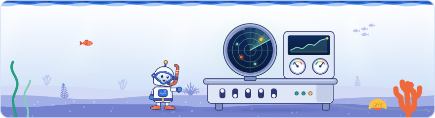

[Knowledge base](../../README.md) / [30-topics](../README.md) / **search-console**

<!-- GENERATED by _system/build_kb.py. Do not edit; change 20-claims/ and rebuild. -->

# Search Console

**What Search Console launched in 2025 and 2026, and how practitioners work with its data.**

<picture><source media="(prefers-color-scheme: dark)" srcset="../../_system/brand/illustrations/30-topics-search-console-dark.svg"></picture>

## What's here

| Topic | Claims | Days | Sessions |
| --- | ---: | --- | ---: |
| [What's new in Search Console](search-console-features.md) | 68 | 1 · 2 · 3 | 7 |
| [Working with Search Console data](search-console-data.md) | 47 | 1 · 2 · 3 | 5 |

*Claims* counts every public claim on the topic. *Days* and *Sessions* say where it was raised on a slide or on stage; a point from a session that was not recorded counts for its day, never as a session.

## In brief

- **[What's new in Search Console](search-console-features.md)**: Google presented five Search Console launches. Query groups cluster queries with the same intent (computed with AI, shown in Insights, with no effect on ranking). An AI-powered configuration turns a natural-language request into Performance report filters and applies them only after the user approves. The generative AI control lets owners decide whether content may be used in AI results, and a generative AI report counts impressions in AI surfaces by page, country and device, while the regular Performance report still includes AI traffic. Platform properties let owners verify Instagram, TikTok, X and YouTube accounts through a pop-up from the platform and see the traffic Google Search, Discover and News send to them. Multimodal search reporting, announced on 24 September 2026, covers Lens, Circle to Search and image searches. The generative AI control and report repeat Day 1, where Google's launch post dated the report 3 June 2026, rolled out to all sites by 31 August 2026. Query groups (announced 27 October 2025) are available only to properties with a large volume of queries, the AI-powered configuration is experimental and visible to a small percentage of users with 20 requests a day, and a claimed Search profile adds its verified accounts as platform properties automatically. Day 1 and Day 2 added existing tools to that picture: Google points to the Crawl Stats report (Settings, Crawl stats) as the most valuable tool for debugging crawl errors alongside server logs, showing how much Google crawls, the errors it received, the content types fetched and the split between discovery and refresh crawling, and Google's site move guide and a community migration both use the Change of Address tool. In the Day 1 Q&A John Mueller said that if Crawl Stats shows about half of a site's crawling going to discovering new pages, crawling of new pages is not the problem, and Google said soft 404s are looked up in the page indexing report rather than in Crawl Stats. An audio recording of Day 1's robots.txt talk added the robots.txt report: it shows the file as Google last fetched it, with a version history and the errors and successes of each fetch, and Google said it uses Google's open-source parser and helps catch CDNs that change robots.txt without the owner knowing and hosts that cloak the file (the last two points are not in Google's docs). A community speaker said publishers can verify their social accounts in Search Console to track repurposed content, which fits the platform properties launched on Day 3.
- **[Working with Search Console data](search-console-data.md)**: A community talk showed an agency workflow that exports Search Console data to BigQuery and lets an LLM agent query it. Google's docs confirm the limits behind it: the interface exports only 1,000 rows, the API and the Looker Studio connector up to 50,000 rows per day per site per search type, and only the bulk export avoids the daily cap. The branded versus non-branded filter is made by an AI-assisted system and works only on top-level properties with enough data, and anonymized queries are left out whenever a filter is applied, so filtered rows do not add up to the chart totals. The agency's use cases included reporting content refreshes, finding bad cannibalization and running SEO experiments that start from a hypothesis. Author's view: tell the LLM about these gaps and spot-check the branded split before trusting its sums. The agency also combines Search Console data, LLM referral traffic from GA4 and the generative AI report in one prompt to compare classic and AI performance, although that report, launched in June 2026 as Day 1 noted, has no click or query data. Day 1's first lightning session, captured by a second recording, showed the same risks from the practitioner side: a chatbot called an average position moving from 8 to 9 an improvement, although position 1 is the top (as Search Console Help defines it), so a community speaker advised giving an LLM fixed metric definitions; another automated monthly reports through the Search Console API, which needs a Google Cloud project and OAuth2 credentials and is free of charge but subject to usage limits. Day 1 also showed the Crawl Stats report's split of crawl requests by response, file type and purpose (discovery versus refresh), with drill-down to the problem URLs. In the Day 1 Q&A a Google panelist expected more AI reporting to launch, without a timeline or a promise, and Google said it should not simply mirror classic results and that AI query data is hard to provide because AI questions do not map back to keywords and the data would have to be grouped to protect privacy while staying useful; it knew of no plans to add crawl stats to the API, a completely new part, whereas a variation of the Performance report would be easier, and said the Search Relations team talks with the Search Console team about the API more than before, partly because with so many vibe-coded systems around it is very easy to say 'use the Search Console API', and annoying when Search Console has no API for that. On Day 2 a community speaker noted that publishers can verify their social accounts in Search Console to track content repurposed for social platforms. Author's view: since the API itself costs nothing, the cost check before automating is about usage limits and the paid parts of the pipeline, such as storage and model calls.

## How to use it

Open a topic for its summary and the claims it is based on, what to do, where it was discussed on each day, every claim (what was shown and said at the event, Google's documentation, press reports, analysis), related topics and sources.

> [!NOTE]
> **Generated** by `_system/build_kb.py`. Do not edit; change `20-claims/topics.yaml` or the claims in `20-claims/` and run `rebuild.bat`.

← [Serving and ranking](../serving-ranking/README.md) · [All topics](../README.md) · [Search trends and Google Trends](../search-trends/README.md) →

