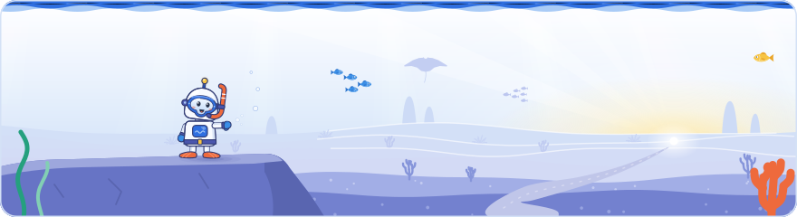

[Knowledge base](../../README.md) / [30-topics](../README.md) / **search-landscape**

<!-- GENERATED by _system/build_kb.py. Do not edit; change 20-claims/ and rebuild. -->

# The state of Search

**What Google says is changing in how people search, and what it promises the web.**

<picture><source media="(prefers-color-scheme: dark)" srcset="../../_system/brand/illustrations/30-topics-search-landscape-dark.svg"></picture>

## What's here

| Topic | Claims | Days | Sessions |
| --- | ---: | --- | ---: |
| [How Search is evolving](search-evolution.md) | 65 | 1 · 2 · 3 | 13 |
| [AI Mode usage and query trends](ai-mode-usage.md) | 39 | 1 · 2 · 3 | 7 |
| [AI Overviews usage](ai-overviews-usage.md) | 26 | 1 · 3 | 4 |
| [Google's five ecosystem principles](ecosystem-principles.md) | 10 | 1 · 2 | 2 |
| [Search Agents in AI Mode](search-agents.md) | 9 | 1 | 2 |
| [How AI Search links to websites](ai-links-to-web.md) | 10 | 1 · 3 | 4 |
| [Consumer decisions and the messy middle](consumer-decisions.md) | 50 | 1 · 3 | 2 |

*Claims* counts every public claim on the topic. *Days* and *Sessions* say where it was raised on a slide or on stage; a point from a session that was not recorded counts for its day, never as a session.

## In brief

- **[How Search is evolving](search-evolution.md)**: Google frames Search as never finished, driven by closed platforms, new user preferences and AI, with the stated goal of making it effortless to find helpful information. Day 2 traced the same change in the web and the results page: the web moved from plain, semantic HTML to pages built with JavaScript, and results moved from ten blue links to feature- and media-rich results because users wanted more, which extends Day 1's principle that the results page will evolve. Google also said AI Overviews and AI Mode launched as fairly text-heavy answers and have become more structured, with more images and tables, for the same reason (said at the event, not in Google's docs). A Google Trends chart showed worldwide search interest in AI rising sharply in the two to three years to mid-2025, and Google said it has climbed far higher since (not in Google's docs). Day 3 told the longer story: Google began in 1995 as BackRub, a Stanford project by Larry Page and Sergey Brin built on PageRank, and its first index in 1998 held 26 million pages, Google's own figure (25 million was said on stage). Google gave three reasons why Search keeps changing, new content formats, the growing breadth of the web and content issues such as spam (said at the event), all with the goal of satisfying users' information needs; universal search (May 2007) and exploration features such as People Also Ask followed changes in what users wanted (also said at the event). The closing talk said SEO is not dead: each change, from the Florida update in 2003 to Web Guide, a Search Labs experiment that groups results by aspects of the query, brings new opportunities. A second recording of Day 1 added the opening keynote by Lino Cattaruzzi: he called this probably the most exciting time in the history of the web and of search, named three drivers of change (AI as a profound inflection point, like mobile and social media before it; content that is instant, engaging and interactive, with user-generated content engaging young audiences most; and information quality as a core focus across Search, YouTube and Discover), and called AI-powered search the new reality of Google Search; an audio recording of the keynote added Google's claim that YouTube has surpassed Netflix as the number one streaming service, in the US and around the world. Author's view: YouTube publishes its lead as US streaming watch time measured by Nielsen, and no published Google source backs 'around the world', so cite it that way. Google said it has made the biggest change to its search box in 25 years, an intelligent, multimodal box that takes text, speech or images and expands for long queries, and that even the ten blue links were settled only after millions of experiments (said at the event). Gary Illyes said 30 years of helping users complete their journeys has made them search more, not less, that Gen Z is a very large part of Search's users and searches differently, for example with images, and that searchers no longer have to 'speak machine'. Community speakers on Day 1 argued that search no longer happens in one place and that people increasingly hand remembering, comparing and even deciding over to search tools.
- **[AI Mode usage and query trends](ai-mode-usage.md)**: Google reports AI Mode queries doubling every quarter since launch, about three times longer than classic queries (the opening keynote's slide and its speaker said two to three times), and one in six multimodal. Brainstorming queries grew 30% faster than AI Mode queries overall in the US since launch, and 'which' and planning queries 40% and 80% faster over the past six months. These AI Mode figures come from Day 1 slides and are not in Google's public documentation. The overall scale, more than five trillion Google searches a year, was shown on Day 1 and repeated on Day 2 by the Google Trends team, who noted that Google announced it publicly in early 2025. Google's Trends FAQ says Google Trends filters out the internal searches made by AI Mode and AI Overviews. Day 3 showed what longer, conversational queries mean for shopping: shoppers ask AI Mode deeper follow-up questions, so Google added Merchant Center attributes intended for conversational experiences, and in testing with lululemon, brand-submitted attributes were used in 50% of relevant AI Mode product recommendations (Google's September 2026 post). Google's marketing research found that people who use AI run more searches, feel more confident about purchases and value easy access such as multimodal input; of these findings only searching more appears in Google's published posts. A second recording of Day 1 added the keynote's figures: AI Mode alone has more than one billion monthly active users, 2.5 billion people use Google's AI-powered search experiences (no feature or period given), and AI Overviews and AI Mode send more than a billion clicks a week to the web; Google also said 77% of their users make decisions faster, that 18 to 24 year olds requery and ask more complex questions, and that searches grow year on year in commercial and non-commercial queries (these three are not in Google's docs). The keynote added that people who also use a standalone LLM keep certain types of use anchored on Google (the example given is unclear in both recordings). Google presents AI Overviews and AI Mode as one experience, where a user can start in an AI Overview and continue in AI Mode, while still offering traditional search as a choice. Gary Illyes said AI Mode grows almost exponentially and people search more because of it, and that a multi-part query, such as a three-row SUV for two teenagers and a car-sick dog, cannot be met by one article but can by a synthesised answer. A community speaker added that the change is conversation, where follow-ups rely on earlier turns, not only longer queries.
- **[AI Overviews usage](ai-overviews-usage.md)**: Google says users like AI Overviews, search more because of them and visit a wider range of sites; the last two of these Day 1 keynote claims match what Google has published, in its March 2025 AI Mode launch post (people are using Search more than ever) and its AI features guide (a greater diversity of websites, and higher-quality clicks from results pages with AI Overviews). Day 3's marketing research added that people who use AI Mode or AI Overviews feel more confident about purchase decisions and visit more brand websites (Google's research, not in its published documents). On clicks, Google's August 2025 post says total organic clicks are relatively stable but shifting between sites, with fewer clicks for quick-answer questions, while a community speaker reported falling clicks on informational and now local queries, and AI features on more commercial results, for the brands the speaker tracks; neither side gave figures. AI Overviews and AI Mode traffic is counted in Search Console's Performance report under the Web search type, and GA4 setups that separate out LLM traffic do not capture it. A second recording of Day 1 added the keynote's figures: AI Overviews and AI Mode send more than a billion clicks a week to the web, 2.5 billion people use Google's AI-powered search experiences, and 77% of their users make decisions faster (the last not in Google's docs); Google presents the two as one experience, where a user can start with an AI Overview and continue in AI Mode, while still offering traditional search as a choice. Gary Illyes said a multi-part query that no single article covers can be answered by a synthesised AI answer that helps users decide where to go. Author's view: Google's I/O 2026 keynote gives 2.5 billion as AI Overviews' monthly active users, so cite the figure that way.
- **[Google's five ecosystem principles](ecosystem-principles.md)**: Google committed to five principles: consistent testing, an evolving results page, serving multiple user needs, rewarding high-quality content, and accepting that traffic patterns will fluctuate. Day 2 echoed the second principle: Google said results moved from ten blue links to feature- and media-rich results, and that AI Overviews and AI Mode are becoming more structured, because users want it (not in Google's docs). Author's view: the fifth principle is the one to plan around. A second recording of Day 1 showed that the principles were presented in the opening keynote by Lino Cattaruzzi, who added that content may be created by humans or by AI as long as it is high quality and made for users, and that monetisation, such as shoppers being open to new brands, is key to the sustainability of the open web.
- **[Search Agents in AI Mode](search-agents.md)**: Search Agents in AI Mode let users set standing requests and be told when something happens, such as a product going on sale, a team winning or a price dropping below a level. On Day 1 Google said Search agents in AI Mode had launched globally a day or two earlier; a search marketing agency reported that Google's VP of Product for Search announced on 28 September 2026 that AI Mode information monitoring was rolling out to everyone in the Google app, after a first launch for AI Pro and Ultra subscribers. An agent is set up by typing a natural-language request, which AI Mode turns into an alert (Google called it an information agent), and Google said agentic capabilities that allow bookings would roll out later in 2026, in the US first. In the Q&A a Google panelist said agents acting on a user's request read pages without checking robots.txt, argued that this makes business sense because an agent sent to buy something must be able to complete the purchase, and said an agent should not blindly trust what a site says about its own authority.
- **[How AI Search links to websites](ai-links-to-web.md)**: Google listed eight features meant to send people from AI answers to websites, including in-line quotes, rich linking, 'Highly Cited' labels, preferred sources and Search profiles; the list was shown on a Day 1 slide and is not in Google's docs. Google's AI features guide states the entry requirement: to appear as a supporting link in AI Overviews or AI Mode, a page must be indexed and eligible to be shown in Search with a snippet, with no additional technical requirements. Day 3 repeated the requirement: AI Overviews and AI Mode are standard search features, not rich results, that work with the normal text results from Google's index and need no structured data; Google said elements such as recipes would need markup only if AI Mode showcased them. Google also presented Web Guide, a Search Labs experiment, as an alternative to AI Mode that groups web results into categories with short summaries while keeping the classic text results. The second recording of Day 1 added the keynote's figures: Google said it sends billions of clicks to the open web every day, more than a billion a week from AI Overviews and AI Mode alone, and cited Sundar Pichai as saying Google is the biggest contributor of clicks to the open web and wants to remain so.
- **[Consumer decisions and the messy middle](consumer-decisions.md)**: Google's marketing research models the 'messy middle' between a purchase trigger and the purchase as loops of exploring and evaluating, from a 2019 UK study of 31,000 shoppers. Its 2026 research, based on 23,000 consumer conversations and 40,000-participant panels (not in Google's published documents), found that people who use AI Mode or AI Overviews feel more confident: they delegate the effort but not the choice, are 'boosted' by ease, assistance and suggestion, search more and visit more brand websites. For high-involvement purchases people add a reassurance step, going back to Google Search and brand websites; searches like 'is [brand] legit' have risen since about 2020, and a familiar brand works as a strong shortcut. Google's advice matched Search's: optimise for people, because a human makes the final decision. These findings extend Day 1's keynote claims that people search more with AI Overviews and visit a wider range of sites, and Google said the AI-boosted group was still small in October 2026 but growing. Author's view: the research describes how people decide, not how Google ranks pages, and none of it is a ranking signal. Day 1's keynote, in a second recording, added Google's claim that 77% of AI Overviews and AI Mode users make decisions faster because of them (not in Google's docs).

## How to use it

Open a topic for its summary and the claims it is based on, what to do, where it was discussed on each day, every claim (what was shown and said at the event, Google's documentation, press reports, analysis), related topics and sources.

> [!NOTE]
> **Generated** by `_system/build_kb.py`. Do not edit; change `20-claims/topics.yaml` or the claims in `20-claims/` and run `rebuild.bat`.

[All topics](../README.md) · [Publisher controls](../publisher-controls/README.md) →

