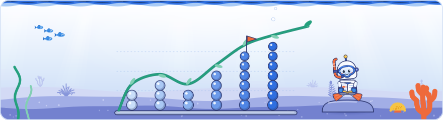

[Knowledge base](../../README.md) / [30-topics](../README.md) / **search-trends**

<!-- GENERATED by _system/build_kb.py. Do not edit; change 20-claims/ and rebuild. -->

# Search trends and Google Trends

**What Google Trends data shows, the tools around it, and how to use search interest for content and SEO.**

<picture><source media="(prefers-color-scheme: dark)" srcset="../../_system/brand/illustrations/30-topics-search-trends-dark.svg"></picture>

## What's here

| Topic | Claims | Days | Sessions |
| --- | ---: | --- | ---: |
| [Reading Google Trends data](trends-data.md) | 37 | 2 · 3 | 2 |
| [Google Trends tools and features](trends-features.md) | 31 | 2 · 3 | 2 |
| [Using Google Trends for SEO and content](trends-for-seo.md) | 29 | 2 · 3 | 3 |

*Claims* counts every public claim on the topic. *Days* and *Sessions* say where it was raised on a slide or on stage; a point from a session that was not recorded counts for its day, never as a session.

## In brief

- **[Reading Google Trends data](trends-data.md)**: Google Trends, presented on Day 2 by the Google Trends team, gives free access to a sample of aggregated, anonymised and categorised searches from Google Search (web, image, shopping and news) and YouTube, from 2004 to a few minutes ago, worldwide or by country or region; Discover is not included because it has no search box, and the Trends FAQ says the internal searches of AI Mode and AI Overviews are filtered out. The key caution is that Trends shows search interest, not search volume: each point on its 0 to 100 scale stands for the term's share of all searches, so a falling line over a long range can hide growing searches; Google said ski's share has fallen since 2004 while its internal numbers show ski searches rising (not in Google's docs). Patterns need context: Google said an early-2012 spike for 'ai' came from the song 'Ai Se Eu Te Pego', not from artificial intelligence (not in Google's docs), and the Trends FAQ adds that one-off spikes on low-interest queries may be privacy noise. Chart readings shown on stage, not in Google's docs, included worldwide interest in Gemini passing ChatGPT for the first time in September 2025 after the Nano Banana launch (which Google announced on 26 August 2025), with a lasting higher baseline, and five years of US interest in umbrellas and sunscreen both peaking in June. Google put its scale at more than five trillion searches a year, a figure it published in early 2025 and which repeats Day 1's keynote. Day 3 added an example from Google's marketing research: Trends charts from January 2016 to March 2026 showed trust-checking searches such as 'is [brand] legit', 'Ist [brand] seriös?' and '[brand] est fiable?' rising in several markets and languages, and Google said such searches have risen since about 2020 in the UK and most other countries it looked at (not in Google's docs).
- **[Google Trends tools and features](trends-features.md)**: Google Trends has two flagship experiences: the Explore page, the heart of Trends, which shows search interest in a term or topic over time, and Trending now, which shows what people are searching for right now, within about ten minutes of an event, with approximate, bucketed volumes. A new Explore page launched at the beginning of 2026, and Google said the legacy page will be retired once its features have moved (no date given, not in Google's docs); in the new page, 'Commonly searched queries' (formerly related queries) lists top and rising queries from the same search sessions. Newer features include a Gemini-based Suggest search terms panel that picks up to eight terms to compare from a plain-language request, quick comparison chips that overlay year, month or week over week, regional colour maps and a reintroduced category filter; the maps and the filter were reported by Search Engine Roundtable (19 August and 2 September 2026) but are not in Google's docs. Trends Help says Trends compares up to 8 groups of up to 50 terms, against 5 groups of 25 in classic explore. Google said Trending now covered 125 countries at the time of the talk, matching Google's August 2024 post (regional trends in 40 of them), while the current Help page says 100+ countries and regions; Google also pointed to Trends TV (trends.google.com/tv) and a YouTube tutorial series of about eight episodes. On Day 3 Google said the difference between words and entities can be seen in Trends, where a term can be searched as a search term or as a topic.
- **[Using Google Trends for SEO and content](trends-for-seo.md)**: Google presented three uses of Google Trends for content, marketing and SEO: keyword selection, scheduling and ideation. For keyword selection, compare candidate terms on the Explore page for the right country, region and time frame, use the higher-interest wording in titles and campaigns, and check both top and rising commonly searched queries. For scheduling, check whether your topics are seasonal in your own market rather than assuming (a five-year US chart showed umbrella interest peaking in June with sunscreen, not in winter), because a seasonal pattern predicts the next wave of interest and the time to have content ready. For ideation, Trending now surfaces events within about ten minutes, and Google said journalists use it every morning to find content gaps (not in Google's docs); Google's own Trends guide adds to follow trends only where the topic fits the business and its expertise. A Day 2 community talk made the same point for international sites: regional demand changes over time, as a chart of northern versus southern European interest in ceiling fans showed. On Day 3 a community speaker described using Trends to choose what to cover in depth when entering a new market, and Google's marketing research showed Trends charts of trust-checking searches such as 'is [brand] legit' rising since about 2020 in many markets and languages (said at the event).

## How to use it

Open a topic for its summary and the claims it is based on, what to do, where it was discussed on each day, every claim (what was shown and said at the event, Google's documentation, press reports, analysis), related topics and sources.

> [!NOTE]
> **Generated** by `_system/build_kb.py`. Do not edit; change `20-claims/topics.yaml` or the claims in `20-claims/` and run `rebuild.bat`.

← [Search Console](../search-console/README.md) · [All topics](../README.md) · [Working with Google](../community/README.md) →

