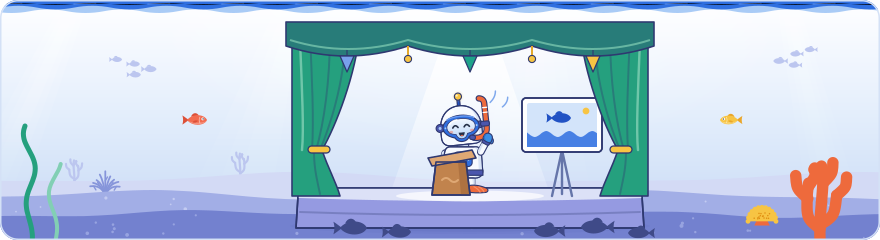

[Knowledge base](../README.md) / **40-sessions**

<!-- GENERATED by _system/build_kb.py. Do not edit; change 20-claims/ and rebuild. -->

# Sessions

**Every session of the event in running order, with the claims captured from it.**

<picture><source media="(prefers-color-scheme: dark)" srcset="../_system/brand/illustrations/40-sessions-dark.svg"></picture>

## What's here

| Day | Date | Theme | Sessions | With claims | Claims |
| --- | --- | --- | ---: | ---: | ---: |
| [Day 1](#day-1--crawling) | 2026-09-30 | Crawling | 13 | 11 | 545 |
| [Day 2](#day-2--indexing) | 2026-10-01 | Indexing | 26 | 19 | 970 |
| [Day 3](#day-3--serving-ranking-search-console-and-performance) | 2026-10-02 | Serving: Ranking, Search Console, and Performance | 20 | 13 | 713 |

*Sessions*: the slots on the agenda. *Claims*: every public claim filed under the day, including documentation, press and analysis notes on its sessions and the points from sessions that were not recorded.

## Day 1 · Crawling

2026-09-30 · 13 sessions on the agenda · 11 with claims · 545 claims

| Time | Session | Speaker | Kind | Coverage | Claims |
| --- | --- | --- | --- | --- | ---: |
| 11:00 | [Welcome and opening keynotes](day1/D1-S01-welcome-and-opening-keynotes.md) | Lino Cattaruzzi, President, Google Iberia | Talk | Slides, Transcript | 60 |
| 11:35 | [What's new in the world of Search](day1/D1-S02-what-s-new-in-the-world-of-search.md) | Gary Illyes, Search Relations | Talk | Transcript, Slides | 41 |
| 11:45 | [How Search works and where's AI?](day1/D1-S03-how-search-works-and-where-s-ai.md) | Cherry Prommawin, Gary Illyes, Search Relations | Talk | Transcript, Slides | 55 |
| 13:10 | [Lightning session A: Automation and AI](day1/D1-S04-lightning-session-a-automation-and-ai.md) | James Powley, Rafael Kovashikawa, Kira Breuer, Carlos Ortega, Thiago Pojda, other community speakers | Lightning | Transcript | 98 |
| 14:05 | [How crawling works](day1/D1-S05-how-crawling-works.md) | Cherry Prommawin, Gary Illyes, Search Relations | Talk | Slides, Transcript | 34 |
| 14:35 | [How crawling errors affect Search](day1/D1-S06-how-crawling-errors-affect-search.md) | Cherry Prommawin, Gary Illyes, Search Relations | Talk | Notes, Transcript | 39 |
| 15:10 | [How Google interprets robots.txt](day1/D1-S07-how-google-interprets-robots-txt.md) | Google | Talk | Slides, Transcript | 36 |
| 15:30 | [Lightning session B: Robots.txt](day1/D1-S08-lightning-session-b-robots-txt.md) | Dave Smart, other community speakers | Lightning | Transcript | 5 |
| 15:40 | [What would you do?: Crawling Edition](day1/D1-S09-what-would-you-do-crawling-edition.md) | Google | Talk | None | 0 |
| 16:00 | [How Google thinks about crawl budget](day1/D1-S10-how-google-thinks-about-crawl-budget.md) | Cherry Prommawin, Search Relations | Talk | Slides, Transcript | 52 |
| 16:20 | [Lightning session C: Crawling](day1/D1-S11-lightning-session-c-crawling.md) | Tobias Schwarz, Jovana Avramovic | Lightning | Transcript | 23 |
| 16:35 | [Q&A](day1/D1-S12-q-a.md) | John Mueller, Gary Illyes, Search Relations | Q&A | Transcript | 85 |
| 17:25 | [Daily wrap-up](day1/D1-S13-daily-wrap-up.md) | Google | Talk | Transcript | 0 |
| — | [Day 1, session not recorded](day1/D1-S00-day-1-session-not-recorded.md) | — | Not recorded | Notes | 17 |

## Day 2 · Indexing

2026-10-01 · 26 sessions on the agenda · 19 with claims · 970 claims

| Time | Session | Speaker | Kind | Coverage | Claims |
| --- | --- | --- | --- | --- | ---: |
| 10:00 | [Checkin and Networking](day2/D2-S01-checkin-and-networking.md) | — | Break | None | 0 |
| 10:15 | [Welcome to indexing day!](day2/D2-S02-welcome-to-indexing-day.md) | Gary Illyes, Cherry Prommawin, Search Relations | Talk | Transcript, Slides | 36 |
| 10:25 | [How is HTML interpreted](day2/D2-S03-how-is-html-interpreted.md) | Cherry Prommawin, Search Relations | Talk | Transcript, Slides | 27 |
| 10:30 | [Controlling indexing](day2/D2-S04-controlling-indexing.md) | John Mueller, Search Relations Team Lead | Talk | Transcript, Slides, Video | 66 |
| 10:40 | [Lightning session D: Rendering and JavaScript](day2/D2-S05-lightning-session-d-rendering-and-javascript.md) | Erin Sparling, Sören Bendig, Rebecca Yu, Natalia Venditto | Lightning | Transcript, Slides | 150 |
| 11:15 | [What is Google friendly JavaScript](day2/D2-S06-what-is-google-friendly-javascript.md) | Erin Sparling, Partner Technology Manager | Talk | Transcript, Slides, Video | 55 |
| 11:30 | [Understanding what's on a page](day2/D2-S07-understanding-what-s-on-a-page.md) | Gary Illyes, Search Relations | Talk | Transcript, Slides, Video | 48 |
| 11:55 | [Handling web duplication](day2/D2-S08-handling-web-duplication.md) | John Mueller, Search Relations Team Lead | Talk | Transcript, Slides | 58 |
| 12:05 | [Lightning session E: Managing Duplicates and Site Moves](day2/D2-S09-lightning-session-e-managing-duplicates-and-site-moves.md) | Tobias Schwarz, Martyna Ağanoğlu, David Carrasco Pamies | Lightning | Transcript, One slide | 82 |
| 12:30 | [Lunch](day2/D2-S10-lunch.md) | — | Break | None | 0 |
| 13:30 | [Finding the gold nuggets: structured data, media, and more!](day2/D2-S11-finding-the-gold-nuggets-structured-data-media-and-more.md) | Gary Illyes, Search Relations | Talk | Transcript, One slide | 11 |
| 13:35 | [What is Structured Data and why we need it on the internet.](day2/D2-S12-what-is-structured-data-and-why-we-need-it-on-the-internet.md) | Ryan Levering, Software Engineer | Talk | Transcript, Slides | 74 |
| 13:50 | [Using images to your advantage and Engaging Search users with videos](day2/D2-S13-using-images-to-your-advantage-and-engaging-search-users-with-videos.md) | Gary Illyes, Search Relations | Talk | Transcript, One slide | 66 |
| 14:00 | [Lightning session F: Media](day2/D2-S14-lightning-session-f-media.md) | a community speaker, Patrick Domanico | Lightning | Transcript | 15 |
| 14:15 | [Focusing on Internationalisation and Localisation](day2/D2-S15-focusing-on-internationalisation-and-localisation.md) | Google | Talk | Transcript, Slides | 64 |
| 14:30 | [Lightning session G: Internationalisation](day2/D2-S16-lightning-session-g-internationalisation.md) | Alizée Baudez, a second community speaker | Lightning | Transcript | 46 |
| 14:45 | [Poster session H: Indexing](day2/D2-S17-poster-session-h-indexing.md) | Community speakers | Poster | Transcript | 3 |
| 15:25 | [Break](day2/D2-S18-break.md) | — | Break | None | 0 |
| 15:30 | [Calculating (some) signals](day2/D2-S19-calculating-some-signals.md) | Google | Talk | Transcript | 33 |
| 15:40 | [Deciding what goes in the index?](day2/D2-S20-deciding-what-goes-in-the-index.md) | Google | Talk | Transcript | 39 |
| 15:50 | [Lightning session J: Indexing and Troubleshooting](day2/D2-S21-lightning-session-j-indexing-and-troubleshooting.md) | Community speakers | Lightning | None | 0 |
| 16:00 | [What would you do?: Indexing Edition](day2/D2-S22-what-would-you-do-indexing-edition.md) | Google | Talk | None | 0 |
| 16:15 | [How does the index look like?](day2/D2-S23-how-does-the-index-look-like.md) | Google | Talk | Transcript | 26 |
| 16:20 | [Google Trends](day2/D2-S24-google-trends.md) | Omri Weisman, Engineering Manager, Google Trends | Talk | Transcript | 71 |
| 16:45 | [Q&A](day2/D2-S25-q-a.md) | Google panel | Q&A | None | 0 |
| 17:25 | [Daily Wrap-up](day2/D2-S26-daily-wrap-up.md) | Google | Talk | None | 0 |
| — | [Day 2, session not recorded](day2/D2-S00-day-2-session-not-recorded.md) | — | Not recorded | None | 0 |

## Day 3 · Serving: Ranking, Search Console, and Performance

2026-10-02 · 20 sessions on the agenda · 13 with claims · 713 claims

| Time | Session | Speaker | Kind | Coverage | Claims |
| --- | --- | --- | --- | --- | ---: |
| 10:00 | [Checkin and Networking](day3/D3-S01-checkin-and-networking.md) | — | Break | None | 0 |
| 10:15 | [Welcome to serving and ranking day!](day3/D3-S02-welcome-to-serving-and-ranking-day.md) | Google | Talk | One slide | 1 |
| 10:25 | [Making sense of users' queries](day3/D3-S03-making-sense-of-users-queries.md) | John Mueller, Gary Illyes, Search Relations | Talk | Transcript, Slides | 95 |
| 10:45 | [Lightning session K: Facets of quality](day3/D3-S04-lightning-session-k-facets-of-quality.md) | Community speakers | Lightning | Transcript | 33 |
| 11:15 | [How Google thinks about Quality](day3/D3-S05-how-google-thinks-about-quality.md) | Google | Talk | Transcript, Slides | 88 |
| 11:45 | [Uncovering Trustworthy Experiences on Discover](day3/D3-S06-uncovering-trustworthy-experiences-on-discover.md) | Google | Talk | Slides | 13 |
| 12:00 | [What are quality updates](day3/D3-S07-what-are-quality-updates.md) | Google | Talk | Transcript, Slides | 71 |
| 12:10 | [Lunch](day3/D3-S08-lunch.md) | — | Break | None | 0 |
| 13:10 | [Quality prevails](day3/D3-S09-quality-prevails.md) | — | Talk | None | 0 |
| 13:25 | [How Search results are born](day3/D3-S10-how-search-results-are-born.md) | Gary Illyes, Search Relations | Talk | Transcript, Slides | 50 |
| 13:40 | [Shopping on Search: Beyond the blue links](day3/D3-S11-shopping-on-search-beyond-the-blue-links.md) | Alex Jansen, Software Engineer, Google Shopping | Talk | Transcript | 60 |
| 13:55 | [Inside Search Console: What’s New & How to Use It](day3/D3-S12-inside-search-console-what-s-new-how-to-use-it.md) | Ariel Kroszynski, Front-End Engineering Manager, Search Console | Talk | Transcript, Slides | 57 |
| 14:20 | [Lightning session L: Understanding SERPs and your users](day3/D3-S13-lightning-session-l-understanding-serps-and-your-users.md) | Nik Vujic, a community speaker | Lightning | Transcript, One slide | 76 |
| 14:45 | [Poster session M: Success Strategies That Work](day3/D3-S14-poster-session-m-success-strategies-that-work.md) | Daniel Hernandez Susa, Gaetano Romeo, Victoria Yap, Elif Öztürk, Jo Juliana Turnbull, Erin Sparling | Poster | One slide | 0 |
| 15:25 | [Break](day3/D3-S15-break.md) | — | Break | None | 0 |
| 15:30 | [Mastering the messy middle](day3/D3-S16-mastering-the-messy-middle.md) | Pablo Pérez, Senior Marketing Research & Insights Manager | Talk | Transcript, Slides | 53 |
| 15:45 | [How long does it take to..?](day3/D3-S17-how-long-does-it-take-to.md) | Gary Illyes, Search Relations | Talk | Transcript, Slides | 80 |
| 16:00 | [Wrapping all up: AI, Search, and making sense of everything.](day3/D3-S18-wrapping-all-up-ai-search-and-making-sense-of-everything.md) | Gary Illyes, Search Relations | Talk | Transcript, One slide | 36 |
| 16:20 | [Q&A](day3/D3-S19-q-a.md) | Alex Jansen, John Mueller, Ariel Kroszynski, Duy Nguyen, Gary Illyes, Google panel | Q&A | One slide | 0 |
| 17:20 | [Closing](day3/D3-S20-closing.md) | Google | Talk | One slide | 0 |
| — | [Day 3, session not recorded](day3/D3-S00-day-3-session-not-recorded.md) | — | Not recorded | None | 0 |

## How to use it

- Each session page lists the claims captured from it in running order, with every audience question followed by its answer, and the topics it covered.
- *Coverage* says what was captured: slide photos (*Slides*, *One slide*), the author's *Notes*, a *Transcript* or a *Video* clip. *None* means nothing was captured, so the knowledge base cannot say what was said there.
- *Day N, session not recorded* collects the points whose session is not known.

The material behind these pages (slide photos, recordings, transcripts and notes) is private and never enters git. The pages hold paraphrased claims and short quotations only. See [PRIVACY.md](../PRIVACY.md).

> [!NOTE]
> **Generated** by `_system/build_kb.py`. Do not edit; change `20-claims/sessions.yaml` or the claims in `20-claims/` and run `rebuild.bat`.

← [30-topics](../30-topics/README.md) · [50-maps](../50-maps/README.md) →

