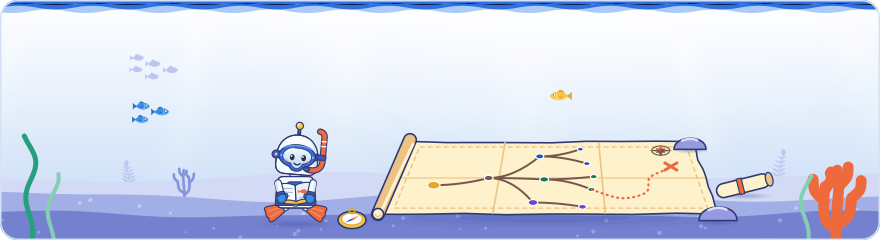

[Knowledge base](../README.md) / **50-maps**

<!-- GENERATED by _system/build_kb.py. Do not edit; change 20-claims/ and rebuild. -->

# Maps

**Eight views across the days covered so far: the topic tree, the interactive mindmap, the Reef map of links, the mention matrix, the verification report, the links between claims, the entity index (the review list of the things the event talked about) and the differences ledger.**

<picture><source media="(prefers-color-scheme: dark)" srcset="../_system/brand/illustrations/50-maps-dark.svg"></picture>

## What's here

| Map | What it shows |
| --- | --- |
| [Topic tree](topic-tree.md) | Every area and topic with its claim count and the sessions that raised it on a slide or on stage. |
| [Mindmap](mindmap.html) | The interactive map of every area and topic: pick a day, filter, and open a topic to read its summary, what to do and every claim with its label, verification and sources. |
| Reef map (`graph.html`) | The things, topics, kit items, documents and claims as a map of links, one neighbourhood at a time ("Graph" in the Art Deco style): click a bubble to put it in the centre, the back button returns; drag to pan or move bubbles, scroll to zoom, right-click for more. Written by the web edition build (`_system/site/build_site.py`), with its data inline. |
| [Mindmap as Markdown](mindmap.markmap.md) | The same tree for markmap tools, with the slide and stage claims under each topic, each cut to at most 110 characters. |
| [Mention matrix](mention-matrix.md) · [CSV](mention-matrix.csv) | How often each topic was raised at the event: slide and stage claims per topic, across days and per session. The CSV holds the per-session counts for a spreadsheet. |
| [Verification report](verification-report.md) | How the slide and stage claims stand against Google's documentation, day by day, and every claim that was said at the event but is not in the documentation. |
| [Links between claims](across-days.md) | Where a later claim repeats, extends, contradicts or updates an earlier one, and the answers to audience questions. |
| [Entity index](entity-index.md) | The review list of the things (`20-claims/entities.yaml`): 90 things, how often each is mentioned, the words that matched, and a fixed sample of 100 mentions to check that the matching is right. |
| [Differences ledger](differences.md) | Where the event and Google's documentation differ and what to follow (the rows of `25-kits/differences.yaml`), then the claims linked as contradicting or updating and the claims that say they are uncertain. Written by `_system/kits.py`, like the copy in the developer kit. |

## At a glance

Version v2.13.0, data through 2026-10-02 (Day 3).

| Public claims | Count |
| --- | ---: |
| All public claims | 2228 |
| Shown or said at the event (slide and stage) | 1700 |
| … confirmed by Google's documentation | 326 |
| … consistent with the documentation | 558 |
| … not in Google's documentation | 433 |
| … with nothing to verify | 383 |
| Links between claims | 554 |

The *docs-backed* badge shows 67%: the share of confirmed and consistent claims among the event claims graded confirmed, consistent or not in the documentation.

## Opening the mindmap

> [!TIP]
> GitHub shows `.html` files as source code. Download or clone the repository and double-click `50-maps/mindmap.html`: it opens in any browser, with no server and no internet connection. The web edition carries the same map as `60-outputs/site/mindmap.html`.

- **Day chips** show one day or all of them; the **filter box** keeps the topics whose title, summary or claims match.
- **Click an area** to fold it, or use **Collapse all**. **Click a topic**, or tab to it and press Enter, to read it in the side panel; the arrow keys move between nodes.
- A bigger circle means more claims; a filled circle means the topic was raised on a slide or on stage in more than one session.
- A topic's panel lists its top things under **Things in this topic**; each one, like the **Reef map** link in the header, opens `graph.html`, the map of links that the web edition build writes next to this file. The Reef map's topic nodes link back here.
- It is in the Deep Dive style and follows the light or dark setting of the computer (dark is night water). It has no switch: for Art Deco, set `default: art-deco` in `_system/theme.yaml` and rebuild. It links back to the web edition.

> [!NOTE]
> **Generated** by `_system/build_kb.py`. Do not edit; change the claims in `20-claims/` (the mindmap page itself: `_system/templates/mindmap.template.html`) and run `rebuild.bat`.

← [40-sessions](../40-sessions/README.md) · [60-outputs](../60-outputs/README.md) →

