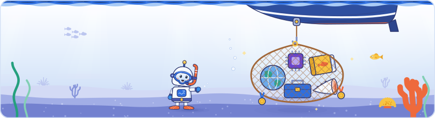

[Knowledge base](../README.md) / **60-outputs**

<!-- GENERATED by _system/build_kb.py. Do not edit; change 20-claims/ and rebuild. -->

# Outputs

**Everything the knowledge base produces: the web edition, the field guides, a kit for developers, the glossary and a preview of the media kit for content teams, a pack for AI agents and the status badges.**

Version v2.13.0 · data through 2026-10-02 (Day 3).

<picture><source media="(prefers-color-scheme: dark)" srcset="../_system/brand/illustrations/60-outputs-dark.svg"></picture>

## What's here

| Folder | What it is | For |
| --- | --- | --- |
| [`site/`](site/index.html) | **Web edition**: every day, topic, thing and claim, with search | Anyone reading |
| [`pdf/`](pdf/README.md) | **Field guides**: a PDF per day in Deep Dive, the main edition, kept current; the classic Art Deco and modern editions are frozen at v2.4.0 ([what they lack](pdf/classic-editions-log.md)) | Reading and printing |
| [`dev/`](dev/README.md) | **Developer kit**: 138 requirements, a ticket CSV, snippets, the differences ledger | Developers |
| [`content/`](content/README.md) | **Media kit**: the wording rules, the glossary and a short preview; the full kit is not part of this community edition | Content and media teams |
| [`agent-pack/`](agent-pack/INDEX.md) | **Agent pack**: the claims, topics, things and kits as JSON, and the links between them as a graph | AI agents |
| [`badges/`](badges/) | **Badges**: the status badges the README pages show | The README pages |

The web edition holds every area, session and claim too, a card for each thing the event talked about, the developer kit, the glossary and the field guides. It works offline and carries its own copy of the PDFs, so `site/` can be shared on its own. The developer kit adds a pre-launch checklist and the differences ledger (`dev/differences.md`: where the event and Google's documentation differ, and what to follow), also a page of the web edition. The media kit keeps its wording rules and glossary open, with a short preview of the full kit, which is not part of this community edition. The agent pack holds claims, topics, sessions, sources, the developer kit and the open part of the content kit as JSON and Markdown, the links between them as one graph (`graph.json`, with lookup tables in `links.json`), a card for each thing the event talked about (`entities.json`), the differences ledger (`differences.json`) and instructions in `AGENTS.md`: hand the folder over as it is. In the knowledge base folder, `ask.bat` (for people) and `python _system/kb_query.py` (for AI agents) answer questions from the pack alone, with a citation for every claim.

> [!TIP]
> GitHub shows `.html` files as source code. To read the web edition, download or clone the repository and double-click `60-outputs/site/index.html`.

## How it is made

| Folder | Built by | From |
| --- | --- | --- |
| `site/` | `_system/site/build_site.py` | The agent pack, the field guides and the mindmap |
| `pdf/` | `_system/pdf/make_pdf.py` | The day's template in `_system/pdf/` and the agent pack |
| `dev/`, `content/` | `_system/kits.py`, run by `_system/build_kb.py` | `25-kits/` and the claims |
| `agent-pack/` | `_system/build_kb.py` | `20-claims/`, `25-kits/` and `_system/templates/AGENTS.md` |
| `badges/` | `_system/badges.py`, run by `_system/build_kb.py` | The claims, the kits and `CHANGELOG.md` |

`rebuild.bat` runs them in order: the knowledge base, then the field guides, then the web edition.

## Badges

        

The build draws these badges, which also head the [knowledge base README](../README.md), from the data every time it runs, so they always match the pages. They take the default style of `_system/theme.yaml`: the Deep Dive pills (an indigo label, an ocean-blue value and a small bubble on the seam).

| Badge | Shows |
| --- | --- |
| `version.svg` | v2.13.0, data through 2026-10-02: the top `CHANGELOG.md` entry and the last day with claims |
| `days.svg` | 3 of 3 event days have claims |
| `claims.svg` | 2228 public claims; private claims never count |
| `docs-backed.svg` | 67% of the slide and stage claims graded against the docs are confirmed or consistent |
| `topics.svg` | 96 topics |
| `sources.svg` | 242 sources: the Google pages and press reports in `agent-pack/sources.json` |
| `dev-kit.svg` | 138 requirements in the developer kit |
| `media-kit.svg` | Media kit: full edition on request; this community edition holds the wording rules, the glossary and a short preview |
| `privacy.svg` | Private material is left out of every shared output: see [PRIVACY.md](../PRIVACY.md) |

*Graded against the docs* means graded confirmed, consistent or undocumented; a claim with nothing to verify (n/a) does not count.

Everything here is built from public claims only: a claim marked `private: true` never reaches this folder, and no slide photo, recording or transcript is ever included. See [PRIVACY.md](../PRIVACY.md).

> [!NOTE]
> **Generated** by the scripts above. Do not edit; change `20-claims/`, `25-kits/` or the day templates in `_system/pdf/` and run `rebuild.bat`.

← [50-maps](../50-maps/README.md) · [70-private](../70-private/README.md) →

