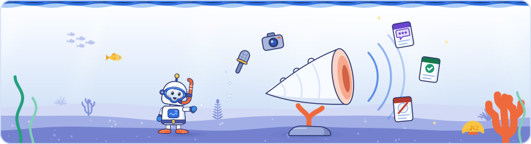

[Knowledge base](../../README.md) / [60-outputs](../README.md) / **content**

<!-- GENERATED by _system/kits.py from 25-kits/. Do not edit; change 25-kits/ and rebuild. -->

# Media kit

**The full media kit is not part of this community edition.**

Behind this page sits a complete kit for content teams: 158 facts with safe wording, 64 myths with the facts that answer them, 80 story angles, 122 short quotations with their credit lines, every figure with its scope (62), and the audience's questions with Google's answers (25). Each item is tied to its claims, labelled, and graded against Google's documentation, so writers know what can be said as Google's position and what was only said on stage.

Version v2.13.0 · data through 2026-10-02 (Day 3). Built from `25-kits/` and the claims in `20-claims/`.

<picture><source media="(prefers-color-scheme: dark)" srcset="../../_system/brand/illustrations/60-outputs-content-dark.svg"></picture>

## A small taste

Three facts, two myths, one story angle and two quotes from the full kit, as the kit holds them: each with the claims it rests on, its label and the credit line to use.

### Facts

#### F-012: A Search Console setting now lets a site leave AI Overviews and AI Mode, and Google says the setting is not used as a ranking or inclusion signal for regular results.

*Documented*

- `D1-C029` Shown on a slide, Day 1 (Google), confirmed by Google docs: Search Console has a property setting called Search generative AI that gives direct control over AI Overviews and AI Mode without affecting web rankings. Its states are inherit from parent, include and exclude.
- `D1-C031` Google's documentation (Google Search Console Help): Google says the control is not used as a ranking or inclusion signal for regular results.
- Google documentation: [Search generative AI control](https://support.google.com/webmasters/answer/16908024?hl=en) (Google Search Console Help, checked 2026-10-02)

#### F-017: Google treats network timeouts, connection resets and DNS errors like 5xx server errors: crawling slows down at once, and indexed URLs that stay unreachable are removed from the index within days.

*Documented*

- `D1-C126` Google's documentation (Google): Google treats network timeouts, connection resets and DNS errors like 5xx server errors: crawling slows down immediately, and already indexed URLs that stay unreachable are removed from Google's index within days.
- Google documentation: [Debug network and DNS errors for Google's crawlers](https://developers.google.com/crawling/docs/troubleshooting/dns-network-errors) (Google, checked 2026-10-03)

#### F-025: noindex costs crawl budget because Google must fetch a page to see the rule, while URLs disallowed in robots.txt are not fetched at all.

*Documented*

- `D1-C106` Shown on a slide, Day 1 (Google), confirmed by Google docs: The noindex rule consumes crawl budget, because Google must fetch the page to see it.
- `D1-C105` Shown on a slide, Day 1 (Google), consistent with Google docs: URLs disallowed through robots.txt do not affect crawl budget, because they are not fetched.
- Google documentation: [Optimize your crawl budget](https://developers.google.com/crawling/docs/crawl-budget) (Google, checked 2026-10-04)

### Myths

#### M-001: SEO is dead: AI search needs GEO, a new discipline.

**Myth:** SEO is dead: AI search needs GEO, a new discipline.

**Fact:** Google said not to worry about the name: good SEO is good GEO and AEO. Its documentation says optimising for generative AI search is still SEO, because the AI features are built on the core ranking systems and highlight content indexed by Google Search. Day 3 closed on the same line: AI features on Google Search use exactly the same processes as traditional results.

*Documented*

- `D1-C050` Shown on a slide, Day 1 (Google), confirmed by Google docs: Google's answer to 'SEO is dead, long live GEO' is not to worry about the name: good SEO is good GEO and AEO.
- `D1-C051` Shown on a slide, Day 1 (Google), confirmed by Google docs: Three reasons were given: generative AI features are built directly on the core ranking systems, query fan-out expands the original query to find related information, and generative AI features highlight content indexed by Google Search.
- `D1-C052` Google's documentation (Google Search Central): Google's guide for generative AI features says optimising for generative AI search is optimising for the search experience, and is therefore still SEO.
- `D3-C701` Shown on a slide, Day 3 (Google), consistent with Google docs: Google's closing slide said AI on Google is just SEO: AI features on Google Search use exactly the same processes as traditional results, so no new acronym is needed, as none was for mobile-first indexing or structured data.
- Google documentation: [Optimizing your website for generative AI features on Google Search](https://developers.google.com/search/docs/fundamentals/ai-optimization-guide) (Google Search Central, checked 2026-10-03)
- Google documentation: [AI features and your website](https://developers.google.com/search/docs/appearance/ai-features) (Google Search Central, checked 2026-10-03)

#### M-002: Cut your content into short, self-contained chunks so Google's AI can use it.

**Myth:** Cut your content into short, self-contained chunks so Google's AI can use it.

**Fact:** Google said chunking matters at the level of an AI model's context window, and Gemini's holds millions of tokens, so Gemini does not need content cut into 100 or 200 word pieces. Google spoke only for its own systems. Google's Day 1 myth slide already said there is no need to chop content.

*Documented*

- `D2-C330` Said on stage, Day 2 (Google), consistent with Google docs: Gary Illyes said the common SEO advice to chunk content for AI systems is misunderstood: chunking is real, but it matters at the level of an AI model's context window.
- `D2-C331` Said on stage, Day 2 (Google), consistent with Google docs: Gary Illyes said Gemini's context window, where chunking actually matters, holds millions of tokens.
- `D2-C332` Said on stage, Day 2 (Google), consistent with Google docs: Gemini does not need content cut into small chunks of 100 or 200 words, Gary Illyes said, since a smaller book fits in its context window.
- `D1-C054` Shown on a slide, Day 1 (Google), confirmed by Google docs: Myth: optimise for AI over readers. Google's answer: optimise for people, with no need to obsess over precise keywords or AI phrasing, no need to chop content, and no need for llms.txt.
- Google documentation: [Optimizing your website for generative AI features on Google Search](https://developers.google.com/search/docs/fundamentals/ai-optimization-guide) (Google Search Central, checked 2026-10-03)
- Google documentation: [Long context](https://ai.google.dev/gemini-api/docs/long-context) (Google AI for Developers (Gemini API docs), checked 2026-10-03)

### Story angle

#### A-001: Is SEO dead? Google's own answer from Barcelona

**Audience:** SEO practitioners, marketers, business owners · **Formats:** LinkedIn post, Article

**Hook:** Google told a room of SEOs that GEO is a label, not a new discipline: good SEO is good GEO and AEO.

**Points:**

1. Google's answer to 'SEO is dead, long live GEO': don't worry about the name, good SEO is good GEO and AEO. *(Documented: `D1-C050`, `D1-C049`)*
2. Three reasons Google gave: generative AI features are built on the core ranking systems, query fan-out expands the query to find related information, and the features highlight content indexed by Google Search. Google's guide calls it still SEO. *(Documented: `D1-C051`, `D1-C052`)*
3. AI Mode and AI Overviews use the same crawling and the same index as Search; at serving they add grounding and query fan-out. *(Documented: `D1-C038`)*
4. Day 2 repeated it: AI Overviews and AI Mode are built on top of Search results, so what works for web results also works for the AI features. *(Documented: `D2-C116`, `D2-C601`)*
5. llms.txt is not needed: Google Search ignores such files, so they neither help nor harm. *(Documented: `D1-C054`, `D1-C061`)*
6. Day 3 closed the event on the same message: AI on Google is just SEO, because AI features on Google Search use exactly the same processes as traditional results, and no new acronym was needed for mobile-first indexing or structured data either. *(Documented: `D3-C701`, `D3-C702`)*
7. 'SEO is dead' posts go back at least to a 'Search engine R.I.P.' forum post of 10 November 1997, Google said on Day 1, adding that the AI features only create more opportunities for site owners. *(Said at Search Central Live: `D1-C197`, `D1-C198`)*
8. Counterpoint: a community speaker argued for adopting the GEO label as the industry's chance to leave SEO's bad reputation behind. *(Said at Search Central Live: `D1-C296`)*

**Caution:** Every Google point except the 1997 history and the 'more opportunities' remark, which were said on stage, is backed by Google's documentation; the GEO counterpoint is a community speaker's view, not Google's. The remark that GEO is a label invented to create a new field comes from the author's notes of a stage talk, so paraphrase it; quote only the checked slide wording.

**Call to action:** Ask readers which 'GEO' tactic they were sold this year, then check it against Google's guide to generative AI features.

**Evidence:**

- `D1-C050` Shown on a slide, Day 1 (Google), confirmed by Google docs: Google's answer to 'SEO is dead, long live GEO' is not to worry about the name: good SEO is good GEO and AEO.
- `D1-C049` Said on stage, Day 1 (Google), consistent with Google docs: Gary Illyes argued that GEO is a label invented to create a new field and is not needed. Understanding how SEO works is enough.
- `D1-C051` Shown on a slide, Day 1 (Google), confirmed by Google docs: Three reasons were given: generative AI features are built directly on the core ranking systems, query fan-out expands the original query to find related information, and generative AI features highlight content indexed by Google Search.
- `D1-C052` Google's documentation (Google Search Central): Google's guide for generative AI features says optimising for generative AI search is optimising for the search experience, and is therefore still SEO.
- `D1-C038` Shown on a slide, Day 1 (Google), consistent with Google docs: AI Mode and AI Overviews use the same crawling and the same index as Search. At serving they add grounding on the Search index and query fan-out.
- `D2-C116` Said on stage, Day 2 (Google), consistent with Google docs: AI Overviews and AI Mode are built on top of Search results: they are a different experience of the same content Google already has.
- `D2-C601` Said on stage, Day 2 (Google), confirmed by Google docs: Sites need no extra work to appear in AI Overviews and AI Mode: both work on top of the existing web results, so what works for web results also works for the AI features.
- `D1-C054` Shown on a slide, Day 1 (Google), confirmed by Google docs: Myth: optimise for AI over readers. Google's answer: optimise for people, with no need to obsess over precise keywords or AI phrasing, no need to chop content, and no need for llms.txt.
- `D1-C061` Google's documentation (Google Search Central): Google's guide says new machine-readable files, AI text files or special markup are not needed to appear in Search, and that such files neither harm nor help visibility because Google Search ignores them.
- `D3-C701` Shown on a slide, Day 3 (Google), consistent with Google docs: Google's closing slide said AI on Google is just SEO: AI features on Google Search use exactly the same processes as traditional results, so no new acronym is needed, as none was for mobile-first indexing or structured data.
- `D3-C702` Said on stage, Day 3 (Google), consistent with Google docs: AI Overviews and AI Mode are built on the Search infrastructure Google has used for 25 to 30 years and have very few processes of their own.
- `D1-C197` Said on stage, Day 1 (Google): Gary Illyes traced 'SEO is dead' predictions back to a post titled 'Search engine R.I.P.' on an online advertising forum on 10 November 1997, and said such posts still appear every month or even every week.
- `D1-C198` Said on stage, Day 1 (Google): Gary Illyes said SEO is not dead and that the new AI features only create more opportunities for site owners to take advantage of.
- `D1-C296` Said on stage, Day 1 (a community speaker): A community speaker argued for adopting the GEO label as the industry's chance to leave behind the bad reputation SEO built, unlike Google's view earlier the same day that the new name is not needed.
- Google documentation: [Optimizing your website for generative AI features on Google Search](https://developers.google.com/search/docs/fundamentals/ai-optimization-guide) (Google Search Central, checked 2026-10-03)
- Google documentation: [AI features and your website](https://developers.google.com/search/docs/appearance/ai-features) (Google Search Central, checked 2026-10-03)

### Quotes

#### Q-001

> "Don't worry about what to call it. Good SEO is good GEO, AEO."

Credit: Google at Search Central Live Deep Dive Europe 2026 (Day 1)

`D1-C050` · Shown on a slide · wording checked · confirmed by Google docs

Context: Google's answer to 'SEO is dead, long live GEO' is not to worry about the name: good SEO is good GEO and AEO.

- Google documentation: [Optimizing your website for generative AI features on Google Search](https://developers.google.com/search/docs/fundamentals/ai-optimization-guide) (Google Search Central, checked 2026-10-03)

#### Q-002

> "Optimizing for people is optimizing for Generative AI Search"

Credit: Google at Search Central Live Deep Dive Europe 2026 (Day 1)

`D1-C058` · Shown on a slide · wording checked · consistent with Google docs

Context: Optimising for people is optimising for generative AI Search.

- Google documentation: [Optimizing your website for generative AI features on Google Search](https://developers.google.com/search/docs/fundamentals/ai-optimization-guide) (Google Search Central, checked 2026-10-03)

## Want to create content from it, at scale?

We help companies turn this knowledge base into a content engine: briefs, articles, social posts and newsletters, generated with the wording rules, credit lines and verification built in, reviewed for quality and written in your brand's voice.

Get in touch: [Ibram & Dawwa GmbH](https://ibramdawwa.de) · [LinkedIn](https://de.linkedin.com/in/ibrahem-angro)

The glossary stays open for everyone: [`glossary.md`](glossary.md) holds all 125 terms in plain English.

## What's here

| File | Use it for |
| --- | --- |
| [`glossary.md`](glossary.md) | 125 terms in plain English. |
| [`content-library.json`](content-library.json) | The wording rules, the glossary and the preview above for AI writing tools, with claims and sources resolved and the topics each item touches |

> [!IMPORTANT]
> This kit comes from an independent attendee knowledge base, not from Google. It holds paraphrases, quotations of 25 words or fewer and links to Google's public documentation only: no slide photos, recordings or transcripts. Credit each item as the credit lines below say.

## Credit lines

- What Google said or showed at the event: "Google at Search Central Live Deep Dive Europe 2026 (Day N)".
- What a community speaker said: "a community speaker at Search Central Live Deep Dive Europe 2026 (Day N)". Never present it as Google's position.
- Where the credit is "a speaker at Search Central Live Deep Dive Europe 2026 (Day N)", the knowledge base does not record whether a Googler or a community speaker said it (a point from a session that was not recorded, or a lightning slot with a Google host): write "said at the event" and never attribute it to Google.
- Google's documentation: name the page and link it.
- A speaker's name appears only where the content library gives one (`speaker` in `content-library.json`). Everywhere else, leave the name out: who said it matters less than what was said and how well it is documented.

## Labels

| Label | Meaning |
| --- | --- |
| Documented | At least one cited Google document states or supports it. |
| Said at Search Central Live | Said or shown at the event and not in Google's documentation. Present it as said at Search Central Live, never as documented policy. |
| Partly documented | Some of its claims are in Google's documentation and some were only said or shown at the event: check each claim and present the undocumented part as said at Search Central Live. |
| Reported by the press | A third-party report of what Google said, not Google's documentation. |
| Author's analysis | The author's interpretation. Never attribute it to Google. |

## Wording rules

1. Documented points (status documented): write "Google's documentation says..." when you paraphrase a Google page, or "Google said at the event, and its documentation supports this..." when the point was said or shown on stage and the documentation only supports it. Link the Google page given in the kit.
2. Event-only points (status event-only): write "Google said at Search Central Live Deep Dive Europe 2026 (Day N)..." or "a Google slide at the event showed...". Never present them as documented policy, a guarantee or a confirmed ranking factor; where it matters, add "this is not in Google's documentation".
3. Community speakers: write "a community speaker at the event said...". Their findings, tools and methods are theirs, not Google's, even when Google's documentation agrees.
4. Unattributed points: where the kit's credit is "a speaker at Search Central Live Deep Dive Europe 2026 (Day N)", the knowledge base does not record whether a Googler or a community speaker said it (a point from a session that was not recorded, or a lightning slot with a Google host). Write "said at the event" and never attribute it to Google.
5. Audience questions are questions, not Google's position. Only Google's answer can be attributed to Google.
6. Names: credit "Google at Search Central Live Deep Dive Europe 2026 (Day 1)", "(Day 2)" or "(Day 3)", or "a community speaker", and name a person only where the kit gives a named speaker (speaker in content-library.json, "Named speaker" in quotes.md). The knowledge base names a speaker only on proof: the name shown on a slide; a self-introduction or an introduction by name in the recording that matches the official speaker list; or the author's own identification at the event (notes or recording label). Wherever the author recorded any doubt about who was speaking (a speaker marked inferred or probable), the name was dropped, even where similar evidence names another session's speaker. Never add a name from your own knowledge; drop the name and keep the information.
7. Analysis claims and every point marked "Author's view:" are the knowledge base author's interpretation and advice (Ibrahim Anjro). Present them as our view or our recommendation, never as Google's.
8. Press claims: name the publication ("as reported by Search Engine Journal"). A press report is neither Google's documentation nor something said at the event.
9. Numbers keep their scope: the market (US only, global English-language queries), the period (since launch, past six months, 2022 versus 2021), the basis (Google internal data, a Google-commissioned survey, a third-party study and its year) and the comparison ("30% faster than AI Mode queries overall" is not "30% growth"). Never round up, combine, annualise or extrapolate a figure. Where a Google figure has no stated market, period or source, say so ("the slide gave no market or period").
10. Hedges stay. If a claim says "or mostly", "as far as I'm aware", "I think", "approximately", "likely" or notes an unclear recording, keep the hedge in your wording or leave the point out.
11. Quotes: use only the kit's quote list or a claim's quote field, verbatim, at most 25 words, inside quotation marks, with no edits, splices or translations inside the marks. Prefer quotes marked checked; label transcript quotes that are not checked as spoken remarks and never show them as slide text.
12. Partly documented points: an angle point labelled Partly documented rests on documented claims and on claims that were only said or shown at the event. Check each cited claim, and attribute the undocumented part to the event ("Google said at Search Central Live..."), never to Google's documentation.
13. Where the event and Google's documentation differ, follow the documentation and say that they differ (for example canonicals on paginated pages, max-snippet:-1, 'Discovered – currently not indexed', SpamBrain's launch year, PageRank's role in ranking, Google's 2023 testing figures, the source year of the 40 billion spam pages figure).
14. No slide photos, screenshots of slides, transcripts, recordings or images of attendees in any content. Recreate charts yourself (for example your own Google Trends charts) and describe slides in your own words.
15. Companies shown on stage as bad examples stay unnamed ("a large German banking group", "a retail brand"). Do not name the clients or competitors in community case studies either.
16. The event is Google Search Central Live Deep Dive Europe 2026, Barcelona: Day 1 on 30 September 2026 (crawling), Day 2 on 1 October 2026 (indexing), Day 3 on 2 October 2026 (serving: ranking, Search Console and performance). Claim ids starting D1 are Day 1, D2 are Day 2 and D3 are Day 3. Day 3's processing times are Google's estimates from internal analysis: always call them estimates. Docs, press and analysis claims only annotate a session; they were not said there.
17. Do not promise outcomes the claims do not state (rankings, traffic, AI citations, indexing). "Can", "may" and "Google said" must not become "will".
18. Keep claim ids in drafts so a reviewer can check every sentence against 20-claims/; remove them from the published text.

## Changing the kit

> [!NOTE]
> **Generated** by `_system/kits.py` from `25-kits/`. Do not edit; change `25-kits/content.yaml` and run `rebuild.bat`.
> The build rewrites every file in this folder. See step 7 of `_system/PLAYBOOK.md`.

← [Developer kit](../dev/README.md) · [60-outputs](../README.md) · [Agent pack](../agent-pack/INDEX.md) →

