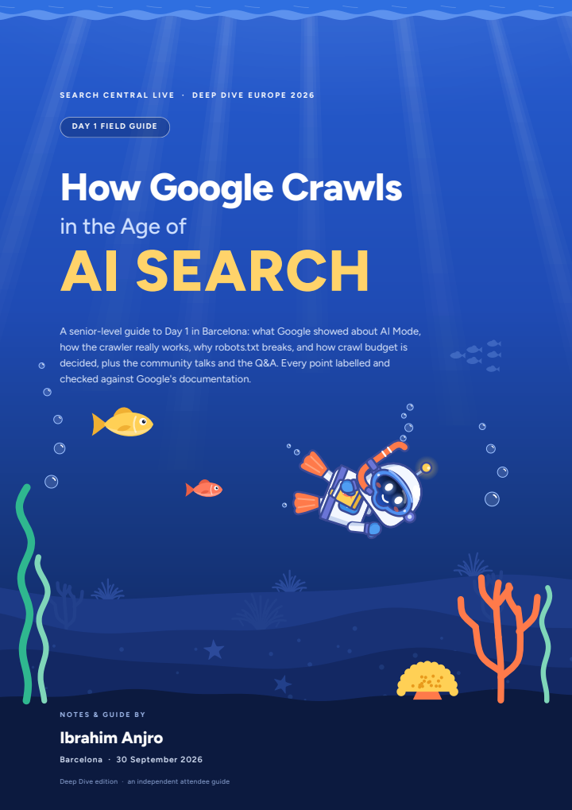
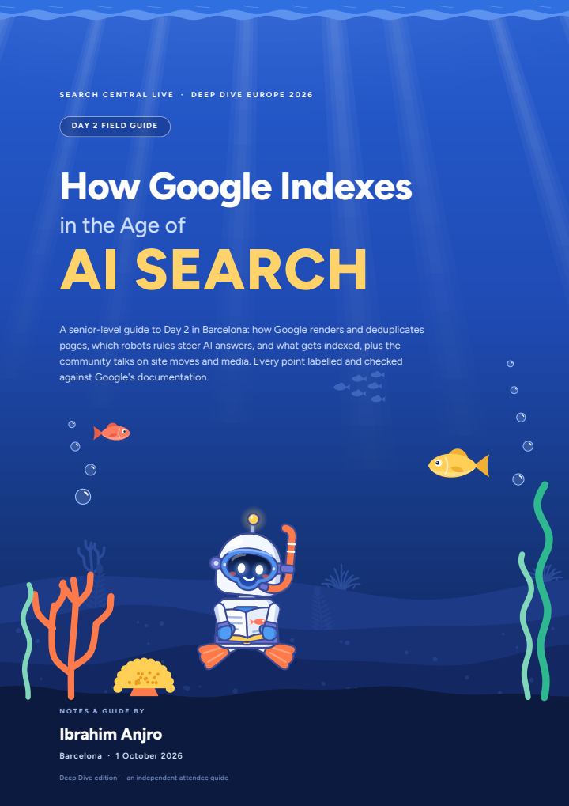

[Knowledge base](../../README.md) / [60-outputs](../README.md) / **pdf**

# Field guides

**The printable field guide of each event day. Deep Dive is the main edition and the one kept current. The classic Art Deco and modern editions are frozen at their v2.4.0 content, and [the classic editions log](classic-editions-log.md) lists what they lack.**

<picture><source media="(prefers-color-scheme: dark)" srcset="../../_system/brand/illustrations/60-outputs-pdf-dark.svg"></picture>

  
  &nbsp;
  
  &nbsp;
  
   
  The Deep Dive covers of the three days. Click one to open the guide.

##  What's here

| Day | Deep Dive current (v2.7.0) | Art Deco classic edition, content as of v2.4.0 | Modern classic edition, content as of v2.4.0 |
| --- | --- | --- | --- |
| **Day 1 · Crawling** Wed 30 September 2026 | [**`day1-field-guide-deep-dive.pdf`**](day1-field-guide-deep-dive.pdf) 34 pages, with the robots.txt talk, the community talks and the Q&A | [`day1-field-guide-art-deco.pdf`](day1-field-guide-art-deco.pdf) 21 pages | [`day1-field-guide-modern.pdf`](day1-field-guide-modern.pdf) 21 pages |
| **Day 2 · Indexing** Thu 1 October 2026 | [**`day2-field-guide-deep-dive.pdf`**](day2-field-guide-deep-dive.pdf) 35 pages | [`day2-field-guide-art-deco.pdf`](day2-field-guide-art-deco.pdf) 32 pages | [`day2-field-guide-modern.pdf`](day2-field-guide-modern.pdf) 32 pages |
| **Day 3 · Serving** Fri 2 October 2026 | [**`day3-field-guide-deep-dive.pdf`**](day3-field-guide-deep-dive.pdf) 33 pages | [`day3-field-guide-art-deco.pdf`](day3-field-guide-art-deco.pdf) 33 pages | [`day3-field-guide-modern.pdf`](day3-field-guide-modern.pdf) 33 pages |

> [!IMPORTANT]
> **Only the Deep Dive edition is kept current.** v2.5.0 added a second attendee's recording of Day 1 and Day 2: 497 new claims, corrected claims and proven speaker names. The Day 1 and Day 2 Deep Dive guides carry them. v2.7.0 added six audio recordings of Day 1 sessions (the keynote, Lightning A, the crawling talks, the robots.txt talk with the start of Lightning B, and the Q&A): 53 new claims, corrections and quotes checked against the audio, in the Day 1 Deep Dive guide only. The Art Deco and modern guides stay byte-identical to v2.4.0, and **[`classic-editions-log.md`](classic-editions-log.md)** lists, day by day, every section, paragraph and correction they lack. Day 3's classic guides lack only two small corrections made after v2.6.0 (the 200-second minimum and a hedged word).

GitHub shows a preview of each PDF; use its download button for the file itself. The [web edition](../site/index.html) carries its own copies in `60-outputs/site/downloads/`, refreshed by every rebuild.

This page and the classic editions log are hand-written (the PDFs are generated): add a day's row when its guide is built, and log a Deep Dive change in the classic editions log.

##  Inside a guide

A cover and contents page, the day's key takeaways, the day at a glance (its agenda, generated from the session data), the content sections, a help and contact page, and the sources, generated from the sources the day's claims cite. Statements carry their source label (Slide, Stage, Docs, Press or Analysis), and the template can tie each one to the claims it rests on; the build stops if a guide cites a claim that does not exist or is private.

| Edition | The look |
| --- | --- |
| **Deep Dive** the main edition | Every page is a white card over sunlit water, between a wavy surface and a seabed with reef fish, seaweed and coral. Sections open with a glossy numbered bubble; the Diver bot, our own robot snorkel diver, is on the cover and the contact page, and quiet reef vignettes (some with the bot) fill large empty spaces at the ends of pages. Set in Figtree. |
| **Art Deco** classic edition, content as of v2.4.0 | Gold and onyx: stepped frames, sunburst rays and ornamental rules, set in Poiret One, Josefin Sans and Jost. |
| **Modern** classic edition, content as of v2.4.0 | A plain, light layout for quick printing. |

##  How they are made

Generated by [`_system/pdf/make_pdf.py`](../../_system/pdf/make_pdf.py) from the day's hand-written `_system/pdf/dayN.template.html`, `_system/pdf/days.yaml` and the agent pack. `rebuild.bat` runs it for every day that has a template, for the Deep Dive edition only (`ocean`). It never rewrites the classic editions. To refresh one on purpose, build it by hand with `make_pdf.py dayN deco` or `make_pdf.py dayN modern`, then update the classic editions log. **Do not edit the PDFs:** change the template or the claims and run `rebuild.bat` (or `rebuild.bat dayN` for one day). Two builds of the same input give byte-identical PDFs. The full guide to the PDF system is [`_system/pdf/README.md`](../../_system/pdf/README.md).

> [!NOTE]
> No slide photo is ever embedded: code examples and diagrams are redrawn from the slides as teaching material. The contact page prints the author's WhatsApp number and LinkedIn link on purpose (set in `_system/pdf/config.yaml`). See [`PRIVACY.md`](../../PRIVACY.md).

← <a href="../README.md">60-outputs</a> · <a href="../dev/README.md">Developer kit</a> →

