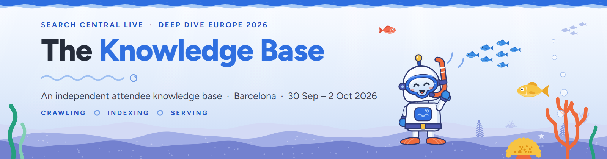
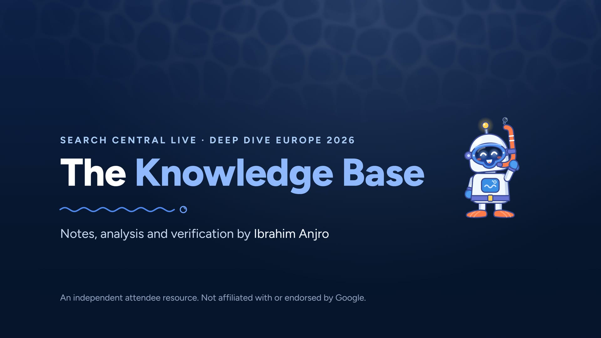
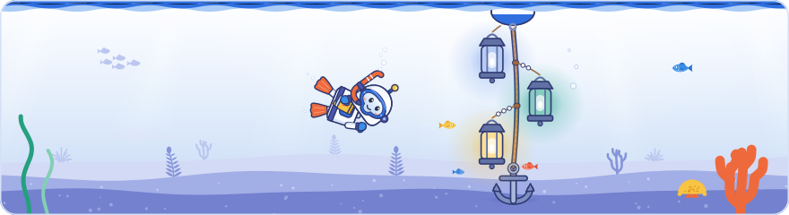
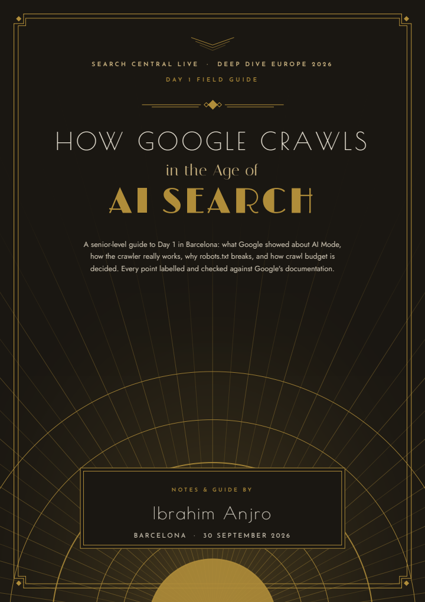
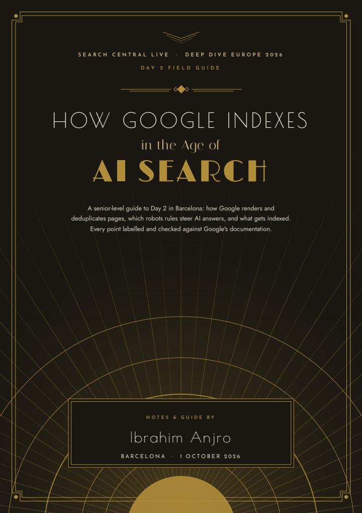
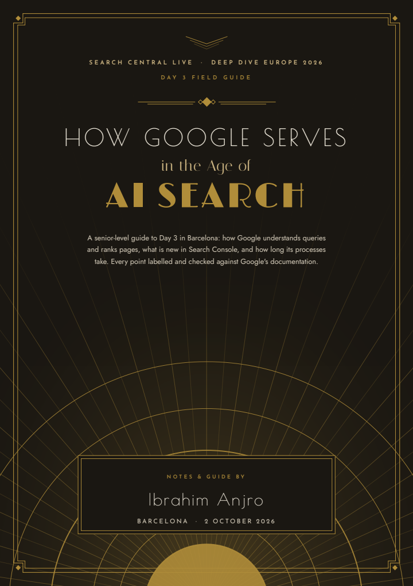
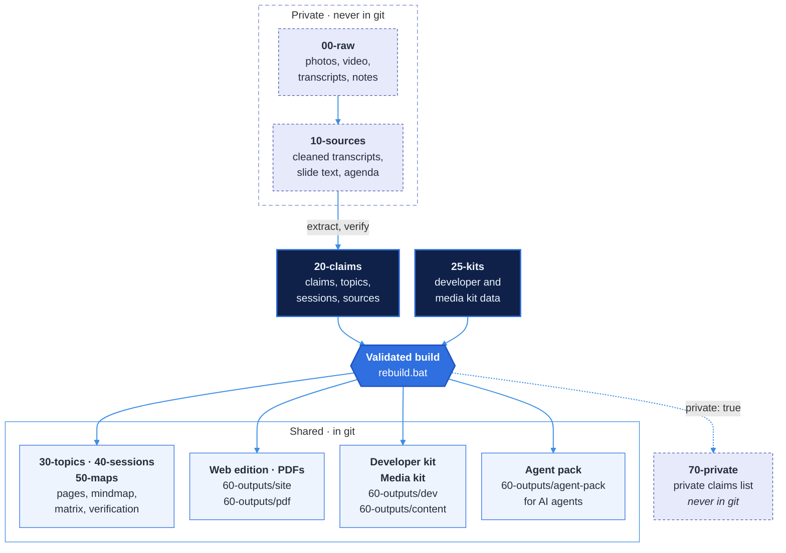

<p align="center">
  <picture>
    <source media="(prefers-color-scheme: dark)" srcset="_system/brand/banner-dark.png">
    <source media="(prefers-color-scheme: light)" srcset="_system/brand/banner-light.png">
    
  </picture>
</p>

<p align="center">
  <sub>Barcelona · 30 September to 2 October 2026 · Notes, analysis and verification by Ibrahim Anjro</sub>
</p>

<p align="center">
  <a href="CHANGELOG.md"></a>
  <a href="40-sessions/README.md"></a>
  <a href="20-claims/README.md"></a>
  <br>
  <a href="50-maps/verification-report.md"></a>
  <a href="30-topics/README.md"></a>
  <a href="20-claims/sources.yaml"></a>
  <br>
  <a href="60-outputs/dev/README.md"></a>
  <a href="60-outputs/content/README.md"></a>
  <a href="PRIVACY.md"></a>
</p>

**In 30 seconds.** This is an independent, open knowledge base of Google's Search Central Live Deep Dive Europe 2026: everything shown and said over three days in Barcelona, broken into 2,228 small, labelled claims and graded against Google's own documentation. It is made for SEOs, developers, content teams and the AI agents that work with them. You get a searchable web edition, three field guides, a developer kit of requirements with tests, and an agent pack that answers with a citation for every claim. It is free: the developer kit and the glossary for any use, everything else for non-commercial use.

##  Three headline findings

1. **About a third of what was shown and said on stage is not in Google's documentation**: of the 1,317 slide and stage claims graded against it, 67% are confirmed or consistent and 433 are undocumented, so those are quoted as said at Search Central Live [verification report: [web](https://ibramdawwagmbh.github.io/search-central-live-2026-knowledge-base/verification.html) · [repo](50-maps/verification-report.md)].
2. **Good SEO is good GEO, and llms.txt is not needed**: Google's Day 1 slides said so, and its guide to generative AI features agrees that optimising for AI search is still SEO and that AI text files neither help nor harm, because Google Search ignores them [[D1-C050](https://ibramdawwagmbh.github.io/search-central-live-2026-knowledge-base/topics/seo-vs-geo.html#D1-C050), [D1-C054](https://ibramdawwagmbh.github.io/search-central-live-2026-knowledge-base/topics/llms-txt.html#D1-C054), [D1-C052](https://ibramdawwagmbh.github.io/search-central-live-2026-knowledge-base/topics/seo-vs-geo.html#D1-C052), [D1-C061](https://ibramdawwagmbh.github.io/search-central-live-2026-knowledge-base/topics/llms-txt.html#D1-C061)].
3. **A Search Console setting lets a site leave AI Overviews and AI Mode without touching its rankings**: the "Search generative AI" property setting controls both features, and Google's help page says the control is not used as a ranking or inclusion signal for regular results [[D1-C029](https://ibramdawwagmbh.github.io/search-central-live-2026-knowledge-base/topics/genai-optout.html#D1-C029), [D1-C031](https://ibramdawwagmbh.github.io/search-central-live-2026-knowledge-base/topics/genai-optout.html#D1-C031)].

<p align="center">
  <a href="https://ibramdawwagmbh.github.io/search-central-live-2026-knowledge-base/#tour"></a>
  <br>
  <a href="https://ibramdawwagmbh.github.io/search-central-live-2026-knowledge-base/#tour"><b>Watch the 1-minute tour</b></a>
</p>

##  Work with us

Ibram & Dawwa GmbH helps companies to:

1. **create content from this knowledge base** at premium scale and quality, and
2. **build an agentic system that checks every website they manage** against these rules.

We are also open for collaboration on this community version: corrections, ideas and contributions are welcome. [Get in touch](https://ibramdawwa.de/contact) · [LinkedIn](https://de.linkedin.com/in/ibrahem-angro)

<p align="center">
   <a href="https://ibramdawwagmbh.github.io/search-central-live-2026-knowledge-base/"><b>Live web edition</b></a> &nbsp;·&nbsp;
   <a href="60-outputs/dev/README.md"><b>Developer kit</b></a> &nbsp;·&nbsp;
   <a href="60-outputs/agent-pack/AGENTS.md"><b>Agent pack</b></a> &nbsp;·&nbsp;
   <a href="60-outputs/pdf/README.md"><b>Field guides</b></a> &nbsp;·&nbsp;
   <a href="METHOD.md"><b>How I graded the claims</b></a>
</p>

> [!IMPORTANT]
> **An independent attendee resource.** This knowledge base is not an official Google publication and is not affiliated with or endorsed by Google. Its shared parts hold paraphrases, short quotations and links to Google's public documentation only: no slide photos, recordings or transcripts.

> [!NOTE]
> **Community edition.** The claims, topics, maps, the developer kit and the agent pack are all here, free to read and to use within [their licences](LICENSE-CONTENT.md). The media kit (facts, myths, story angles and quotes for content teams) is not included; its [preview](60-outputs/content/README.md) shows what it holds.

<p align="center"></p>

##  The three days

<picture><source media="(prefers-color-scheme: dark)" srcset="_system/brand/illustrations/root-dark.svg"></picture>

<!-- When a day is added: link its Deep Dive PDF (and any classic edition) and its day page here, add its covers to "Two editions", and set its status. -->

| Day | Theme | Field guide | Read | Status |
| --- | --- | --- | --- | --- |
| **Day 1**<br><sub>Wed&nbsp;30&nbsp;Sep</sub> | **Crawling**<br><sub>How Search works, AI in Search, crawling, crawl errors, robots.txt, crawl budget, community lightning talks, the Q&amp;A</sub> | [**Deep&nbsp;Dive**](60-outputs/pdf/day1-field-guide-deep-dive.pdf)<br><sub>Classic, as of v2.4.0:</sub><br>[Art&nbsp;Deco](60-outputs/pdf/day1-field-guide-art-deco.pdf) · [Modern](60-outputs/pdf/day1-field-guide-modern.pdf) | [Day&nbsp;page](60-outputs/site/days/day-1.html)<br>[Sessions](40-sessions/README.md) | Complete |
| **Day 2**<br><sub>Thu&nbsp;1&nbsp;Oct</sub> | **Indexing**<br><sub>HTML, controlling indexing, JavaScript, duplicates and site moves, structured data, images and video, internationalisation, signals, the index, Google Trends</sub> | [**Deep&nbsp;Dive**](60-outputs/pdf/day2-field-guide-deep-dive.pdf)<br><sub>Classic, as of v2.4.0:</sub><br>[Art&nbsp;Deco](60-outputs/pdf/day2-field-guide-art-deco.pdf) · [Modern](60-outputs/pdf/day2-field-guide-modern.pdf) | [Day&nbsp;page](60-outputs/site/days/day-2.html)<br>[Sessions](40-sessions/README.md) | Complete |
| **Day 3**<br><sub>Fri&nbsp;2&nbsp;Oct</sub> | **Serving**<br><sub>Query understanding, retrieval, quality and ranking, core and spam updates, search features and shopping, Search Console, measuring AI visibility, the messy middle, processing times, AI in Search</sub> | [**Deep&nbsp;Dive**](60-outputs/pdf/day3-field-guide-deep-dive.pdf)<br><sub>Classic, as of v2.4.0:</sub><br>[Art&nbsp;Deco](60-outputs/pdf/day3-field-guide-art-deco.pdf) · [Modern](60-outputs/pdf/day3-field-guide-modern.pdf) | [Day&nbsp;page](60-outputs/site/days/day-3.html)<br>[Sessions](40-sessions/README.md) | Complete |

##  Two editions

Every field guide comes in two styled editions. **Deep Dive** is the main edition and the one kept current: sunlit water, a reef of flat, friendly fish, coral and seaweed, glossy bubble numbers, and the Diver bot, our own robot snorkel diver, swimming, reading and pointing on the covers, waving on the contact page and resting in the quiet ends of pages. **Art Deco** is the classic edition in gold and onyx, and a plain **modern** version is there for quick printing. Both classic editions are frozen at their v2.4.0 content. The second recording of Day 1 and Day 2 (v2.5.0) and the six Day 1 audio recordings (v2.7.0, with the robots.txt talk now covered) are only in Deep Dive, so the Day 1 Deep Dive guide has 34 pages and the classic one 21, and Day 2 has 35 against 32. The **[classic editions log](60-outputs/pdf/classic-editions-log.md)** lists what the classic guides lack, day by day. Day 3 has the same page count in every edition; its classic guides lack only a few corrections made after v2.6.0 (a unit and an uncertain word).

| Day 1 · Crawling | Day 2 · Indexing | Day 3 · Serving |
| :---: | :---: | :---: |
| <a href="60-outputs/pdf/day1-field-guide-deep-dive.pdf"></a> | <a href="60-outputs/pdf/day2-field-guide-deep-dive.pdf"></a> | <a href="60-outputs/pdf/day3-field-guide-deep-dive.pdf"></a> |
| <sub>Deep Dive, the main edition</sub> | <sub>Deep Dive, the main edition</sub> | <sub>Deep Dive, the main edition</sub> |
| <a href="60-outputs/pdf/day1-field-guide-art-deco.pdf"></a> | <a href="60-outputs/pdf/day2-field-guide-art-deco.pdf"></a> | <a href="60-outputs/pdf/day3-field-guide-art-deco.pdf"></a> |
| <sub>Art Deco, classic edition, content as of v2.4.0 ([what it lacks](60-outputs/pdf/classic-editions-log.md))</sub> | <sub>Art Deco, classic edition, content as of v2.4.0 ([what it lacks](60-outputs/pdf/classic-editions-log.md))</sub> | <sub>Art Deco, classic edition, content as of v2.4.0 ([what it lacks](60-outputs/pdf/classic-editions-log.md))</sub> |

The web edition, the mindmap and the Reef map are in Deep Dive too: light water, or night water when your computer is set to dark. They have no switch to another style. The style of every output is one line in [`_system/theme.yaml`](_system/theme.yaml): set `default: art-deco` there and rebuild to get them in Art Deco (where the Reef map is called the Graph). In Deep Dive the web edition's water moves gently: sunlight sways through the page heads, the reef fish swim (click one and it darts off), the Diver bot bobs and blinks, plankton twinkles at night and the home figures count up. All of it stays behind the text, and nothing moves when your computer is set to reduce motion.

##  For your teams

| Team | Give them | What it is |
| --- | --- | --- |
| **Developers** | [Developer&nbsp;kit](60-outputs/dev/README.md) | [`implementation-guide.md`](60-outputs/dev/implementation-guide.md): every requirement with why, how and a test, plus code where it applies<br>[`requirements.csv`](60-outputs/dev/requirements.csv): import into your ticket tool, with the claims and topics of each requirement<br>[`snippets.md`](60-outputs/dev/snippets.md): copy-paste code<br>[`pre-launch-checklist.md`](60-outputs/dev/pre-launch-checklist.md): release sign-off<br>[`differences.md`](60-outputs/dev/differences.md): where the event and Google's documentation differ, and what to follow |
| **Content&nbsp;and&nbsp;media** | [Media&nbsp;kit](60-outputs/content/README.md) | [`glossary.md`](60-outputs/content/glossary.md): 125 terms in plain English, open for everyone<br>The wording rules and a short preview of the kit in its [`README.md`](60-outputs/content/README.md), and [`content-library.json`](60-outputs/content/content-library.json) for AI writing tools<br>The full media kit (facts, myths, story angles, quotes, the question bank and the numbers registry) is not part of this community edition |
| **Anyone&nbsp;reading** | [Web&nbsp;edition](60-outputs/site/index.html) | All three days, every topic and claim, a card for each of the 90 things the event talked about (Search Console, Googlebot, 429, hreflang ...), search (typo-tolerant, with a speaker filter), the Reef map of links between them, the developer kit, the glossary and the PDFs of every edition; every claim shows what rests on it and the things it names |
| **AI&nbsp;agents** | [Agent&nbsp;pack](60-outputs/agent-pack/AGENTS.md) | Claims, topics, sessions, sources, things, the developer kit, the wording rules and glossary, and the differences ledger as JSON, the links between them as a graph (`graph.json`), a card per thing (`entities/`), with `AGENTS.md`; in this folder, `python _system/kb_query.py` answers from the pack with a citation per claim |

> [!TIP]
> To change a kit, edit [`25-kits/`](25-kits/README.md) and run `rebuild.bat`. The build refuses any item that cites a missing or private claim.

##  Start here

| To… | Open |
| --- | --- |
| Read it | Web edition, with search: [`60-outputs/site/index.html`](60-outputs/site/index.html)<br>Mindmap: [`50-maps/mindmap.html`](50-maps/mindmap.html)<br>Reef map, the things and claims as a map of links: [`50-maps/graph.html`](50-maps/graph.html) |
| See what Google repeated most | [`50-maps/mention-matrix.md`](50-maps/mention-matrix.md) |
| See what was said on stage but is undocumented | [`50-maps/verification-report.md`](50-maps/verification-report.md) |
| See how the claims were captured and graded | [`METHOD.md`](METHOD.md) |
| See what changed between days | [`50-maps/across-days.md`](50-maps/across-days.md) |
| Check the things and the claims they are found in | [`50-maps/entity-index.md`](50-maps/entity-index.md) |
| See where the event and Google's documentation differ | [`50-maps/differences.md`](50-maps/differences.md), the differences ledger |
| Ask it a question | Double-click [`ask.bat`](ask.bat) and type a question, a thing (429, GSC, hreflang) or a claim ID |
| Give it to an AI agent | Hand over the [`60-outputs/agent-pack/`](60-outputs/agent-pack/AGENTS.md) folder.<br>Its `AGENTS.md` tells the agent how to use it. |

> [!NOTE]
> **Read it online:** [ibramdawwagmbh.github.io/search-central-live-2026-knowledge-base](https://ibramdawwagmbh.github.io/search-central-live-2026-knowledge-base/), the web edition with the mindmap and the Reef map inside.
>
> GitHub shows `.html` files as source code. To read it offline the web edition, the mindmap or the Reef map, download or clone the repository and open [`60-outputs/site/index.html`](60-outputs/site/index.html), [`50-maps/mindmap.html`](50-maps/mindmap.html) or [`50-maps/graph.html`](50-maps/graph.html) in a browser. They work offline.

<p align="center"></p>

##  How it works

Everything is built from one source of truth: small, labelled, verified statements called **claims**, stored in [`20-claims/`](20-claims/README.md). Each claim says who said it (slide, stage, Google's docs, a press report, or the author's analysis), where the evidence is, and whether Google's documentation confirms it. Topic pages, session pages, the maps, the agent pack, the kits, the web edition and the PDFs are generated from the claims. **To change anything, edit the claims and rebuild.**



The build checks every record before it writes anything, and writes nothing when it finds an error. A claim marked `private: true` never reaches a shared output; the build lists it in `70-private/` instead (see [`PRIVACY.md`](PRIVACY.md)).

<details>
<summary><b>What a claim looks like</b></summary>
<br>

One record from [`20-claims/day1.yaml`](20-claims/day1.yaml), laid out one field per line, with the long text wrapped. The full field rules are in [`_system/schema/claim.md`](_system/schema/claim.md).

```yaml
- id: D1-C054                    # Day 1, claim 054: never reused or renumbered
  s: D1-S03                      # the session: "How Search works and where's AI?"
  label: slide                   # shown on screen
  who: Google
  ev: IMG_4653                   # the evidence: a slide photo, kept private
  ver: confirmed                 # Google's documentation states the same thing
  src: [ai-optimization-guide]   # the Google page it was checked against
  topics: [seo-vs-geo, llms-txt, helpful-content]
  text: "Myth: optimise for AI over readers. Google's answer: optimise for people,
    with no need to obsess over precise keywords or AI phrasing, no need to chop
    content, and no need for llms.txt."
  quote: "LLMS.txt isn't necessary."
  quote_checked: true
```

</details>

### Labels: who is speaking

| Label | Means |
| --- | --- |
| **Slide** | Shown on screen, by Google or a community speaker |
| **Stage** | Said on stage, from notes, a transcript or a recording |
| **Docs** | Google's own published documentation |
| **Press** | A third-party report of what Google or a Googler said |
| **Analysis** | The author's interpretation or advice, never Google's position |

### Verification grades: what Google's documentation says

| Grade | Means |
| --- | --- |
| **confirmed** | The documentation states the same thing. |
| **consistent** | The documentation supports it without stating it directly. |
| **undocumented** | Said or shown at the event, but not in the documentation. Quote it as said at Search Central Live, not as documented policy. |
| **source** | The claim is the cited document itself: a Google page (Docs) or a press report (Press). |
| **n/a** | Nothing to verify: a quotation, framing, agenda fact, audience question, opinion or analysis. |

Slide and stage claims are graded confirmed, consistent, undocumented or n/a; a technical fact shown or said by Google is never n/a. The **docs-backed** badge counts the public slide and stage claims graded confirmed, consistent or undocumented, and shows the share of them that is confirmed or consistent.

<p align="center"></p>

##  Where things are

| Folder | What it holds | Kind |
| --- | --- | --- |
| [`00-raw/`](00-raw/README.md) | Untouched inputs per day: slide photos, video clips, raw transcripts, notes | Private |
| [`10-sources/`](10-sources/README.md) | Cleaned transcripts, slide transcriptions, photo previews, the agenda | Private |
| [`20-claims/`](20-claims/README.md) | The claims (`dayN.yaml`), topics, sessions, sources and the things they name (`entities.yaml`) | **Edit here** |
| [`25-kits/`](25-kits/README.md) | Source of the developer kit, the media kit's wording rules, glossary and preview, and the differences ledger | **Edit here** |
| [`30-topics/`](30-topics/README.md) | One page per topic, grouped by area | Generated |
| [`40-sessions/`](40-sessions/README.md) | One page per session, in running order | Generated |
| [`50-maps/`](50-maps/README.md) | Topic tree, mindmap, Reef map, mention matrix, verification report, cross-day links, entity index, differences ledger | Generated |
| [`60-outputs/`](60-outputs/README.md) | Everything made for readers, teams and agents, listed below | Generated |
| ↳ [`site/`](60-outputs/site/index.html) | **The web edition**: open `index.html`. It works offline | Generated |
| ↳ [`pdf/`](60-outputs/pdf/README.md) | The field guide PDFs: Deep Dive, kept current, and the classic Art Deco and modern editions, frozen at v2.4.0 | Generated |
| ↳ [`agent-pack/`](60-outputs/agent-pack/AGENTS.md) | The version for AI agents | Generated |
| ↳ [`dev/`](60-outputs/dev/README.md) | **Developer kit**: implementation guide, ticket CSV, snippets, checklist | Generated |
| ↳ [`content/`](60-outputs/content/README.md) | **Media kit**: the glossary, the wording rules and a short preview; the full kit is not part of this community edition | Generated |
| ↳ [`badges/`](60-outputs/badges/) | The status badges at the top of this page, drawn from the data | Generated |
| [`70-private/`](70-private/README.md) | Notes about my own sites and private claims | Private |
| [`_system/`](_system/README.md) | Build scripts, schema, templates, PDF and web builders, the Deep Dive artwork and brand files, tools, tests | Code&nbsp;and&nbsp;rules |

Private folders keep only their `README.md` in git; every other folder is in git. Generated folders are rebuilt by `rebuild.bat`: never edit them by hand (the hand-written files among them are `60-outputs/pdf/README.md` and `60-outputs/pdf/classic-editions-log.md`). The web edition carries its own copy of the PDFs, so `60-outputs/site/` can be shared on its own: double-click its `index.html`.

##  Build it yourself

The one-click scripts (Windows), rebuilding by hand, adding a day, the tests and checks, and the same steps with `python3` on macOS and Linux are in [`_system/README.md`](_system/README.md).

<p align="center"></p>

##  Licence

| What | Licence |
| --- | --- |
| **Code**: the build, the validator, `kb_query.py`, the scripts, templates and the web edition's JavaScript and CSS | [MIT](LICENSE) |
| **Developer kit and glossary**: `25-kits/` requirements, snippets and differences, `60-outputs/dev/`, the glossary, the pack's `dev-requirements.json` and `differences.json`, `50-maps/differences.md` | [CC BY 4.0](https://creativecommons.org/licenses/by/4.0/): any use, commercial too, with credit |
| **All other content**: claims, topics, sessions, maps, the web edition's text, the field guides, the agent pack, [`METHOD.md`](METHOD.md) | [CC BY-NC 4.0](https://creativecommons.org/licenses/by-nc/4.0/): non-commercial use, with credit |
| **Artwork and the Diver bot**: `_system/brand/`, `_system/ocean_art.py`, the web edition's ocean art, the covers and art in the PDFs | [CC BY-NC-ND 4.0](https://creativecommons.org/licenses/by-nc-nd/4.0/) |
| Quotations, Google's documentation, press material, trademarks, fonts | Not the author's to license: see [`NOTICE.md`](NOTICE.md) |

Organisations may also use the content internally, including for training, internal documentation and auditing their own or their clients' websites. Republishing it, or generating content from it for publication, is commercial use and is not covered. The full map and the wording are in [`LICENSE-CONTENT.md`](LICENSE-CONTENT.md); none of this is legal advice.

A credit line like this is enough: *Search Central Live Deep Dive Europe 2026 knowledge base, community edition, by Ibrahim Anjro ([Ibram & Dawwa GmbH](https://ibramdawwa.de)), CC BY-NC 4.0* (CC BY 4.0 for the developer kit and the glossary).

Copyright © 2026 Ibrahim Anjro

The raw material (slide photos, recordings, transcripts) and private notes never enter git; see [`PRIVACY.md`](PRIVACY.md).

<br>

<p align="center"></p>

<p align="center">
  
  <br>
  <b>Notes, analysis and verification by Ibrahim Anjro</b>
  <br>
  <sub>An independent attendee knowledge base · not affiliated with or endorsed by Google</sub>
  <br>
  <sub>Styled in Deep Dive, with Art Deco as the classic edition · <a href="_system/brand/README.md">Brand assets</a></sub>
  <br>
  <sub><a href="CHANGELOG.md">Changelog</a> · <a href="METHOD.md">Method</a> · <a href="LICENSE-CONTENT.md">Licence</a> · <a href="PRIVACY.md">Privacy</a> · <a href="_system/README.md">System</a> · <a href="_system/PLAYBOOK.md">Playbook</a></sub>
</p>
