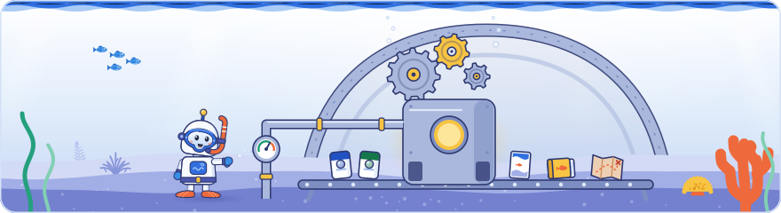

[Knowledge base](../README.md) / **_system**

# The system

**The code, rules and templates that turn the claims into every page, map, kit, PDF and the web edition.**

<picture><source media="(prefers-color-scheme: dark)" srcset="brand/illustrations/_system-dark.svg"></picture>

<p align="center"></p>

##  What's here

| Path | What it does |
| --- | --- |
| [`PLAYBOOK.md`](PLAYBOOK.md) | How to add a day: eleven steps, each ending with a check. |
| [`build_kb.py`](build_kb.py) | The main build. Validates every record in `20-claims/` and `25-kits/` before it writes anything, then writes `30-topics/`, `40-sessions/`, `50-maps/`, the agent pack (with `graph.json`, every existing link between claims, topics, sessions, sources and kit items, and `links.json`, the same links as lookup tables), the kits and `70-private/private-claims.md`, and finally scans every shared output for the excluded photos. `--check` validates only; `--root DIR` works on another copy. |
| [`kits.py`](kits.py) | The developer and media kits: checks `25-kits/` against the claims and renders `60-outputs/dev/`, `60-outputs/content/` and the kit files of the agent pack. Since v2.11.0 also the three ledgers: the numbers registry, the differences ledger (from `25-kits/differences.yaml`) and the question bank. Called by `build_kb.py`. |
| [`kb_query.py`](kb_query.py) | Asks the knowledge base from the command line: `search`, `entity`, `neighbours`, `claims`, `evidence`, `cite`, `about`, and `ask` (the loop `ask.bat` runs). Reads only `60-outputs/agent-pack/`, offline, standard library only, the same answer every time; every claim comes with its citation. AI agents run it as `AGENTS.md` describes. |
| [`badges.py`](badges.py) | The status badges on the front page: `render(stats, style)` draws each one as a small SVG from the build's numbers, written to `60-outputs/badges/`: Deep Dive pills by default, Art Deco ones when the theme says so. |
| [`edition.yaml`](edition.yaml), [`edition.py`](edition.py) | Which edition the build makes: `edition: full` (the main branch; also without the file) or `edition: community` (the community branch: the media kit is replaced by a short preview, and the author, the company and LinkedIn links appear on the Content, Developers and About pages and in the footer). `edition.py` reads it for `build_kb.py`, `kits.py` and the web edition; `kb_query.py` learns the edition from the agent pack. The community kit (`25-kits/content.yaml`) says `edition: community` too, and the build stops when the two disagree, so a checkout without `edition.yaml` or `edition.py` never builds the full edition from the preview. In the community edition it also holds the addresses of the live web edition and the repository and the contact, Impressum and privacy links, for the canonical and social tags, the sitemap and the footer. |
| [`theme.yaml`](theme.yaml), [`theme.py`](theme.py) | The default style of every output with two looks: `default: deep-dive` (or `art-deco`). The PDFs, the web edition, the mindmap, the badges and the brand files follow it; `theme.py` reads it and stops on a bad value. |
| [`ocean_art.py`](ocean_art.py) | The Deep Dive artwork as code: water, waves, seabed, reef fish, coral, seaweed, bubbles, icons and the Diver bot, our own robot snorkel diver, in six poses. Pure functions that return SVG, the same on every run. |
| [`schema/`](schema/claim.md) | `claim.md`: the field rules for claims, sessions, topics and sources (schema v2). |
| [`templates/`](templates/) | `day.template.yaml` (the start of a new `dayN.yaml`), `AGENTS.md` (the agent pack's instructions) and `mindmap.template.html` (the interactive mindmap). |
| [`pdf/`](pdf/README.md) | The field guide system: one HTML template per day, three styles (Deep Dive, Art Deco and modern; only Deep Dive is rebuilt, the classic two are frozen at v2.4.0), bundled fonts. Writes `60-outputs/pdf/`. |
| [`site/`](site/build_site.py) | `build_site.py`, `site.css`, `site.js` and bundled fonts: the offline web edition in `60-outputs/site/`, built from the agent pack, in Deep Dive (Art Deco only through `theme.yaml` and a rebuild; the pages have no switch), with gentle motion in Deep Dive (rays, swimming and clickable fish, the bot's blink, plankton at night, the rolling surface, the swaying seabed, the count-up, smooth page changes) that switches off for reduced motion. Claim cards show what rests on each claim, source and topic pages what they back. Search covers the glossary, topics, both kits, sessions and claims, corrects typos, matches word starts, expands aliases (from the glossary and a short list in `build_site.py`) and filters claims by speaker, offering only names the kits can prove. |
| [`brand/`](brand/README.md) | The README artwork, drawn by `make_brand.py`: the Deep Dive hero banners (light and night water, with the Diver bot), the wave divider, the README icons and the field guide covers, plus the header illustration of every README (drawn by `make_illustrations.py`) and the Art Deco set as the classic edition and the palettes they share with the field guides and the web edition. |
| [`tools/`](tools/) | `ingest.py` and `heic2jpg.ps1` (import raw material, make previews and the media index), `check_commit.py` (the privacy guard that `save-version.bat` and `setup-git.bat` run before committing), `entity_candidates.py` (lists candidate things for `20-claims/entities.yaml` with their mention counts; it writes outside the repository), `find_python.cmd` and `git_identity.cmd` (helpers for the `.bat` scripts). |
| [`tests/`](tests/run_tests.py) | `run_tests.py`: regression tests for the build, the kits, the links and `graph.json`, the web edition and its search, ingest, the privacy guard, the eval scorer, the PDF helpers (Art Deco and Deep Dive recolouring, style names), `theme.py`, the Diver bot and the brand file names. Never touches this repository. |
| [`eval/`](eval/README.md) | `questions.yaml` (the answer key, never copied into the agent pack) and `eval_check.py`, which scores an agent's answers. |

##  How the pieces run

`rebuild.bat` runs them in this order and ends with a summary of what failed. When the knowledge base build fails, the PDFs and the web edition are skipped; a failed PDF edition does not stop the other editions or the web edition.

| Step | Command | Writes |
| --- | --- | --- |
| 1.&nbsp;Knowledge&nbsp;base | `python _system/build_kb.py` | The topic, session and map pages, the agent pack, both kits, the badges, the outputs README and the private claims list |
| 2.&nbsp;Field&nbsp;guides | `python _system/pdf/make_pdf.py dayN deco`, `modern` and `ocean` (Deep Dive), for every day with a template | The PDFs in `60-outputs/pdf/` |
| 3.&nbsp;Web&nbsp;edition | `python _system/site/build_site.py` | The web edition in `60-outputs/site/` |

Everything needs Python 3.10+ and the packages in [`requirements.txt`](../requirements.txt) (`install-tools.bat` installs them). No output depends on the clock: the version comes from `CHANGELOG.md` and dates from the data, so a rebuild without data changes is byte-identical.

### Switching the default look

Set `default: art-deco` (or back to `deep-dive`) in [`theme.yaml`](theme.yaml), double-click `rebuild.bat`, then run `python _system/brand/make_brand.py` and `python _system/brand/make_brand.py --covers`. The badges, the mindmap and the Reef map, the web edition, `make_pdf.py dayN` and the README banners, divider and palette all follow; both editions are always built.

> [!IMPORTANT]
> After changing the build itself, run `python _system/tests/run_tests.py`. Change the data in `20-claims/` and `25-kits/`, never the generated folders.

##  Build and maintain

How to install, rebuild, add a day and check the knowledge base. The [front page](../README.md) points here.

### One-click scripts (Windows)

| Script | What it does |
| --- | --- |
| [`install-tools.bat`](../install-tools.bat)<br><sub>Once&nbsp;per&nbsp;computer</sub> | Installs Git, Python 3.12, the packages in [`requirements.txt`](../requirements.txt) and the browser engine for the PDFs. Safe to run again. |
| [`setup-git.bat`](../setup-git.bat)<br><sub>Once</sub> | Starts version history (already done on this computer). |
| [`ingest.bat`](../ingest.bat)<br><sub>When&nbsp;new&nbsp;material&nbsp;arrives</sub> | Drag a folder of photos, videos or transcripts onto it and type the day. After a dry run and your <kbd>Y</kbd> it copies them untouched into `00-raw/dayN/`, makes previews and an index with capture times. |
| [`rebuild.bat`](../rebuild.bat)<br><sub>After&nbsp;the&nbsp;data&nbsp;changes</sub> | Rebuilds pages, maps, kits and agent pack, then the Deep Dive PDFs (the classic Art Deco and modern PDFs stay frozen), then the web edition. `rebuild.bat day2` does the same with only that day's PDF. |
| [`ask.bat`](../ask.bat)<br><sub>Any&nbsp;time</sub> | Asks the knowledge base a question: type it and read the best matching thing and the top claims, each with its citation; type a claim ID to see its evidence, an empty line to quit. Offline; it reads only the agent pack. AI agents run the same with `python _system/kb_query.py`. |
| [`save-version.bat`](../save-version.bat)<br><sub>After&nbsp;each&nbsp;round&nbsp;of&nbsp;work</sub> | Commits the folder as a new version, then asks for an optional tag such as `v2.1.0` (<kbd>Enter</kbd> skips it). It stops and asks for <kbd>YES</kbd> before committing anything that looks like a photo, recording or transcript. |

### On macOS and Linux

The `.bat` files are Windows-only. On macOS or Linux, run the same steps with `python3` from the knowledge base's folder:

```
python3 -m pip install -r requirements.txt     # once: the packages
python3 -m playwright install chromium         # once: the browser engine for the PDFs
python3 _system/build_kb.py                    # validate, then pages, maps, kits and agent pack
python3 _system/pdf/make_pdf.py day1           # a Deep Dive field guide (day1, day2 or day3)
python3 _system/site/build_site.py             # the web edition
python3 _system/kb_query.py ask "what does Google say about 429?"
python3 _system/tests/run_tests.py             # the regression tests
```

<details>
<summary><b>Rebuild by hand</b></summary>
<br>

```
python _system/build_kb.py               # validate, then topics, sessions, maps, kits, agent pack
python _system/pdf/make_pdf.py day1      # the Deep Dive field guide (the default style in _system/theme.yaml)
python _system/pdf/make_pdf.py day1 deco # a classic edition (deco or modern): replaces the frozen v2.4.0 file, so log it
python _system/site/build_site.py        # web edition in 60-outputs/site/
python _system/tests/run_tests.py        # regression tests for the build
```

`python _system/build_kb.py --check` validates without writing anything. Requirements: Python 3.10+ and the packages in [`requirements.txt`](../requirements.txt) (Playwright needs Chromium: `python -m playwright install chromium`).

</details>

<details>
<summary><b>Adding a day</b></summary>
<br>

Follow [`PLAYBOOK.md`](PLAYBOOK.md). Each step ends with a check:

1. **Ingest** the day's material with `ingest.bat` and add its sessions to `20-claims/sessions.yaml`.
2. **Clean the transcripts** against the slides.
3. **Extract claims**, session by session.
4. **Verify** them against Google's documentation.
5. **Link** them to earlier days.
6. **Update the topics.**
7. **Keep the kits current**, then the ledgers: figures, differences, questions.
8. **Build** with `rebuild.bat`.
9. **Write the day's PDF** ([`pdf/README.md`](pdf/README.md)).
10. **Have it reviewed**, and test an agent on the pack ([`eval/README.md`](eval/README.md)).
11. **Release**: a new entry in [`CHANGELOG.md`](../CHANGELOG.md), a rebuild, then `save-version.bat`.

</details>

<details>
<summary><b>Tests and checks</b></summary>
<br>

| Check | How it runs and what it catches |
| --- | --- |
| **Validation** | `python _system/build_kb.py --check`, and first in every build<br>Unknown or repeated keys, wrong types, bad dates, duplicate IDs, quotes over 25 words, missing or private claims cited by topics, kits or eval questions, the excluded attendee photo. Writes nothing. |
| **Output&nbsp;scan** | Inside every build<br>After writing, every shared output is scanned for the excluded photos. |
| **Regression&nbsp;tests** | `python _system/tests/run_tests.py` (`--keep`, `-k name`)<br>Builds small fixture repositories in a temp folder, then builds a copy of the real data twice and checks it is clean, byte-identical and schema-valid, and that the web edition loads with no console error. Never touches this repository. |
| **Privacy&nbsp;guard** | Inside `save-version.bat` and `setup-git.bat`<br>Flags every new file that looks like raw material before it is committed. |
| **Agent&nbsp;eval** | `python _system/eval/eval_check.py`<br>Scores an agent's answers from the agent pack against the answer key. See [`eval/README.md`](eval/README.md). |

</details>

<p align="center"></p>

<p align="center"><sub><a href="../README.md">Knowledge base</a> · <a href="PLAYBOOK.md">Playbook</a> · <a href="pdf/README.md">PDF system</a> · <a href="eval/README.md">Agent eval</a></sub></p>
