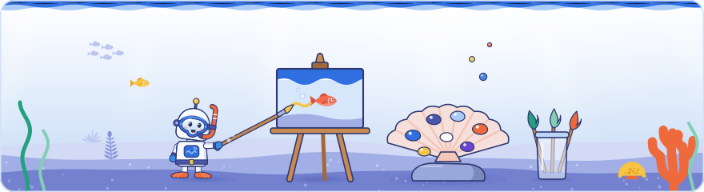
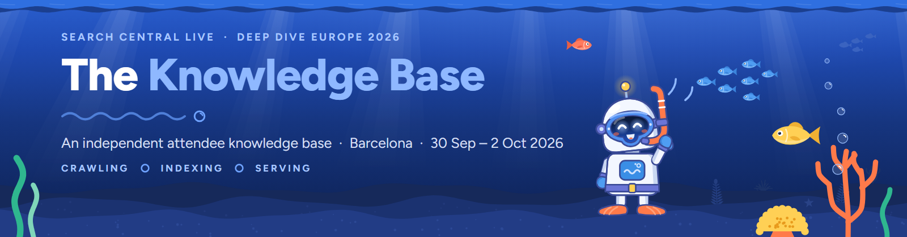
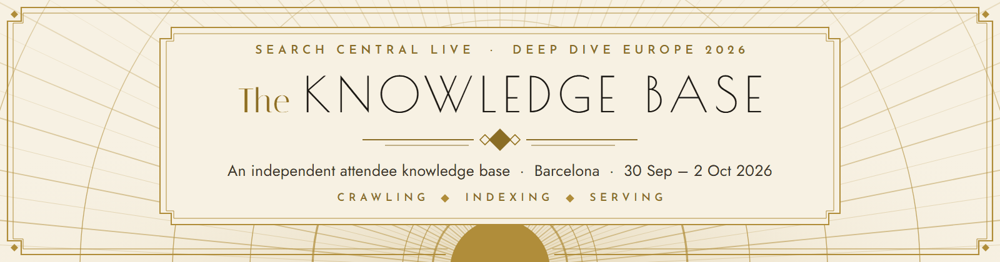
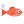

[Knowledge base](../../README.md) / [_system](../README.md) / **brand**

# Brand assets

**The artwork behind the READMEs: the Deep Dive hero banner in light and night water with the Diver bot, the header illustration of every README, the wave divider, the README icons, the field guide covers, and the colour and type rules they share with the field guides and the web edition. The Art Deco set is kept beside them as the classic edition.**

<picture><source media="(prefers-color-scheme: dark)" srcset="illustrations/_system-brand-dark.svg"></picture>

<p align="center"></p>

<p align="center">
  
  <br><sub>banner-light.png, shown to GitHub's light theme</sub>
</p>

<p align="center">
  
  <br><sub>banner-dark.png, shown to GitHub's dark theme</sub>
</p>

##  What's here

| File | What it is |
| --- | --- |
| [`banner-light.png`](banner-light.png) | The root README's hero banner for light themes: sunlit water, the reef and the Diver bot |
| [`banner-dark.png`](banner-dark.png) | The same banner for dark themes: night water |
| [`divider.svg`](divider.svg) | The wave divider between the major sections of every README: a two-layer wave line either side of a glossy bubble |
| [`palette.svg`](palette.svg) | The Deep Dive colours as swatches, for this page |
| [`icons/`](icons/) | Fourteen small README icons, 24 × 24 px: the Diver bot's head, fish, bubble, boat, coral, map, compass, anchor, book, lock, code, starfish, seaweed and wave |
| [`covers/`](covers/) | Page 1 of each field guide in the Deep Dive and Art Deco editions (`dayN-deep-dive.png`, `dayN-art-deco.png`), for the *Two editions* showcase on the front page |
| [`banner-art-deco-light.png`](banner-art-deco-light.png), [`banner-art-deco-dark.png`](banner-art-deco-dark.png) | The classic edition's banners: cream or onyx ground, gold frames and rays |
| [`divider-art-deco.svg`](divider-art-deco.svg), [`palette-art-deco.svg`](palette-art-deco.svg) | The classic edition's gold ornament and its five colours |
| [`make_brand.py`](make_brand.py) | Draws everything above. Hand-written |
| [`illustrations/`](illustrations/) | The header illustration of every README, one 880 × 240 card per README in sunlit water (`<slug>-light.svg`) and night water (`<slug>-dark.svg`): 31 subjects, each tied to its README's title |
| [`make_illustrations.py`](make_illustrations.py) | Draws, checks and writes `illustrations/`. Hand-written |
| [`illus_common.py`](illus_common.py), [`illus_a.py`](illus_a.py) to [`illus_d.py`](illus_d.py) | The illustration scenes as code: the shared grammar (water, seabed, surface, colours, ids) and four groups of scenes with their props. Hand-written |
| [`../badges.py`](../badges.py) | Draws the status badges; the SVGs in `60-outputs/badges/` are generated |

The canonical names (`banner-light.png`, `banner-dark.png`, `divider.svg`, `palette.svg`) always hold the default style of [`_system/theme.yaml`](../theme.yaml), now Deep Dive; the other style carries its name in the file. Every README uses only the canonical names, so flipping the default and running `make_brand.py` again changes the look of every README at once (then update the two banner alt texts: on this page and in the root README).

The banners are 1600 × 420 px, drawn at twice the size they are shown, so they stay sharp on high-density screens. The divider is 600 × 24 on a transparent ground, in mid blues that read on light and dark pages. In `badges.py`, `render(stats, style)` draws each badge from the build's numbers; the build passes the theme's default, so the README badges are Deep Dive pills: an indigo label, an ocean-blue value and a small bubble on the seam.

##  The Diver bot

<p align="center"></p>

Our own mascot: a friendly robot snorkel diver drawn from numbers in [`_system/ocean_art.py`](../ocean_art.py) (`diver_bot`, `diver_bot_svg`). A pearl-white dome with one antenna and a glowing yellow bulb, an oval dive mask with a nose pocket, an indigo strap, a coral snorkel and coral fins, and a yellow field guide with a little fish on it. It swims on the Day 1 cover, reads on the Day 2 cover, points at the reef on the Day 3 cover, waves on the banner and each guide's contact page, rests in the end vignettes, and in the web edition swims through the home page, peeks over the footer and points the way on empty search results and the mindmap's empty panel; its head is the web edition's favicon and the `bot` icon here.

> [!IMPORTANT]
> The Diver bot is original. It never takes anything from Google's mascot or the event's artwork: no crest or hair, no rectangular head or slot visor, no rows or rings of coloured dots, no speech-bubble frame, no hats, and none of Google's brand colours (`#4285f4`, `#ea4335`, `#fbbc05`, `#34a853`), which `ocean_art.py` and `make_brand.py` refuse. Keep it that way when you change it.

##  Using them

Paths are relative to the README that uses them: from the root they start with `_system/brand/`, from a folder one level down with `../_system/brand/`.

**Hero banner** (the root README only, once):

```html
<picture>
  <source media="(prefers-color-scheme: dark)" srcset="_system/brand/banner-dark.png">
  
</picture>
```

**Divider** (between major sections and above the footer navigation):

```html
<p align="center"></p>
```

**Icon** in a heading or a link row, 24 px (18 px in a line of links). The heading already says what it is, so the alt text is empty:

```html
##  Where things are
```

Leave the icon out of a heading that other pages link to: GitHub adds a hyphen for it to the start of the heading's anchor.

**Cover** (the *Two editions* showcase), linked to its PDF and described in its alt text:

```html
<a href="60-outputs/pdf/day1-field-guide-deep-dive.pdf"></a>
```

**Header illustration** (every README once, right under the lead paragraph; the root README has it under *The three days*). GitHub shows the night-water card in dark mode:

```html
<picture><source media="(prefers-color-scheme: dark)" srcset="../_system/brand/illustrations/00-raw-dark.svg"></picture>
```

Keep it on one line. The alt text says what the picture shows and how it relates to the README's title. The generated READMEs get it from `ILLUSTRATION_ALT` in `_system/build_kb.py`; write it by hand in the others.

**Badge** (live numbers, so a hand-written README never states a count that goes stale):

```html

```

The badges are `version`, `days`, `claims`, `docs-backed`, `topics`, `sources`, `dev-kit`, `media-kit` and `privacy`. Their alt text says what a badge counts, never the number itself, because the number changes with every rebuild and the alt text does not. Every image that carries meaning needs a meaningful alt text, and every path must be relative and match the file name's case exactly. No external images, fonts or badge services.

##  Regenerating

Generated by [`make_brand.py`](make_brand.py). **Do not edit the banners, the divider, the palettes, the icons or the covers:** change `make_brand.py` (or the field guides) and run it.

```
python _system/brand/make_brand.py             # both sets (canonical names for the theme's default) and icons/
python _system/brand/make_brand.py --preview   # also writes previews to _system/brand/_build/
python _system/brand/make_brand.py --covers    # covers/: page 1 of each built Deep Dive and Art Deco field guide
```

- **Not part of `rebuild.bat`.** The banner holds no numbers, so it only changes when the design does. Run `--covers` after the field guides change. The badges are the opposite: `rebuild.bat` redraws them from the data. Do not edit them; change the data and run `rebuild.bat`.
- **One copy of each file.** When the default style is written, its files under its own name (such as `banner-deep-dive-light.png`) are deleted, so no image is kept twice.
- **Offline.** The banners are HTML and SVG photographed by Chromium (Playwright) at device scale 2. The fonts are embedded from `_system/pdf/fonts/` and every network request is blocked. The icons are plain SVG text; the covers are rendered from the PDFs with pdfium.
- **Checked.** The script stops if a bundled font fails to load, if the banner text has a character those fonts do not cover, if an icon uses one of Google's brand colours, or if a PNG is still above 300 KB (the Deep Dive banners and the covers keep full colour; the Art Deco banners are reduced to a palette of 256, 192, 128 or 96 colours). Two runs give byte-identical files.
- **Look before committing.** `--preview` puts each banner, its divider and the icons on GitHub's light page (`#ffffff`) and dark page (`#0d1117`), 800 px wide, as GitHub shows them. Check both.
- **Committing.** The privacy check in `save-version.bat` accepts a PNG here only when it sits directly in this folder or in `covers/`, has a lower-case name with hyphens and is at most 1 MB. Any other image still stops the commit.

Needs Python with Playwright, Chromium, Pillow and pypdfium2, all in [`requirements.txt`](../../requirements.txt) (`install-tools.bat` installs them).

##  README illustrations

Every README carries one header illustration whose subject is its title: a net of unsorted finds for *Raw inputs*, a treasure chest of pearl cards for *Claims*, a coral filing cabinet for *Indexing*, a sonar console for *Search Console*, a printing press for *Field guide PDFs*, and so on. They share one grammar (sunlit or night water, a wavy surface, three low hills of seabed, the Diver bot at about 45 % of the card's height, the subject centre-right) and are drawn from numbers like the rest of the Deep Dive artwork, reusing the fish, coral, seaweed, bubbles and bot poses of `ocean_art.py`.

```
python _system/brand/make_illustrations.py                        # draw, check and write illustrations/ (62 files)
python _system/brand/make_illustrations.py --check                # draw and check everything, write nothing
python _system/brand/make_illustrations.py --only 20-claims,root  # redraw only these cards
python _system/brand/make_illustrations.py --preview DIR          # also a contact sheet and one PNG per card, on GitHub's light and dark pages
```

- **Slugs.** A card is named after its README's folder with `/` turned into `-`: `30-topics/crawling/README.md` is `30-topics-crawling`, `_system/pdf/README.md` is `_system-pdf`, the root README is `root`.
- **Scenes.** Each `illus_*.py` module (not `illus_common.py`) exposes `SCENES = {slug: function(dark) -> svg}`. Group A: the root and the pipeline folders; B: the topic areas about how pages get in; C: the topic areas about results, tools and people; D: the outputs and the system. Props such as the treasure chest, the toolbox or the printing press live in the module that uses them.
- **Checked before anything is written.** Every card is well-formed SVG with `viewBox="0 0 880 240"`, has no text, script, image, style, class, `<use>` or external reference, keeps every id prefixed with its slug, avoids Google's brand colours and stays under 80 KB (a warning above 40 KB). Each card is drawn twice and must come out byte-identical. The set of cards must match the tracked READMEs: a README without a scene, or a scene without a README, stops the run.
- **A new README** (a new topic area, say) needs a scene in one of the modules, a run of `make_illustrations.py`, and the `<picture>` line: in the README itself when it is hand-written, as a line in `ILLUSTRATION_ALT` of `_system/build_kb.py` when the build writes it. The build names any topic area still without a picture; `_system/tests/run_tests.py` checks that every README shows its own card and that the files are valid, small, deterministic and free of text.
- **Not part of `rebuild.bat`.** The cards hold no numbers, so they only change when a scene does. Look at the `--preview` sheet in both themes before committing. The privacy check in `save-version.bat` lets SVG files through, so the cards commit like the icons.

##  Colours

<p align="center"></p>

| Name | Hex | Used for |
| --- | --- | --- |
| Ink | `#262d3b` | Headings and the title on the light banner |
| Night water | `#0f2148` | The dark banner's water and the night-water cards of the web edition |
| Deep blue | `#2152c4` | The spaced capitals on the light banner, links and accents |
| Ocean blue | `#2f6fe0` | The water surface, *Knowledge Base* on the light banner, the icons, the badge values |
| Wave | `#a9cbf6` | The back wave, pale fills inside the icons |
| Sky | `#e2edfb` | The sunlit water behind the text |
| Indigo | `#4b56ad` | The seabed band, the badge labels |
| Periwinkle | `#a2aee6` | The seabed silhouettes |
| Coral | `#ee6a3c` | Coral, the Diver bot's snorkel and fins, code and route marks in the icons |
| Sun | `#f7c443` | The yellow fish, the anemone, the Diver bot's field guide |
| Reef green | `#1fa38a` | Fish and seaweed |

The same values as the Deep Dive field guides (`_system/pdf/ocean.css`), the web edition (`_system/site/site.css`) and the artwork library (`_system/ocean_art.py`). Every icon colour keeps at least 3:1 contrast on GitHub's white and on its dark `#0d1117`.

<details>
<summary><b>The classic edition: Art Deco colours</b></summary>
<br>

<p align="center"></p>

| Name | Hex | Used for |
| --- | --- | --- |
| Onyx | `#1a1712` | The dark banner's ground, the badge labels, the lettering on the light banner |
| Cream | `#f7f1e3` | The light banner's ground, the lettering on the dark banner, the badge label text |
| Gold | `#b08d3a` | Frames, rays, arches and the sun, the divider, the badge values and hairlines |
| Dark gold | `#8a6d25` | The spaced capitals on the light banner: gold on cream needs the darker tone to stay legible |
| Light gold | `#d9c08a` | The spaced capitals on the dark banner, the privacy badge's value |

The same values as the Art Deco field guides (`_system/pdf/deco.css`) and the web edition's Art Deco style.

<p align="center"></p>

</details>

##  Type

| Role | Font | On the banner |
| --- | --- | --- |
| Display and text | Figtree 800, 700 and 400 | *The Knowledge Base* (800), the spaced capitals of the event line and the day strip (700), the line under the wavy rule (400) |
| Code | JetBrains Mono | Not used here: code in the Deep Dive field guides and the web edition |
| Art Deco (classic) | Poiret One, Italiana, Josefin Sans 600, Jost 400 | The Art Deco banners: KNOWLEDGE BASE, *The*, the spaced capitals and the text line |
| Badges | Verdana, DejaVu Sans or the system sans-serif, 10 to 11 px | The viewer's own font; each text is pinned to a width from Verdana's metrics, so it always fits |

The fonts are bundled in [`_system/pdf/fonts/`](../pdf/fonts/LICENSES.md) under the SIL Open Font License 1.1. They work only inside rendered images: GitHub sets README text in its own font.

> [!IMPORTANT]
> The banners say "An independent attendee knowledge base" and show no Google logo and nothing styled like Google's own pages. Keep it that way: nothing here may pass for an official Google publication. The artwork never shows event material either: no slide photos, speakers or attendees, and no copy of the event's logo, slide template or mascot.

<p align="center"></p>

<p align="center"><sub>← <a href="../README.md">_system</a> · <a href="../pdf/README.md">PDF system</a> →</sub></p>
