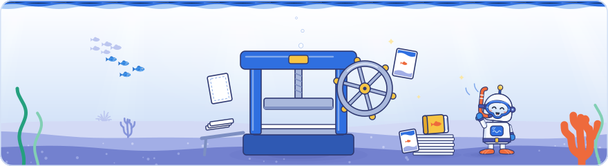

[Knowledge base](../../README.md) / [_system](../README.md) / **pdf**

# Field guide PDFs

**This folder turns a hand-written HTML template per day into A4 PDFs in [`60-outputs/pdf/`](../../60-outputs/pdf/README.md):
`dayN-field-guide-deep-dive.pdf` (the Deep Dive edition, the main one, kept current), and the classic editions
`dayN-field-guide-art-deco.pdf` (Art Deco) and `dayN-field-guide-modern.pdf`.**

<picture><source media="(prefers-color-scheme: dark)" srcset="../brand/illustrations/_system-pdf-dark.svg"></picture>

Three worked examples exist: `day1.template.html` (Crawling, 34 pages in Deep Dive), `day2.template.html` (Indexing, 35 pages) and
`day3.template.html` (Serving, 33 pages). This folder holds the code, the templates and the fonts. The PDFs it writes are generated:
never edit them, rebuild them.

> [!IMPORTANT]
> **Only the Deep Dive edition is rebuilt.** Since v2.5.0 the Art Deco and modern PDFs are frozen at their v2.4.0 content
> (Day 1 21 pages, Day 2 32, Day 3 33) and `rebuild.bat` never rewrites them. What they lack is logged per day in
> [`60-outputs/pdf/classic-editions-log.md`](../../60-outputs/pdf/classic-editions-log.md). The builders and stylesheets for both
> classic styles stay here and still work: see step 4 below for building one by hand.

## What's here

| File | What it is |
|---|---|
| `make_pdf.py` | Entry point. Fills the placeholders (including the generated agenda and sources list), checks `data-claims` and excluded photos, builds each style and reports failures. |
| `build_ocean.py` | The Deep Dive builder: its own underwater cover per day (with the Diver bot), the glossy section bubbles, the recolouring of the modern palette, and the per-page underlay (water, white card, seabed, running header and footer, end vignettes). Stops on a colour it cannot recolour. |
| `build_deco.py`, `build.py` | The Art Deco and modern builders (cover, page frame, header, footer, metadata). `build_deco.py` also recolours the modern palette to Art Deco and stops on a colour it cannot recolour. |
| `common.py` | Shared code: config and day data, Chromium rendering, page numbers, font checks. |
| `day1.template.html`, `day2.template.html` | The guide's content, one template per day. |
| `days.yaml` | Per-day text that is not in the template: cover lines, footer, PDF properties per edition, page-marker text, sources lead. |
| `config.yaml` | Author details printed in every guide (name, title line, WhatsApp, LinkedIn). UTF-8. |
| `ocean.css`, `deco.css`, `style.css` | The three styles: Deep Dive, Art Deco and modern. All three style the same class names (exceptions under *Component catalogue*). |
| `fonts/` | Bundled fonts, `LICENSES.md`, and `make_ttf.py`, which rebuilds the header/footer `.ttf` files from the bundled `.woff2`. |
| `_build/` | Intermediate files (ignored by git). |

The Deep Dive artwork is not in this folder: every wave, fish, coral and the Diver bot is drawn as code by
[`_system/ocean_art.py`](../ocean_art.py), shared with the website, the mindmap and the brand images. The default edition is set
in [`_system/theme.yaml`](../theme.yaml) (read by `_system/theme.py`).

## Producing a day's guide

1. **Data first.** Fill `20-claims/` for the day (sessions, claims, sources) and run `python _system/build_kb.py`.
   The PDF reads the agent pack it writes: `60-outputs/agent-pack/claims.jsonl`, `sessions.json` and `sources.json`.
2. **Copy a template.** `copy _system\pdf\day2.template.html _system\pdf\day3.template.html`, then rewrite the content.
   Day 2 is the fuller example (long agenda, 17-row contents, a template `<style>` block, three pages of sources); Day 1 is the
   shorter one. Keep the structure described below; delete what you do not need.
3. **Fill `days.yaml`.** Copy a whole day block (`day1:` or `day2:`), rename it `day3:` and rewrite every value:
   - `edition`, `title` (exactly three lines for the Deep Dive and Art Deco covers), `subtitle`, `cover_date` (printed on every cover);
   - `footer` (Deep Dive and modern, every page) and `pdf:` title and subject for each style (`ocean`, `deco`, `modern`);
   - `pages: PTK / PSRC`: visible text that appears on the takeaways page and on the sources page (see *Page numbers*);
   - `photos`: printed in the sources lead; `sources_extra`: source keys to list although no claim cites them;
     `sources_checked` (optional): overrides the "checked on" date of the lead, which otherwise is the newest `checked` date of the listed sources.
4. **Build.** `python _system/pdf/make_pdf.py day3` builds the default edition named in `_system/theme.yaml` (`deep-dive` →
   Deep Dive, `art-deco` → Art Deco). Name a style to build another: `ocean` (or `deep-dive`), `deco`, `modern`, `both`
   (Art Deco and modern) or `all` (all three).
   It needs the packages in `requirements.txt` and Playwright's Chromium (`install-tools.bat` installs both).
   Each style is built even if another fails; the run ends with `PDF BUILD FAILED for …` and exit code 1 if any failed.
   `rebuild.bat` rebuilds the knowledge base, then the **Deep Dive edition only** of every `dayN.template.html`, then the
   website; `rebuild.bat day3` does the same with only that day's PDF.
   **A classic edition by hand:** `python _system/pdf/make_pdf.py day3 deco` (Art Deco) or `… day3 modern`. This replaces the
   frozen file with the template's current content, so do it only to bring that edition up to date on purpose: then update its
   day in `60-outputs/pdf/classic-editions-log.md` and run `rebuild.bat` so the web edition copies the new file. `both` and `all`
   also build the classic editions; `git restore 60-outputs/pdf/<file>` brings back the frozen one if it was rebuilt by mistake.
5. **Look at the PDFs**, every page, in every edition you built. To get one PNG per page, run this in a scratch folder:
   `python -c "import pypdfium2 as p, sys; d = p.PdfDocument(sys.argv[1]); [d[i].render(scale=1.2).to_pil().save(f'p{i + 1:02d}.png') for i in range(len(d))]" <path to the PDF>`.
   Check the contents numbers, that no page holds only a line or two (see *Page budget*), that no figure is clipped, that the
   Deep Dive edition shows no text over the reef or the robot, and that the Art Deco edition shows no modern blue, red or green.

> [!TIP]
> Two builds of the same input give byte-identical PDFs, so `git diff` only shows real changes.

## Placeholders

`make_pdf.py` replaces these in the template. Any `{{…}}` left over stops the build.

| Placeholder | Filled with |
|---|---|
| `{{AUTHOR}}`, `{{TITLE_LINE}}` | `config.yaml` author and title line |
| `{{PHONE}}`, `{{WA_URL}}`, `{{QR}}` | WhatsApp number, its `https://wa.me/<digits>` link and QR code |
| `{{LI_URL}}`, `{{LI_TEXT}}`, `{{QRLI}}` | LinkedIn URL; the same without `https://`, without `www.` or the country subdomain and without a trailing `/`; its QR code |
| `{{SUBTITLE}}`, `{{COVER_DATE}}` | `days.yaml` subtitle and cover date (modern cover) |
| `{{PHOTOS}}`, `{{CHECKED}}` | `days.yaml` photos; the newest `checked` date of the listed sources, or `days.yaml` sources_checked (sources lead) |
| `{{AGENDA}}` | The day's sessions from `sessions.json` (see below) |
| `{{SOURCES}}` | The sources cited by the day's public claims, plus `sources_extra` (see below) |
| `{{COVER_ART}}` | Modern cover artwork (the Deep Dive and Art Deco builders replace the whole cover) |
| `{{PTK}}`, `{{P01}}`…`{{P99}}`, `{{PSRC}}` | Page numbers, found after a first render |

### Generated agenda (`{{AGENDA}}`)
One row per session of the day, in `sessions.json` order. `D<day>-S00` (kind `unrecorded` in `sessions.json`) and sessions of
kind `break` are left out; talks, lightning sessions, panels, Q&A and posters are listed. The time is printed as written in
`sessions.yaml`. The speaker line is the speakers ("A", "A and B", "A, B and C"), then the session `role` after a comma
("Cherry Prommawin, Search Advocate").

| `coverage` | Alone | With other values |
|---|---|---|
| `slides` | **Slides** captured | **Slides** |
| `one-slide` | **One slide** captured | **One slide** |
| `transcript` | **Transcript** | **Transcript** |
| `video` | **Video** | **Video** |
| `notes` | **Notes** only | **Notes** only |
| `none` | Not covered | Not covered |

Several values are printed in their `sessions.yaml` order and joined with " · ", and a row with more than one value drops the word
"captured" (Day 2: "**Transcript** · **Slides** · **Video**"). Each value is kept on one line with no-break spaces, so a long row
wraps between values, never inside one. The dot is full when slides, one-slide, transcript or video is among the values, light
(`.l`) when notes is the only thing captured, grey (`.n`) otherwise. An unknown value stops the build, and so does a day with no
row left. To change a row, change `20-claims/sessions.yaml` and rebuild the KB.

### Generated sources (`{{SOURCES}}`)
Every source key cited by a public claim whose `day` is this day (docs, press and analysis claims that annotate the day count
too), plus `sources_extra`, in the order of `sources.json` (the order of `20-claims/sources.yaml`). Each row is `title — publisher`,
linked to its URL. A date such as "9 December 2024" in a title or publisher is kept on one line. Titles come from the data, so fix
them in `sources.yaml`. The list is as long as the data makes it: Day 1 lists 33 sources, Day 2 lists 115 (see *Page budget*).

## Page numbers

Write `{{PTK}}`, `{{Pnn}}` and `{{PSRC}}` in the contents rows. The builder renders once with `00`, then finds each page in the
PDF text, skipping the cover and contents pages, and renders again with the real numbers.
- `{{Pnn}}` is found by the text `Section nn`, so the section's kicker must read `Section nn` (e.g. `Section 12 · Indexing`).
  Do not write "Section nn" in body text before that section.
- `{{PTK}}` and `{{PSRC}}` are found by the texts in `days.yaml` `pages:`.
- Any marker whose text is not found stops the build with its name and text (nothing is ever printed as `00`).
- The contents page must fit on one page (it is page 2). Day 1's 13 rows fit at the default spacing; Day 2's 17 rows fit
  because each row has `style="padding:0.3mm 0"` and its `<style>` block tightens `.toc .t` and `.toc .d`. With even more
  sections, shorten the `.d` descriptions.

## Linking statements to claims (`data-claims`)

Put `data-claims="D2-C014 D2-C015"` on any element whose text states a claim: the `
`, `<li>`, `<tr>`, `.card`, `.stat`,
`<figure>` or a `` around one tagged sentence inside a paragraph. Every id must be a public claim in
`claims.jsonl`; an unknown or private id stops the build. Ids from another day are fine (Day 2's three-day arc cites Day 1
claims). The attribute is invisible in the PDF. Rule of thumb: every `.tag` (Slide, Stage, Docs, Press, Analysis) sits inside an
element with `data-claims`, and the tag matches the claim's label. Day 2 also marks undocumented stage and slide points with
`(not&nbsp;in&nbsp;docs)` (or a narrower note such as `(that part not&nbsp;in&nbsp;docs)`) and explains
the marker in the contents legend. The Deep Dive edition sets these markers in their own quiet italic (`.nid`).

## Template styles

A template may carry a `<style>` block after `<link rel="stylesheet" href="style.css">`. Every builder keeps it (the Deep Dive
and Art Deco builders only swap the stylesheet link for `ocean.css` or `deco.css`), so its rules apply to all three styles. Day 2's block keeps `.nw` spans and
`.no` verdicts on one line, sets `text-wrap: pretty` on paragraphs, list items, cells, captions, leads, cards, stats and legend
lines (no one-word last lines), sets `figure svg { overflow: visible; }`, tightens the contents rows and keeps each `li` on one
page. For a one-off, use an inline `style="…"`: Day 1's sources list has `style="line-height:1.2"` and its three-day arc figure
`style="margin-top:8mm"`; Day 2's sources list has `style="padding-left:8mm; line-height:1.2"`.

## The Deep Dive edition

Style key `ocean` (alias `deep-dive`); output `dayN-field-guide-deep-dive.pdf`; PDF title and subject from `days.yaml` `pdf.ocean`.
An original underwater look inspired by the event, never a copy of its material: no logos, no photos, and none of the search
engine's brand colours (see the guardrails in `_system/ocean_art.py`). `build_ocean.py` works in these steps, without ever
editing the template:

1. **Touches.** Swaps `style.css` for `ocean.css`, adds a "Dive log" kicker over the contents, gives `(not in docs)` markers
   the `.nid` style, keeps dates in section leads on one line and turns each section number into a glossy bubble (the number
   stays real text, so it can be found and copied).
2. **Recolouring.** Maps the modern palette of the SVG figures and inline colours to the Deep Dive palette (`TEXT_MAP`,
   `FILL_MAP`, `STROKE_MAP`, `INLINE_MAP`, see *Colours and the recolouring*) and swaps Inter and Fraunces for Figtree.
3. **Cover.** Replaces the template's cover with a full-bleed night-water cover drawn by `cover_scene()`: water with sun rays,
   a calm distant fish school, the seabed, a deep band with an organic top edge that the reef overlaps, two reef fish and the
   Diver bot. Each day has its own layout in `COVERS` (scene seed, mirrored reef corners, fish and robot): Day 1's bot swims down
   the title's diagonal towards the coral; Day 2's sits on the seabed beside the anemone, reading its field guide; Day 3's stands on the seabed, pointing at the reef. A day without
   an entry uses Day 1's. The colophon (author, date, edition line) sits on the title's left axis.
4. **Pagination** with `common.paginate`, as in the other editions.
5. **Underlay.** One 210 × 297 mm page per content page, generated as HTML in 0.1 mm units and rendered by Chromium, then each
   content page (transparent background) is merged on top with pypdf. It holds the sky gradient and light blobs, a slim
   two-layer water surface, the white rounded card behind the text (x 11–199 mm, y 17–273 mm, with a faint line texture on a
   page that opens a section), a slim seabed with the indigo footer band, the running header (author · "Day N Field Guide" left,
   the current section's number and title right, found from the section pages) and footer (`days.yaml` footer · "Deep Dive
   edition" left, "Barcelona · 2026" right, the page number in a bubble in the centre). Small reef accents sit only in the
   margins and the seabed, deterministic per page number.
6. **End vignettes.** The builder measures each content page with pdfplumber (the lowest char, rule, box or image). Where the
   card leaves at least 45 mm free below the content (`VIG_MIN`), it draws a quiet vignette in that space, never closer than
   11 mm to the content (`VIG_GAP`): pale mono reef silhouettes on a wavy hairline 5.5 mm above the card's edge, two far fish,
   and on every second page that has room the Diver bot (a small swim, then reading on the line). The contact page always gets
   the bot standing on the line and waving. Pages without that space get nothing. The build prints the pages it chose
   (`end vignettes: p2, p6, p8 (swim), …`), and the choice follows from the content, so a longer section simply loses its vignette.
7. **Fonts and metadata.** `check_fonts` as for every edition, then title, author and subject.

The robot is `ocean_art.diver_bot()`; the builder passes `unit_px=96/254` in the underlay so the bot picks the right line
weight and detail for its printed size, and a new uid for every copy.

## Page budget

Every `section.s` starts a new page, so a section that overflows by a few lines costs a whole page. The table was measured on
the v2.3.0 builds, when all three editions broke pages at the same places; the frozen classic editions still have these page
counts. Since v2.5.0 the Deep Dive templates are longer (Day 1 34 pages, Day 2 35): see *Deep Dive* below.

| Part | Day 1 (21 pages) | Day 2 (32 pages) |
|---|---|---|
| Cover and contents | 2 pages (13 contents rows) | 2 pages (17 contents rows, tightened) |
| Key takeaways | 1 page, 10 items | 1 page, 12 items |
| At a glance (Section 01) | 1 page: 13 agenda rows and the three-day arc fill it | 2 pages: 23 agenda rows, then the map of the day and the arc |
| Content sections | Sections 02–10 on 15 pages (1–2 each; the checklist is 1) | Sections 02–14 on 23 pages (1–3 each) |
| Help and contact | 1 page | 1 page |
| Sources | 1 page: 33 entries and the closing line | 3 pages: 115 entries |

- **Deep Dive.** The text sits inside the card (`@page` margins 23.5 / 19 / 30 / 19 mm in `ocean.css`), so a Deep Dive page holds a
  little less than an Art Deco one. The v2.5.0 templates added two Day 1 sections (the community lightning talks and the Q&A) and
  more Day 2 material from a second attendee's recording: Day 1 was then 31 pages (sources on 2 pages, 78 entries) and Day 2 35
  pages (122 sources). The v2.7.0 Day 1 audio recordings added the spoken robots.txt talk and Lightning B to Section 07 and more
  Q&A: Day 1 is now 34 pages (91 sources on 2 pages, at `margin-bottom: 0.9mm`; the checklist rows tightened to keep 19 checks
  on one page). Hold Day 2 at 35 or less, and Day 1 at 34 or less unless a section is added.
  Never get there by shrinking text: body text stays at 9 pt or more, small print at 7 pt or more.
- **Sources.** In the frozen classic editions, at `line-height:1.2` Day 1's 33 entries and the closing disclaimer fit on page 21,
  with little room left (the v2.5.0 Deep Dive list, 78 entries at `padding-left:8mm`, takes two pages). The modern style holds a few more. On Day 2 the first Art Deco sources page
  holds 34 entries and a full further page about 42. Without the `line-height`, Day 1's 29 entries (v2.0.0) pushed the closing
  line onto a page of its own.
- **Agenda.** In Day 1's layout the at-a-glance page is full at 13 rows plus the arc: a 14th row (tested) pushes the arc onto a
  page of its own and adds a page to the guide. With a longer agenda, give the second page more to hold, as Day 2 does with its
  map of the day, or drop the arc.
- **When a build gains a page**, find the section whose last page holds only a few lines and tighten that section (list spacing,
  a shorter figure, a shorter paragraph) rather than shrinking text below the sizes in `ocean.css`, `deco.css` and `style.css`.
  Rebuild and look at every page again.

## Component catalogue

The classes below exist in `ocean.css`, `deco.css` and `style.css`, except the modern cover's `.rule` and `.spacer` (the Deep Dive
and Art Deco builders replace the cover) and `.section-head.plain`, which `style.css` and `ocean.css` style (Art Deco centres
every section head). In the Deep Dive edition a template `<style>` block still applies on top of `ocean.css`, so look at every page.

**Page structure**
- `.cover` — first block of the template; must stay one `
…
`. Modern cover content: `.eyebrow`, `.rule`,
  `<h1>` (an `<em>` part is set in italic), `.sub` (`{{SUBTITLE}}`), `.spacer`, `.meta` with `div > .k + .v` (`.v.name` for the author).
  The Deep Dive and Art Deco builders replace the whole block with their own cover built from `days.yaml`.
- `.front` — contents page: `h2.title`, `.toc > .row` (`.n` number, `.t` title with `.d` description, `.p` page placeholder),
  `.legend` (`h4` + one `div` per tag).
- `section.s` — one per section, starts a new page. Inside: `.section-head` with `.num` (a glossy bubble in Deep Dive), `.kicker`
  (`Section nn · …`), `h2`, `.lead`. `.section-head.plain` (no number) for takeaways and sources.

**Text**: `p`, `h3` (sub-heading), `h4` (minor heading, may hold a `.tag`), `ul`/`ol`, `strong`, `code`, `.small`, `.muted`,
`.mt0` (no top margin), `.avoid` (keep on one page).

**Source labels**: `Slide` before the sentence it labels. Slide = shown on
screen, Stage = said on stage, Docs = Google's own documentation, Press = a third-party report of what Google said,
Analysis = the author's view. Tags also work in `th` and `h4` to label a whole table or block.

**Cards and grids**: `.grid2`, `.grid3`, `.grid4` hold `.card`s. A card has optional `.badge` (small coloured label; colour via
`style="color:#2457e6"`, `#0b8a5f`, `#6d3fd6`, `#b86e00`, `#667085` or `#c8372d`, all recoloured in Deep Dive and Art Deco), `.ct` (title), `.cs`
(body; may hold `p`, `ul`, tags). `.stat` is a figure tile: `.v` (the number), `.l` (what it measures), optional `.s` (its scope,
e.g. "US, since launch").

**Tables**: plain `<table>` with `thead th` (set widths with `style="width:40mm"`), `td.k` (bold first column), `td.fig` (big number),
`.ok` / `.no` (green / red verdict text). `table.avoid` keeps a short table on one page.

**Callouts and quotes**: `.callout` (a deep-blue box in Deep Dive, dark in Art Deco, tinted in modern) with `.h` header; `.callout.blue`
for audience questions; use them for Analysis blocks. `.quote` is a large pull quote with optional `.by`.

**Code**: `pre.code` with spans `.c` (comment), `.k` (field name), `.v` (allow / good value), `.x` (disallow / bad value).

**Fixed blocks**: `ol.takeaways` (`li > div > b + span`), `.agenda` (`{{AGENDA}}`), `.check-group` + `ul.check` (checklist),
`ol.sources` (`{{SOURCES}}`), `.contact` (contact box with `.ck`, `.cname`, `.ctitle`, `.cline`, `a.cnum`, `a.clink`, `.csub`,
`.cqrs > .cqr` QR codes and `.cqrl` labels; keep the classes on the `<a>` so the link colours stay). The Deep Dive builder finds
the contact page by its "Let's keep in contact" line, for the waving bot.

**Figures and SVG diagrams**
- `<figure>` + inline `<svg viewBox="0 0 680 H" …>` + `<figcaption><b>Short title.</b> Explanation.</figcaption>`.
  `viewBox` must be the first attribute of `<svg>`: the Deep Dive and Art Deco builders recolour, and check, only SVGs that start `<svg viewBox`.
- Width is always 680 units; pick the height. Text 9–12.5 units, headings 13–22.
- Keep stroked boxes inside the 680-unit width: a border on the edge is half clipped. Move the box in by half its stroke
  (`x="0.5"`, or `width="209.5"` for a box that ends at 680), as both templates do.
- `font-family="Inter, 'Noto Symbols'"` on the `<svg>`; `Fraunces, 'Noto Symbols'` for display words and `JetBrains Mono, 'Noto Symbols'`
  for code. Deep Dive swaps Inter and Fraunces → Figtree (Fraunces words in bold); Art Deco swaps Inter → Jost and Fraunces → Poiret One.
  Always keep `'Noto Symbols'` at the end.
- Rounded corners `rx="8|10|12"` stay rounded in Deep Dive and become square in Art Deco. Give each `<marker id>` an id that is unique in the whole template.
- Arrows, ticks and crosses (→ ↑ ↓ ✓ ✕ ≥) are fine: they come from the bundled `Noto Symbols` family (Noto Sans Math and Noto Sans Symbols 2).

### Colours and the recolouring

Use only the modern palette below, each colour only where the table allows it. The Deep Dive builder looks each colour up in
`TEXT_MAP`, `FILL_MAP`, `STROKE_MAP` and `INLINE_MAP` in `build_ocean.py`; the Art Deco builder in the maps of the same names in
`build_deco.py`. Both apply them the same way:
- in an SVG that starts `<svg viewBox`, on `rect`, `text`, `tspan`, `path`, `circle`, `line`, `polygon`, `g`, `svg` and `marker`:
  `fill` goes through `TEXT_MAP` on `text`, `tspan` and `g`, and through `FILL_MAP` on the others; `stroke` goes through `STROKE_MAP`;
- anywhere in the template, `style="color:#…"` goes through `INLINE_MAP` (badges, eyebrows); `style="border-left-color: var(--blue)"`
  is removed.

| Colour | Name | SVG text fill | SVG shape fill | SVG stroke | Inline `color` |
|---|---|---|---|---|---|
| `#2457e6` | blue | yes | yes | yes | yes |
| `#e8eefd` | blue fill | | yes | | |
| `#0f1d33` | ink | yes | yes | | |
| `#2a3446` | body text | yes | | | |
| `#667085` | muted | yes | yes | yes | yes |
| `#98a2b3` | faint | yes | yes | yes | |
| `#e4e7ec`, `#c7cdd8` | rules | | | yes | |
| `#f5f7fb` | wash | | yes | | |
| `#0b1a33` | navy | | yes | | |
| `#0b8a5f` | green | yes | yes | yes | yes |
| `#e3f4ec` | green fill | | yes | | |
| `#c8372d` | red | yes | yes | yes | yes |
| `#fbe7e5` | red fill | | yes | | |
| `#6d3fd6` | violet | yes | | yes | yes |
| `#b86e00` | amber | yes | yes | yes | yes |
| `#bcd0ff` | light blue | yes | | yes | |
| `#dbe5ff`, `#e3eaff` | light blues | yes | | | |
| `#fff` | white | stays white | stays white in Deep Dive, becomes cream in Art Deco | stays white | |

> [!WARNING]
> **The build stops on a colour it cannot recolour.** Before recolouring, each builder lists every colour it would leave in
> its modern value and stops with `colours the Deep Dive style cannot recolour: <rect stroke="#0f1d33">, …` (or `… the Art Deco
> style …`). It catches, inside SVGs that start `<svg viewBox`: a `fill` or `stroke` that is not in the matching map (white
> excepted); a hex `color` or `stop-color` attribute other than white (gradients are not recoloured); any hex colour on an element
> outside the list above, such as `ellipse`, `polyline` or `stop`, even white. Anywhere in the template it also catches a
> `style="color:#…"` that is not in `INLINE_MAP`. The other editions are still built. Fix it by using the palette above, or by
> adding the colour to the matching map in `build_ocean.py` and `build_deco.py`.
>
> **The check reads only the forms above.** These are neither checked nor recoloured, so do not use them: colours inside a `style`
> attribute in an SVG (`style="fill:…"`), `rgb()` and named colours, SVGs whose first attribute is not `viewBox`, `style="color: #…"`
> with a space, and other inline properties such as `background`. Write hex colours in lower case and inline colours exactly as
> `style="color:#2457e6"`: an upper-case inline colour passes the check but stays modern.

## What stops a build

These stop the run before any style is built (all but the first are printed as `ERROR: …`):

| Message | Fix |
|---|---|
| `Unknown style 'x'. Use deco, modern, ocean (or deep-dive), both or all.` | Use one of those. |
| `_system/theme.yaml: default is 'x', but it must be one of: art-deco, deep-dive.` (or the file is missing) | Fix `theme.yaml`, or name a style on the command line. |
| `days.yaml has no 'dayN' entry` / `days.yaml dayN is missing: …` | Add or complete the day's block in `days.yaml` (including `pdf.ocean.title` and `pdf.ocean.subject`). |
| `config.yaml is missing: …` | Fill author, title_line, whatsapp and linkedin_url. |
| `dayN.template.html not found in _system/pdf/` | Create the template. |
| `… not found. Run _system/build_kb.py first.` | Build the agent pack. |
| `data-claims cites ids that are not public claims` | Fix the id, or make the claim public / rebuild the KB. |
| `unknown coverage` / `sessions.json has no sessions for day N` | Fix `coverage` or add the day's sessions in `sessions.yaml`, then rebuild the KB. |
| `sources_extra keys missing from sources.json` / `claims cite sources missing from sources.json` | Fix the key in `days.yaml`, or rebuild the KB. |
| `no public claim of day N cites a source` | Cite sources in the day's claims, or list keys in `sources_extra`. |
| `… is an excluded photo (EXCLUDED in _system/build_kb.py)` | Remove that photo name from the template, `days.yaml` or `config.yaml`. |

These stop one style; the others are still built and the run ends with `PDF BUILD FAILED for …`:

| Message | Fix |
|---|---|
| `colours the Deep Dive style cannot recolour` / `colours the Art Deco style cannot recolour` | See *Colours and the recolouring*. |
| `days.yaml title must be a list of three cover lines` (Deep Dive, Art Deco) | Write `title:` as three lines. |
| `no complete 
` (Deep Dive, Art Deco) | Restore the cover block at the top of the template. |
| `the underlay has N pages for M content pages` (Deep Dive) | A bug in `build_ocean.py`'s underlay; report it with the build output. |
| `the template uses {{PTK}} but days.yaml has no pages: …` (or `{{PSRC}}`) | Add that `pages:` text in `days.yaml`. |
| `page markers whose text is not in the PDF` | Fix the section kicker (`Section nn`) or the `pages:` text in `days.yaml`. |
| `unfilled placeholders` | A misspelled `{{…}}` in the template. |
| `fonts that are not bundled` | A character none of the bundled fonts has: see `fonts/LICENSES.md`. |
| `the running header/footer cannot draw these characters` (Art Deco, modern) | The author name (`config.yaml`) or `footer` (`days.yaml`) has a character the header/footer font lacks: see `fonts/LICENSES.md`. |
| `cannot write … Is the PDF open in a viewer?` | Close the PDF and run again. |

← <a href="../README.md">_system</a> · <a href="../../60-outputs/pdf/README.md">The field guides</a> →

